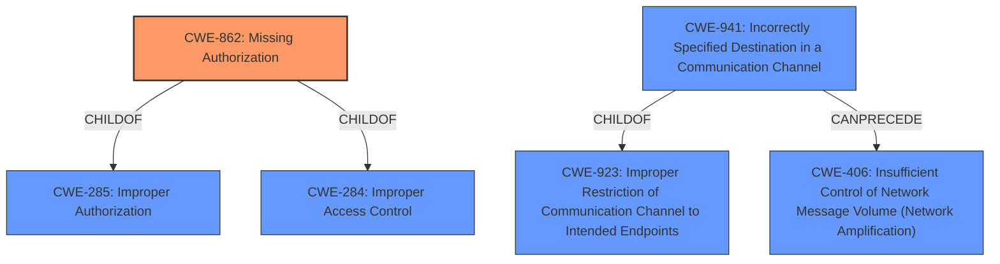

# Enhanced Analysis for CVE-2022-27215

# Summary
| CWE ID | CWE Name | Confidence | CWE Abstraction Level | CWE Vulnerability Mapping Label | CWE-Vulnerability Mapping Notes |
|---|---|---|---|---|---|
| CWE-862 | Missing Authorization | 1.0 | Class | Primary | Allowed-with-Review |
| CWE-941 | Incorrectly Specified Destination in a Communication Channel | 0.5 | Base | Secondary | Allowed |

## Evidence and Confidence

*   **Confidence Score:** 0.75
*   **Evidence Strength:** HIGH

## Relationship Analysis
The primary CWE is CWE-862 (Missing Authorization), which is a class-level CWE. It is a child of CWE-285 (Improper Authorization) and CWE-284 (Improper Access Control), both of which are more abstract. CWE-941 (Incorrectly Specified Destination in a Communication Channel) is a base-level CWE and a child of CWE-923 (Improper Restriction of Communication Channel to Intended Endpoints). It can precede CWE-406 (Insufficient Control of Network Message Volume (Network Amplification)).



## Vulnerability Chain
The vulnerability chain starts with a **missing permission check** (CWE-862), which allows attackers with Overall/Read permission to connect to an attacker-specified URL using attacker-specified credentials (CWE-941).

## Summary of Analysis
The analysis is based on the provided evidence, which includes a clear description of the vulnerability, key phrases, and CVE reference links. The **root cause** of the vulnerability is a **missing permission check**, which aligns with CWE-862 (Missing Authorization). The impact of the vulnerability is that an attacker can connect to an attacker-specified URL using attacker-specified credentials. This can be classified as CWE-941 (Incorrectly Specified Destination in a Communication Channel), but only loosely.

CWE-862 is a Class-level CWE, and the mapping guidance suggests examining its children for a better fit. However, none of the children of CWE-862 appear to be a better fit.

CWE-941 describes a scenario where the product creates a communication channel to initiate an outgoing request to an actor, but it does not correctly specify the intended destination for that actor. The vulnerability description indicates the attacker can specify the URL, which aligns with this CWE.

The selected CWEs are at the optimal level of specificity because they accurately represent the **root cause** and impact of the vulnerability.

Relevant CWE Information:

# Enhanced Context (25 CWEs)
The following CWEs were identified as potentially relevant to this vulnerability:

## CWE-1220: Insufficient Granularity of Access Control
**Abstraction Level**: Base
**Similarity Score**: 0.77
**Source**: dense
**Description**:
The product implements access controls via a policy or other feature with the intention to disable or restrict accesses (reads and/or writes) to assets in a system from untrusted agents. However, implemented access controls lack required granularity, which renders the control policy too broad because it allows accesses from unauthorized agents to the security-sensitive assets.
**Mapping Guidance**:
- Usage: Allowed

## CWE-274: Improper Handling of Insufficient Privileges
**Abstraction Level**: Base
**Similarity Score**: 0.77
**Source**: dense
**Description**:
The product does not handle or incorrectly handles when it has insufficient privileges to perform an operation, leading to resultant weaknesses.
**Mapping Guidance**:
- Usage: Discouraged

## CWE-280: Improper Handling of Insufficient Permissions or Privileges 
**Abstraction Level**: Base
**Similarity Score**: 0.77
**Source**: dense
**Description**:
The product does not handle or incorrectly handles when it has insufficient privileges to access resources or functionality as specified by their permissions. This may cause it to follow unexpected code paths that may leave the product in an invalid state.
**Mapping Guidance**:
- Usage: Allowed

## CWE-653: Improper Isolation or Compartmentalization
**Abstraction Level**: Class
**Similarity Score**: 0.76
**Source**: dense
**Description**:
The product does not properly compartmentalize or isolate functionality, processes, or resources that require different privilege levels, rights, or permissions.
**Mapping Guidance**:
- Usage: Allowed

## CWE-639: Authorization Bypass Through User-Controlled Key
**Abstraction Level**: Base
**Similarity Score**: 0.75
**Source**: dense
**Description**:
The system's authorization functionality does not prevent one user from gaining access to another user's data or record by modifying the key value identifying the data.
**Mapping Guidance**:
- Usage: Allowed

## CWE-807: Reliance on Untrusted Inputs in a Security Decision
**Abstraction Level**: Base
**Similarity Score**: 0.75
**Source**: dense
**Description**:
The product uses a protection mechanism that relies on the existence or values of an input, but the input can be modified by an untrusted actor in a way that bypasses the protection mechanism.
**Mapping Guidance**:
- Usage: Allowed

## CWE-668: Exposure of Resource to Wrong Sphere
**Abstraction Level**: Class
**Similarity Score**: 0.75
**Source**: dense
**Description**:
The product exposes a resource to the wrong control sphere, providing unintended actors with inappropriate access to the resource.
**Mapping Guidance**:
- Usage: Discouraged

## CWE-691: Insufficient Control Flow Management
**Abstraction Level**: Pillar
**Similarity Score**: 0.75
**Source**: dense
**Description**:
The code does not sufficiently manage its control flow during execution, creating conditions in which the control flow can be modified in unexpected ways.
**Mapping Guidance**:
- Usage: Discouraged

## CWE-266: Incorrect Privilege Assignment
**Abstraction Level**: Base
**Similarity Score**: 0.75
**Source**: dense
**Description**:
A product incorrectly assigns a privilege to a particular actor, creating an unintended sphere of control for that actor.
**Mapping Guidance**:
- Usage: Allowed

## CWE-424: Improper Protection of Alternate Path
**Abstraction Level**: Class
**Similarity Score**: 0.75
**Source**: dense
**Description**:
The product does not sufficiently protect all possible paths that a user can take to access restricted functionality or resources.
**Mapping Guidance**:
- Usage: Allowed-with-Review

## CWE-941: Incorrectly Specified Destination in a Communication Channel
**Abstraction Level**: Base
**Similarity Score**: 5764.58
**Source**: sparse
**Description**:
The product creates a communication channel to initiate an outgoing request to an actor, but it does not correctly specify the intended destination for that actor.
**Mapping Guidance**:
- Usage: Allowed

## CWE-863: Incorrect Authorization
**Abstraction Level**: Class
**Similarity Score**: 5727.77
**Source**: sparse
**Description**:
The product performs an authorization check when an actor attempts to access a resource or perform an action, but it does not correctly perform the check.
**Mapping Guidance**:
- Usage: Allowed-with-Review

## CWE-285: Improper Authorization
**Abstraction Level**: Class
**Similarity Score**: 5653.21
**Source**: sparse
**Description**:
The product does not perform or incorrectly performs an authorization check when an actor attempts to access a resource or perform an action.
**Mapping Guidance**:
- Usage: Discouraged

## CWE-862: Missing Authorization
**Abstraction Level**: Class
**Similarity Score**: 5522.32
**Source**: sparse
**Description**:
The product does not perform an authorization check when an actor attempts to access a resource or perform an action.
**Mapping Guidance**:
- Usage: Allowed-with-Review

## CWE-639: Authorization Bypass Through User-Controlled Key
**Abstraction Level**: Base
**Similarity Score**: 5454.03
**Source**: sparse
**Description**:
The system's authorization functionality does


## CWE Relationship Analysis

Current CWEs represent these abstraction levels: .


### Vulnerability Chain Analysis

**Chain starting from CWE-862:**
- 862 (Missing Authorization) - ROOT


**Chain starting from CWE-941:**
- 941 (Incorrectly Specified Destination in a Communication Channel) - ROOT


### CWE Relationship Diagram

```mermaid
graph TD
    classDef primary fill:#f96,stroke:#333,stroke-width:2px
    classDef secondary fill:#69f,stroke:#333
    classDef tertiary fill:#9e9,stroke:#333
```