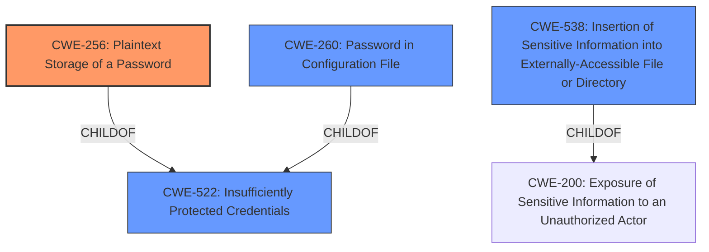

# Raw Analyzer Response for CVE-2022-27218

# Summary
| CWE ID | CWE Name | Confidence | CWE Abstraction Level | CWE Vulnerability Mapping Label | CWE-Vulnerability Mapping Notes |
|---|---|---|---|---|---|
| CWE-256 | Plaintext Storage of a Password | 1.0 | Base | Allowed | Primary CWE |
| CWE-538 | Insertion of Sensitive Information into Externally-Accessible File or Directory | 0.8 | Base | Allowed | Secondary Candidate |
| CWE-260 | Password in Configuration File | 0.7 | Base | Allowed | Secondary Candidate |
| CWE-522 | Insufficiently Protected Credentials | 0.6 | Class | Allowed-with-Review | Secondary Candidate |

## Evidence and Confidence

*   **Confidence Score:** 0.9
*   **Evidence Strength:** HIGH

## Relationship Analysis
The primary CWE selected is CWE-256, which is a Base level CWE and child of CWE-522. CWE-522 is a Class level CWE that is considered as a secondary candidate. CWE-260 is also a Base level CWE and child of CWE-522, and is considered a secondary candidate. CWE-538 is also a Base level CWE.

## Vulnerability Chain
The vulnerability chain starts with the **unencrypted storage of tokens** (CWE-256) leading to the impact of allowing users with extended read permissions or access to the file system to view the tokens.

## Summary of Analysis
The initial analysis pointed to CWE-256, CWE-522, CWE-260 and CWE-538. The final selection was made based on the specific details in the vulnerability description, the relationships between the CWEs, and the mapping guidance provided by MITRE. The analysis is based on the provided evidence, specifically the "Vulnerability Description Key Phrases" section which highlights the **rootcause** as **unencrypted storage of tokens**, and the "CVE Reference Links Content Summary" which states that the incapptic connect uploader Plugin stores personal tokens unencrypted.

The selected CWEs are at the optimal level of specificity because they accurately represent the **rootcause** of the vulnerability (CWE-256) and other potential contributing factors (CWE-538, CWE-260).

Relevant CWE Information:

# Enhanced Context (25 CWEs)
The following CWEs were identified as potentially relevant to this vulnerability:

## CWE-256: Plaintext Storage of a Password
The vulnerability description clearly states that tokens are stored **unencrypted**, which directly aligns with the description of CWE-256: "Storing a password in plaintext may result in a system compromise." The impact of this is that users with Extended Read permission can view the tokens. This is a direct consequence of the **plaintext storage**. The CWE-256 is a base level CWE and is a child of CWE-522. The mapping guidance recommends using Base level CWEs. Confidence: 1.0

## CWE-538: Insertion of Sensitive Information into Externally-Accessible File or Directory
The vulnerability involves storing tokens in `config.xml` files, which can be accessed by users with Extended Read permission. This aligns with CWE-538, which describes placing sensitive information into files or directories accessible to authorized users but not the sensitive information itself. The tokens are sensitive information, and the `config.xml` files are externally accessible to users with specific permissions. CWE-538 is a base level CWE. Confidence: 0.8

## CWE-260: Password in Configuration File
The vulnerability involves storing tokens in `config.xml` files. This aligns with CWE-260, which describes storing passwords in configuration files, leading to potential compromise. While the vulnerability involves tokens and not passwords, tokens are sensitive information. CWE-260 is a base level CWE. Confidence: 0.7

## CWE-522: Insufficiently Protected Credentials
CWE-522 is a class-level CWE that broadly covers situations where credentials are not adequately protected. The storage of **unencrypted tokens** falls under this category. However, given the more specific nature of CWE-256, CWE-522 is less preferred. The mapping guidance recommends reviewing children of this CWE to see if there is a better fit. Confidence: 0.6

### Other CWEs Considered But Not Used:

*   **CWE-312: Cleartext Storage of Sensitive Information** - Similar to CWE-256, but less specific to password/token storage.
*   **CWE-319: Cleartext Transmission of Sensitive Information** - This CWE relates to transmission, not storage.
*   **CWE-522: Insufficiently Protected Credentials** - A more general case that is less specific than CWE-256.
*   **CWE-311: Missing Encryption of Sensitive Data** - This is a Class level CWE and is too high level.
*   **CWE-257: Storing Passwords in a Recoverable Format** - This CWE involves storing passwords in a recoverable format, whereas in this case, tokens are stored in plaintext.
*   **CWE-497: Exposure of Sensitive System Information to an Unauthorized Control Sphere** - This CWE is related to system level information.
*   **CWE-1391: Use of Weak Credentials** - This CWE relates to weak credentials and not **unencrypted storage**.
*   **CWE-639: Authorization Bypass Through User-Controlled Key** - The vulnerability is not related to authorization bypass.
*   **CWE-178: Improper Handling of Case Sensitivity** - This CWE is related to case sensitivity.
*   **CWE-1289: Improper Validation of Unsafe Equivalence in Input** - This CWE is related to validation of input.
*   **CWE-289: Authentication Bypass by Alternate Name** - The vulnerability is not related to authentication bypass.
*   **CWE-499: Serializable Class Containing Sensitive Data** - The vulnerability is not related to serializable class.
*   **CWE-498: Cloneable Class Containing Sensitive Information** - The vulnerability is not related to cloneable class.
*   **CWE-942: Permissive Cross-domain Policy with Untrusted Domains** - The vulnerability is not related to cross-domain policy.
*   **CWE-433: Unparsed Raw Web Content Delivery** - The vulnerability is not related to web content delivery.
*   **CWE-549: Missing Password Field Masking** - The vulnerability is not related to password field masking.
*   **CWE-552: Files or Directories Accessible to External Parties** - This CWE is more general than the selected CWEs.