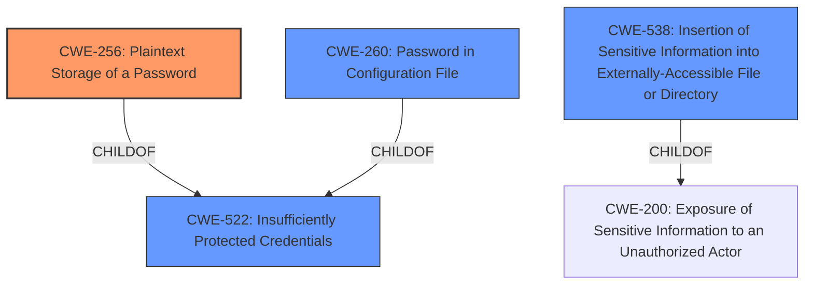

# Analysis for CVE-2022-27218

# Summary
| CWE ID | CWE Name | Confidence | CWE Abstraction Level | CWE Vulnerability Mapping Label | CWE-Vulnerability Mapping Notes |
|---|---|---|---|---|---|
| CWE-256 | Plaintext Storage of a Password | 1.0 | Base | Allowed | Primary CWE |
| CWE-538 | Insertion of Sensitive Information into Externally-Accessible File or Directory | 0.8 | Base | Allowed | Secondary Candidate |
| CWE-260 | Password in Configuration File | 0.7 | Base | Allowed | Secondary Candidate |
| CWE-522 | Insufficiently Protected Credentials | 0.6 | Class | Allowed-with-Review | Secondary Candidate |

## Evidence and Confidence

*   **Confidence Score:** 0.9
*   **Evidence Strength:** HIGH

## Relationship Analysis
The primary CWE selected is CWE-256, which is a Base level CWE and child of CWE-522. CWE-522 is a Class level CWE that is considered as a secondary candidate. CWE-260 is also a Base level CWE and child of CWE-522, and is considered a secondary candidate. CWE-538 is also a Base level CWE.

## Vulnerability Chain
The vulnerability chain starts with the **unencrypted storage of tokens** (CWE-256) leading to the impact of allowing users with extended read permissions or access to the file system to view the tokens.

## Summary of Analysis
The initial analysis pointed to CWE-256, CWE-522, CWE-260 and CWE-538. The final selection was made based on the specific details in the vulnerability description, the relationships between the CWEs, and the mapping guidance provided by MITRE. The analysis is based on the provided evidence, specifically the "Vulnerability Description Key Phrases" section which highlights the **rootcause** as **unencrypted storage of tokens**, and the "CVE Reference Links Content Summary" which states that the incapptic connect uploader Plugin stores personal tokens unencrypted.

The selected CWEs are at the optimal level of specificity because they accurately represent the **rootcause** of the vulnerability (CWE-256) and other potential contributing factors (CWE-538, CWE-260).

Relevant CWE Information:

# Enhanced Context (25 CWEs)
The following CWEs were identified as potentially relevant to this vulnerability:

## CWE-256: Plaintext Storage of a Password
The vulnerability description clearly states that tokens are stored **unencrypted**, which directly aligns with the description of CWE-256: "Storing a password in plaintext may result in a system compromise." The impact of this is that users with Extended Read permission can view the tokens. This is a direct consequence of the **plaintext storage**. The CWE-256 is a base level CWE and is a child of CWE-522. The mapping guidance recommends using Base level CWEs. Confidence: 1.0

## CWE-538: Insertion of Sensitive Information into Externally-Accessible File or Directory
The vulnerability involves storing tokens in `config.xml` files, which can be accessed by users with Extended Read permission. This aligns with CWE-538, which describes placing sensitive information into files or directories accessible to authorized users but not the sensitive information itself. The tokens are sensitive information, and the `config.xml` files are externally accessible to users with specific permissions. CWE-538 is a base level CWE. Confidence: 0.8

## CWE-260: Password in Configuration File
The vulnerability involves storing tokens in `config.xml` files. This aligns with CWE-260, which describes storing passwords in configuration files, leading to potential compromise. While the vulnerability involves tokens and not passwords, tokens are sensitive information. CWE-260 is a base level CWE. Confidence: 0.7

## CWE-522: Insufficiently Protected Credentials
CWE-522 is a class-level CWE that broadly covers situations where credentials are not adequately protected. The storage of **unencrypted tokens** falls under this category. However, given the more specific nature of CWE-256, CWE-522 is less preferred. The mapping guidance recommends reviewing children of this CWE to see if there is a better fit. Confidence: 0.6

### Other CWEs Considered But Not Used:

*   **CWE-312: Cleartext Storage of Sensitive Information** - Similar to CWE-256, but less specific to password/token storage.
*   **CWE-319: Cleartext Transmission of Sensitive Information** - This CWE relates to transmission, not storage.
*   **CWE-522: Insufficiently Protected Credentials** - A more general case that is less specific than CWE-256.
*   **CWE-311: Missing Encryption of Sensitive Data** - This is a Class level CWE and is too high level.
*   **CWE-257: Storing Passwords in a Recoverable Format** - This CWE involves storing passwords in a recoverable format, whereas in this case, tokens are stored in plaintext.
*   **CWE-497: Exposure of Sensitive System Information to an Unauthorized Control Sphere** - This CWE is related to system level information.
*   **CWE-1391: Use of Weak Credentials** - This CWE relates to weak credentials and not **unencrypted storage**.
*   **CWE-639: Authorization Bypass Through User-Controlled Key** - The vulnerability is not related to authorization bypass.
*   **CWE-178: Improper Handling of Case Sensitivity** - This CWE is related to case sensitivity.
*   **CWE-1289: Improper Validation of Unsafe Equivalence in Input** - This CWE is related to validation of input.
*   **CWE-289: Authentication Bypass by Alternate Name** - The vulnerability is not related to authentication bypass.
*   **CWE-499: Serializable Class Containing Sensitive Data** - The vulnerability is not related to serializable class.
*   **CWE-498: Cloneable Class Containing Sensitive Information** - The vulnerability is not related to cloneable class.
*   **CWE-942: Permissive Cross-domain Policy with Untrusted Domains** - The vulnerability is not related to cross-domain policy.
*   **CWE-433: Unparsed Raw Web Content Delivery** - The vulnerability is not related to web content delivery.
*   **CWE-549: Missing Password Field Masking** - The vulnerability is not related to password field masking.
*   **CWE-552: Files or Directories Accessible to External Parties** - This CWE is more general than the selected CWEs.

# Enhanced Query for CVE-2022-27218

## Vulnerability Description
Jenkins incapptic connect uploader Plugin 1.15 and earlier stores tokens unencrypted in job config.xml files on the Jenkins controller where they can be viewed by users with Extended Read permission, or access to the Jenkins controller file system.

### Vulnerability Description Key Phrases
- **rootcause:** **unencrypted storage of tokens**
- **impact:** view tokens
- **attacker:** users with Extended Read permission and users with access to Jenkins controller file system
- **product:** Jenkins incapptic connect uploader Plugin
- **version:** 1.15 and earlier

## CVE Reference Links Content Summary
Based on the provided information, here's an analysis of CVE-2022-27218:

**CVE-2022-27218**

*   **Root cause of vulnerability:** The incapptic connect uploader Plugin stores personal tokens unencrypted.
*   **Weaknesses/vulnerabilities present:** Sensitive data exposure. The plugin stores personal tokens in plain text within job `config.xml` files.
*   **Impact of exploitation:** An attacker with Item/Extended Read permission or access to the Jenkins controller file system can view the unencrypted tokens. This could allow the attacker to gain access to systems or resources protected by those tokens.
*   **Attack vectors:**
    *   Direct access to the Jenkins controller's file system.
    *   Exploiting the Jenkins UI with Item/Extended Read permissions.
*   **Required attacker capabilities/position:**
    *   Access to the Jenkins controller file system.
    *   Jenkins user with Item/Extended Read permissions.

The provided information clearly relates to CVE-2022-27218, detailing the vulnerability in the `incapptic connect uploader` plugin.

## Retriever Results

### Top Combined Results

| Rank | CWE ID | Name | Abstraction | Usage  | Retrievers | Individual Scores |
|------|--------|------|-------------|-------|------------|-------------------|
| 1 | 256 | Plaintext Storage of a Password | Base | Allowed | sparse | 0.470 |
| 2 | 522 | Insufficiently Protected Credentials | Class | Allowed-with-Review | sparse | 0.432 |
| 3 | 260 | Password in Configuration File | Base | Allowed | sparse | 0.375 |
| 4 | 538 | Insertion of Sensitive Information into Externally-Accessible File or Directory | Base | Allowed | sparse | 0.305 |
| 5 | 862 | Missing Authorization | Class | Allowed-with-Review | sparse | 0.294 |
| 6 | 555 | J2EE Misconfiguration: Plaintext Password in Configuration File | Variant | Allowed | dense | 0.469 |
| 7 | 549 | Missing Password Field Masking | Base | Allowed | graph | 0.002 |
| 8 | 532 | Insertion of Sensitive Information into Log File | Base | Allowed | sparse | 0.270 |
| 9 | 863 | Incorrect Authorization | Class | Allowed-with-Review | sparse | 0.263 |
| 10 | 319 | Cleartext Transmission of Sensitive Information | Base | Allowed | sparse | 0.262 |

# Complete CWE Specifications

## CWE-256: Plaintext Storage of a Password
**Abstraction:** Base
**Status:** Incomplete

### Description
Storing a password in plaintext may result in a system compromise.

### Extended Description
Password management issues occur when a password is stored in plaintext in an application's properties, configuration file, or memory. Storing a plaintext password in a configuration file allows anyone who can read the file access to the password-protected resource. In some contexts, even storage of a plaintext password in memory is considered a security risk if the password is not cleared immediately after it is used.

### Alternative Terms
None

### Relationships
ChildOf -> CWE-522

### Mapping Guidance
**Usage:** Allowed
**Rationale:** This CWE entry is at the Base level of abstraction, which is a preferred level of abstraction for mapping to the root causes of vulnerabilities.
**Comments:** Carefully read both the name and description to ensure that this mapping is an appropriate fit. Do not try to 'force' a mapping to a lower-level Base/Variant simply to comply with this preferred level of abstraction.
**Reasons:**
- Acceptable-Use

### Observed Examples
- **CVE-2022-30275:** Remote Terminal Unit (RTU) uses a driver that relies on a password stored in plaintext.

## CWE-522: Insufficiently Protected Credentials
**Abstraction:** Class
**Status:** Incomplete

### Description
The product transmits or stores authentication credentials, but it uses an insecure method that is susceptible to unauthorized interception and/or retrieval.

### Extended Description
Not provided

### Alternative Terms
None

### Relationships
ChildOf -> CWE-1390
ChildOf -> CWE-287
ChildOf -> CWE-668

### Mapping Guidance
**Usage:** Allowed-with-Review
**Rationale:** This CWE entry is a Class and might have Base-level children that would be more appropriate
**Comments:** Examine children of this entry to see if there is a better fit
**Reasons:**
- Abstraction

### Observed Examples
- **CVE-2022-30018:** A messaging platform serializes all elements of User/Group objects, making private information available to adversaries
- **CVE-2022-29959:** Initialization file contains credentials that can be decoded using a "simple string transformation"
- **CVE-2022-35411:** Python-based RPC framework enables pickle functionality by default, allowing clients to unpickle untrusted data.

## CWE-260: Password in Configuration File
**Abstraction:** Base
**Status:** Incomplete

### Description
The product stores a password in a configuration file that might be accessible to actors who do not know the password.

### Extended Description
This can result in compromise of the system for which the password is used. An attacker could gain access to this file and learn the stored password or worse yet, change the password to one of their choosing.

### Alternative Terms
None

### Relationships
ChildOf -> CWE-522

### Mapping Guidance
**Usage:** Allowed
**Rationale:** This CWE entry is at the Base level of abstraction, which is a preferred level of abstraction for mapping to the root causes of vulnerabilities.
**Comments:** Carefully read both the name and description to ensure that this mapping is an appropriate fit. Do not try to 'force' a mapping to a lower-level Base/Variant simply to comply with this preferred level of abstraction.
**Reasons:**
- Acceptable-Use

### Observed Examples
- **CVE-2022-38665:** A continuous delivery pipeline management tool stores an unencypted password in a configuration file.

## CWE-538: Insertion of Sensitive Information into Externally-Accessible File or Directory
**Abstraction:** Base
**Status:** Draft

### Description
The product places sensitive information into files or directories that are accessible to actors who are allowed to have access to the files, but not to the sensitive information.

### Extended Description
Not provided

### Alternative Terms
None

### Relationships
ChildOf -> CWE-200

### Mapping Guidance
**Usage:** Allowed
**Rationale:** This CWE entry is at the Base level of abstraction, which is a preferred level of abstraction for mapping to the root causes of vulnerabilities.
**Comments:** Carefully read both the name and description to ensure that this mapping is an appropriate fit. Do not try to 'force' a mapping to a lower-level Base/Variant simply to comply with this preferred level of abstraction.
**Reasons:**
- Acceptable-Use

### Additional Notes
**[Maintenance]** Depending on usage, this could be a weakness or a category. Further study of all its children is needed, and the entire sub-tree may need to be clarified. The current organization is based primarily on the exposure of sensitive information as a consequence, instead of as a primary weakness.

**[Maintenance]** There is a close relationship with CWE-552, which is more focused on weaknesses. As a result, it may be more appropriate to convert CWE-538 to a category.

### Observed Examples
- **CVE-2018-1999036:** SSH password for private key stored in build log

## CWE-862: Missing Authorization
**Abstraction:** Class
**Status:** Incomplete

### Description
The product does not perform an authorization check when an actor attempts to access a resource or perform an action.

### Extended Description
Not provided

### Alternative Terms
AuthZ: "AuthZ" is typically used as an abbreviation of "authorization" within the web application security community. It is distinct from "AuthN" (or, sometimes, "AuthC") which is an abbreviation of "authentication." The use of "Auth" as an abbreviation is discouraged, since it could be used for either authentication or authorization.

### Relationships
ChildOf -> CWE-285
ChildOf -> CWE-284

### Mapping Guidance
**Usage:** Allowed-with-Review
**Rationale:** This CWE entry is a Class and might have Base-level children that would be more appropriate
**Comments:** Examine children of this entry to see if there is a better fit
**Reasons:**
- Abstraction

### Additional Notes
**[Terminology]** Assuming a user with a given identity, authorization is the process of determining whether that user can access a given resource, based on the user's privileges and any permissions or other access-control specifications that apply to the resource.

### Observed Examples
- **CVE-2022-24730:** Go-based continuous deployment product does not check that a user has certain privileges to update or create an app, allowing adversaries to read sensitive repository information
- **CVE-2009-3168:** Web application does not restrict access to admin scripts, allowing authenticated users to reset administrative passwords.
- **CVE-2009-3597:** Web application stores database file under the web root with insufficient access control (CWE-219), allowing direct request.

## CWE-555: J2EE Misconfiguration: Plaintext Password in Configuration File
**Abstraction:** Variant
**Status:** Draft

### Description
The J2EE application stores a plaintext password in a configuration file.

### Extended Description
Storing a plaintext password in a configuration file allows anyone who can read the file to access the password-protected resource, making it an easy target for attackers.

### Alternative Terms
None

### Relationships
ChildOf -> CWE-260

### Mapping Guidance
**Usage:** Allowed
**Rationale:** This CWE entry is at the Variant level of abstraction, which is a preferred level of abstraction for mapping to the root causes of vulnerabilities.
**Comments:** Carefully read both the name and description to ensure that this mapping is an appropriate fit. Do not try to 'force' a mapping to a lower-level Base/Variant simply to comply with this preferred level of abstraction.
**Reasons:**
- Acceptable-Use

## CWE-549: Missing Password Field Masking
**Abstraction:** Base
**Status:** Draft

### Description
The product does not mask passwords during entry, increasing the potential for attackers to observe and capture passwords.

### Extended Description
Not provided

### Alternative Terms
None

### Relationships
ChildOf -> CWE-522

### Mapping Guidance
**Usage:** Allowed
**Rationale:** This CWE entry is at the Base level of abstraction, which is a preferred level of abstraction for mapping to the root causes of vulnerabilities.
**Comments:** Carefully read both the name and description to ensure that this mapping is an appropriate fit. Do not try to 'force' a mapping to a lower-level Base/Variant simply to comply with this preferred level of abstraction.
**Reasons:**
- Acceptable-Use

## CWE-532: Insertion of Sensitive Information into Log File
**Abstraction:** Base
**Status:** Incomplete

### Description
The product writes sensitive information to a log file.

### Extended Description
Not provided

### Alternative Terms
None

### Relationships
ChildOf -> CWE-538
ChildOf -> CWE-200

### Mapping Guidance
**Usage:** Allowed
**Rationale:** This CWE entry is at the Base level of abstraction, which is a preferred level of abstraction for mapping to the root causes of vulnerabilities.
**Comments:** Carefully read both the name and description to ensure that this mapping is an appropriate fit. Do not try to 'force' a mapping to a lower-level Base/Variant simply to comply with this preferred level of abstraction.
**Reasons:**
- Acceptable-Use

### Observed Examples
- **CVE-2017-9615:** verbose logging stores admin credentials in a world-readable log file
- **CVE-2018-1999036:** SSH password for private key stored in build log

## CWE-863: Incorrect Authorization
**Abstraction:** Class
**Status:** Incomplete

### Description
The product performs an authorization check when an actor attempts to access a resource or perform an action, but it does not correctly perform the check.

### Extended Description
Not provided

### Alternative Terms
AuthZ: "AuthZ" is typically used as an abbreviation of "authorization" within the web application security community. It is distinct from "AuthN" (or, sometimes, "AuthC") which is an abbreviation of "authentication." The use of "Auth" as an abbreviation is discouraged, since it could be used for either authentication or authorization.

### Relationships
ChildOf -> CWE-285
ChildOf -> CWE-284

### Mapping Guidance
**Usage:** Allowed-with-Review
**Rationale:** This CWE entry is a Class and might have Base-level children that would be more appropriate
**Comments:** Examine children of this entry to see if there is a better fit
**Reasons:**
- Abstraction

### Additional Notes
**[Terminology]** 

Assuming a user with a given identity, authorization is the process of determining whether that user can access a given resource, based on the user's privileges and any permissions or other access-control specifications that apply to the resource.

### Observed Examples
- **CVE-2021-39155:** Chain: A microservice integration and management platform compares the hostname in the HTTP Host header in a case-sensitive way (CWE-178, CWE-1289), allowing bypass of the authorization policy (CWE-863) using a hostname with mixed case or other variations.
- **CVE-2019-15900:** Chain: sscanf() call is used to check if a username and group exists, but the return value of sscanf() call is not checked (CWE-252), causing an uninitialized variable to be checked (CWE-457), returning success to allow authorization bypass for executing a privileged (CWE-863).
- **CVE-2009-2213:** Gateway uses default "Allow" configuration for its authorization settings.

## CWE-319: Cleartext Transmission of Sensitive Information
**Abstraction:** Base
**Status:** Draft

### Description
The product transmits sensitive or security-critical data in cleartext in a communication channel that can be sniffed by unauthorized actors.

### Extended Description

Many communication channels can be "sniffed" (monitored) by adversaries during data transmission. For example, in networking, packets can traverse many intermediary nodes from the source to the destination, whether across the internet, an internal network, the cloud, etc. Some actors might have privileged access to a network interface or any link along the channel, such as a router, but they might not be authorized to collect the underlying data. As a result, network traffic could be sniffed by adversaries, spilling security-critical data.

Applicable communication channels are not limited to software products. Applicable channels include hardware-specific technologies such as internal hardware networks and external debug channels, supporting remote JTAG debugging. When mitigations are not applied to combat adversaries within the product's threat model, this weakness significantly lowers the difficulty of exploitation by such adversaries.

When full communications are recorded or logged, such as with a packet dump, an adversary could attempt to obtain the dump long after the transmission has occurred and try to "sniff" the cleartext from the recorded communications in the dump itself. Even if the information is encoded in a way that is not human-readable, certain techniques could determine which encoding is being used, then decode the information. 

### Alternative Terms
None

### Relationships
ChildOf -> CWE-311
ChildOf -> CWE-311

### Mapping Guidance
**Usage:** Allowed
**Rationale:** This CWE entry is at the Base level of abstraction, which is a preferred level of abstraction for mapping to the root causes of vulnerabilities.
**Comments:** Carefully read both the name and description to ensure that this mapping is an appropriate fit. Do not try to 'force' a mapping to a lower-level Base/Variant simply to comply with this preferred level of abstraction.
**Reasons:**
- Acceptable-Use

### Additional Notes
**[Maintenance]** The Taxonomy_Mappings to ISA/IEC 62443 were added in CWE 4.10, but they are still under review and might change in future CWE versions. These draft mappings were performed by members of the "Mapping CWE to 62443" subgroup of the CWE-CAPEC ICS/OT Special Interest Group (SIG), and their work is incomplete as of CWE 4.10. The mappings are included to facilitate discussion and review by the broader ICS/OT community, and they are likely to change in future CWE versions.

### Observed Examples
- **CVE-2022-29519:** Programmable Logic Controller (PLC) sends sensitive information in plaintext, including passwords and session tokens.
- **CVE-2022-30312:** Building Controller uses a protocol that transmits authentication credentials in plaintext.
- **CVE-2022-31204:** Programmable Logic Controller (PLC) sends password in plaintext.

