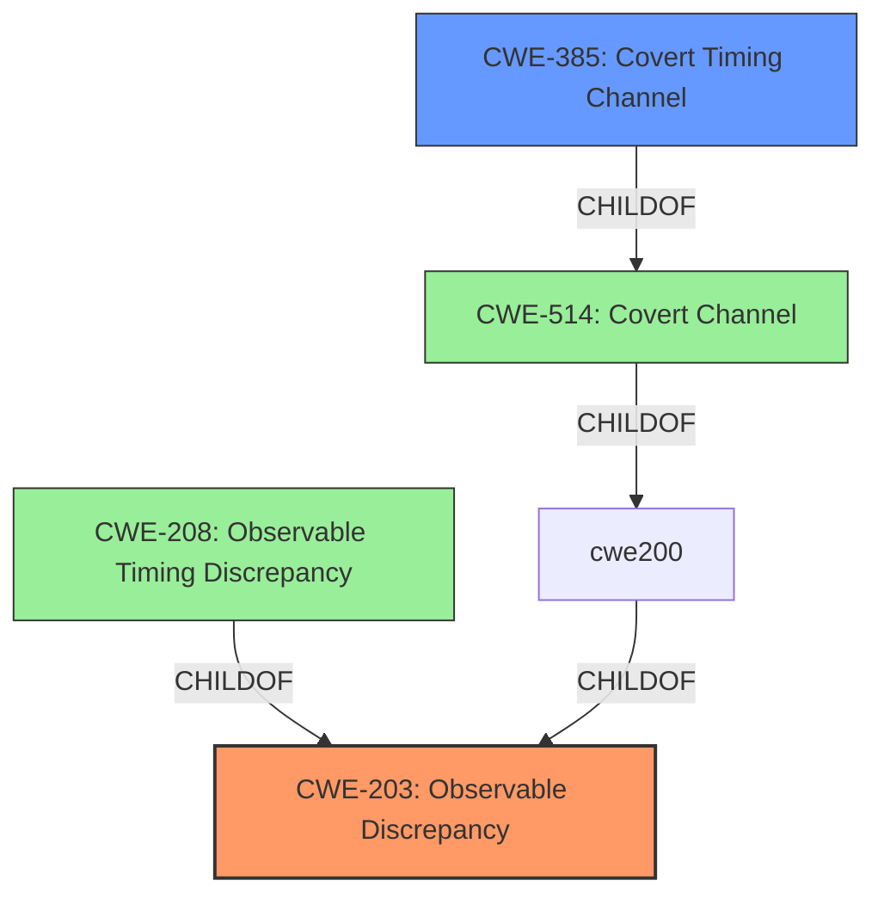

# Analysis Report for CVE-2022-27221

# Vulnerability Analysis Report: CVE-2022-27221

## Description


## Analysis (with Relationship Data)

# Summary
| CWE ID | CWE Name | Confidence | CWE Abstraction Level | CWE Vulnerability Mapping Label | CWE-Vulnerability Mapping Notes |
|---|---|---|---|---|---|
| CWE-203 | Observable Discrepancy | 0.9 | Base | Primary | Allowed |
| CWE-385 | Covert Timing Channel | 0.6 | Base | Secondary | Allowed |

## Evidence and Confidence

*   **Confidence Score:** 0.9
*   **Evidence Strength:** HIGH

## Relationship Analysis
The primary CWE is CWE-203, which represents the **observable discrepancy** that allows the attacker to infer information. CWE-385, a child of CWE-514 (Covert Channel), represents a more specific type of observable discrepancy based on timing. CWE-208 is a more specific type of CWE-203 when the discrepancy is specifically related to timing.



## Vulnerability Chain
The vulnerability chain starts with the **vulnerability** that allows an attacker to observe length differences in HTTP responses based on their guesses. This **observable discrepancy** (CWE-203) then allows the attacker to obtain plaintext secret values. If the discrepancy is only based on timing, then CWE-208 might be considered.

## Summary of Analysis
The initial assessment identified several potential CWEs, primarily focusing on those related to timing and observable discrepancies. The final decision was based on the specific details of the vulnerability, where the length differences observed are the key discrepancy and the root cause, but a covert timing channel could also be a factor.

The evidence from the "CVE Reference Links Content Summary" section states that the "weakness" is "Observable Discrepancy". The "Vulnerability Description" states that an "attacker in machine-in-the-middle could obtain plaintext secret values by observing length differences during a series of guesses in which a string in an HTTP request URL potentially matches an unknown string in an HTTP response body".

CWE-203 (Observable Discrepancy) is the most appropriate primary CWE because it directly addresses the root cause of the **vulnerability**, which is the **observable difference** in the length of the HTTP response body. This **observable discrepancy** allows the attacker to infer information about the secret values. The abstraction level is Base, which is appropriate for root cause analysis.

CWE-385 (Covert Timing Channel) is a more specific kind of side channel, and the vulnerability could potentially involve a timing element in addition to the length differences. However, since the primary observation is based on length, CWE-203 is a better fit. I am less confident that this is also a secondary factor.

CWE-208 (Observable Timing Discrepancy) was considered as a potential CWE, but it is more specific than CWE-203 and focuses solely on timing discrepancies. While timing might be a contributing factor, the core issue is the length difference, making CWE-203 a more accurate representation of the vulnerability.

CWE-319 (Cleartext Transmission of Sensitive Information) was considered, but the **vulnerability** is not directly related to transmitting sensitive information in cleartext. Instead, it is about an attacker inferring information through **observable differences**.

CWE-61 (UNIX Symbolic Link (Symlink) Following) is not relevant because the vulnerability has nothing to do with symbolic links or file system access.

Relevant CWE Information:

# Enhanced Context (25 CWEs)
The following CWEs were identified as potentially relevant to this vulnerability:

## CWE-1289: Improper Validation of Unsafe Equivalence in Input
**Abstraction Level**: Base
**Similarity Score**: 0.80
**Source**: dense

**Description**:
The product receives an input value that is used as a resource identifier or other type of reference, but it does not validate or incorrectly validates that the input is equivalent to a potentially-unsafe value.

**Mapping Guidance**:
- Usage: Allowed
- Rationale: This CWE entry is at the Base level of abstraction, which is a preferred level of abstraction for mapping to the root causes of vulnerabilities.

## CWE-807: Reliance on Untrusted Inputs in a Security Decision
**Abstraction Level**: Base
**Similarity Score**: 0.78
**Source**: dense

**Description**:
The product uses a protection mechanism that relies on the existence or values of an input, but the input can be modified by an untrusted actor in a way that bypasses the protection mechanism.

**Mapping Guidance**:
- Usage: Allowed
- Rationale: This CWE entry is at the Base level of abstraction, which is a preferred level of abstraction for mapping to the root causes of vulnerabilities.

## CWE-208: Observable Timing Discrepancy
**Abstraction Level**: Base
**Similarity Score**: 0.77
**Source**: dense

**Description**:
Two separate operations in a product require different amounts of time to complete, in a way that is observable to an actor and reveals security-relevant information about the state of the product, such as whether a particular operation was successful or not.

**Mapping Guidance**:
- Usage: Allowed
- Rationale: This CWE entry is at the Base level of abstraction, which is a preferred level of abstraction for mapping to the root causes of vulnerabilities.

## CWE-183: Permissive List of Allowed Inputs
**Abstraction Level**: Base
**Similarity Score**: 0.76
**Source**: dense

**Description**:
The product implements a protection mechanism that relies on a list of inputs (or properties of inputs) that are explicitly allowed by policy because the inputs are assumed to be safe, but the list is too permissive - that is, it allows an input that is unsafe, leading to resultant weaknesses.

**Mapping Guidance**:
- Usage: Allowed
- Rationale: This CWE entry is at the Base level of abstraction, which is a preferred level of abstraction for mapping to the root causes of vulnerabilities.

## CWE-184: Incomplete List of Disallowed Inputs
**Abstraction Level**: Base
**Similarity Score**: 0.76
**Source**: dense

**Description**:
The product implements a protection mechanism that relies on a list of inputs (or properties of inputs) that are not allowed by policy or otherwise require other action to neutralize before additional processing takes place, but the list is incomplete.

**Mapping Guidance**:
- Usage: Allowed
- Rationale: This CWE entry is at the Base level of abstraction, which is a preferred level of abstraction for mapping to the root causes of vulnerabilities.

## CWE-204: Observable Response Discrepancy
**Abstraction Level**: Base
**Similarity Score**: 0.76
**Source**: dense

**Description**:
The product provides different responses to incoming requests in a way that reveals internal state information to an unauthorized actor outside of the intended control sphere.

**Mapping Guidance**:
- Usage: Allowed
- Rationale: This CWE entry is at the Base level of abstraction, which is a preferred level of abstraction for mapping to the root causes of vulnerabilities.

## CWE-41: Improper Resolution of Path Equivalence
**Abstraction Level**: Base
**Similarity Score**: 0.75
**Source**: dense

**Description**:
The product is vulnerable to file system contents disclosure through path equivalence. Path equivalence involves the use of special characters in file and directory names. The associated manipulations are intended to generate multiple names for the same object.

**Mapping Guidance**:
- Usage: Allowed
- Rationale: This CWE entry is at the Base level of abstraction, which is a preferred level of abstraction for mapping to the root causes of vulnerabilities.

## CWE-1288: Improper Validation of Consistency within Input
**Abstraction Level**: Base
**Similarity Score**: 0.75
**Source**: dense

**Description**:
The product receives a complex input with multiple elements or fields that must be consistent with each other, but it does not validate or incorrectly validates that the input is actually consistent.

**Mapping Guidance**:
- Usage: Allowed
- Rationale: This CWE entry is at the Base level of abstraction, which is a preferred level of abstraction for mapping to the root causes of vulnerabilities.

## CWE-444: Inconsistent Interpretation of HTTP Requests ('HTTP Request/Response Smuggling')
**Abstraction Level**: Base
**Similarity Score**: 0.75
**Source**: dense

**Description**:
The product acts as an intermediary


## CWE Relationship Analysis

Current CWEs represent these abstraction levels: .


### Vulnerability Chain Analysis

**Chain starting from CWE-208:**
- 208 (Observable Timing Discrepancy) - ROOT


**Chain starting from CWE-203:**
- 203 (Observable Discrepancy) - ROOT


### CWE Relationship Diagram

```mermaid
graph TD
    classDef primary fill:#f96,stroke:#333,stroke-width:2px
    classDef secondary fill:#69f,stroke:#333
    classDef tertiary fill:#9e9,stroke:#333
```


*Report generated on 2025-03-30 20:02:29*
