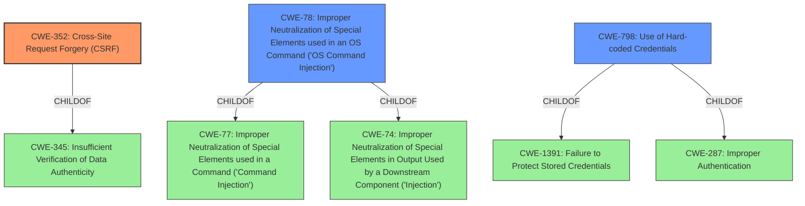

# Analysis for CVE-2022-27226

# Summary
| CWE ID | CWE Name | Confidence | CWE Abstraction Level | CWE Vulnerability Mapping Label | CWE-Vulnerability Mapping Notes |
|---|---|---|---|---|---|
| CWE-352 | Cross-Site Request Forgery (CSRF) | 1 | Compound | Primary | Allowed |
| CWE-78 | Improper Neutralization of Special Elements used in an OS Command ('OS Command Injection') | 0.7 | Base | Secondary | Allowed |
| CWE-798 | Use of Hard-coded Credentials | 0.6 | Base | Secondary | Allowed |

## Evidence and Confidence

*   **Confidence Score:** 0.8
*   **Evidence Strength:** HIGH

## Relationship Analysis
The primary CWE is CWE-352, which is a compound weakness requiring multiple conditions to be met. While it is an attack-oriented composite, it accurately reflects the **CSRF issue** as a root cause. CWE-78 is a potential secondary weakness due to the potential for command injection via the crontab entry, and CWE-798 is also a secondary weakness due to the reliance on default credentials.

## Vulnerability Chain
The vulnerability chain starts with a **CSRF issue** (CWE-352) that allows a threat actor to create a crontab entry. This leads to remote code execution, potentially exacerbated by the use of default credentials (CWE-798). If the crontab entry is not properly neutralized, this could lead to OS Command Injection (CWE-78).

CSRF (CWE-352) -> Crontab Entry Creation -> Remote Code Execution -> (Optional) OS Command Injection (CWE-78) due to **improper neutralization** + reliance on default credentials (CWE-798).

## Summary of Analysis
The primary root cause of this vulnerability is the **CSRF issue** (CWE-352). The vulnerability description clearly states "A **CSRF issue** in /api/crontab on iRZ Mobile Routers through 2022-03-16 allows a threat actor to create a crontab entry in the router administration panel." This is further supported by the CVE Reference Links Content Summary, which identifies "The primary vulnerability is the lack of CSRF protection in the router's web interface, allowing unauthorized actions via crafted requests."

CWE-78, Improper Neutralization of Special Elements used in an OS Command ('OS Command Injection'), is considered a secondary weakness because the crontab entry, once created via the **CSRF**, may allow for command injection if special elements are not neutralized. The CVE Reference Links Content Summary alludes to this by stating "Insecure Crontab Functionality: The crontab feature, designed for scheduling tasks, allows for arbitrary command execution, which can lead to RCE."

CWE-798, Use of Hard-coded Credentials, is considered a secondary weakness. The vulnerability description states, "In addition, if the routers default credentials arent rotated or a threat actor discovers valid credentials, remote code execution can be achieved without user interaction." This indicates that default credentials could bypass the need for the **CSRF**, but is considered secondary to the **CSRF issue**.

The chosen CWEs are at the optimal level of specificity. CWE-352 is a compound weakness that accurately captures the vulnerability. CWE-78 and CWE-798 are base level weaknesses.

Relevant CWE Information:

# Enhanced Context (25 CWEs)
The following CWEs were identified as potentially relevant to this vulnerability:

## CWE-807: Reliance on Untrusted Inputs in a Security Decision
**Abstraction Level**: Base
**Similarity Score**: 0.77
**Source**: dense

**Description**:
The product uses a protection mechanism that relies on the existence or values of an input, but the input can be modified by an untrusted actor in a way that bypasses the protection mechanism.

**Mapping Guidance**:
- Usage: Allowed
- Rationale: This CWE entry is at the Base level of abstraction, which is a preferred level of abstraction for mapping to the root causes of vulnerabilities.

*Not Selected:* While the **CSRF** relies on untrusted inputs, CWE-352 is a more direct representation of the vulnerability.

## CWE-668: Exposure of Resource to Wrong Sphere
**Abstraction Level**: Class
**Similarity Score**: 0.76
**Source**: dense

**Description**:
The product exposes a resource to the wrong control sphere, providing unintended actors with inappropriate access to the resource.

**Mapping Guidance**:
- Usage: Discouraged
- Rationale: CWE-668 is high-level and is often misused as a catch-all when lower-level CWE IDs might be applicable. It is sometimes used for low-information vulnerability reports [REF-1287]. It is a level-1 Class (i.e., a child of a Pillar). It is not useful for trend analysis.

*Not Selected:* CWE-668 is too high-level. CWE-352 is a more specific representation of the **CSRF issue**.

## CWE-497: Exposure of Sensitive System Information to an Unauthorized Control Sphere
**Abstraction Level**: Base
**Similarity Score**: 0.76
**Source**: dense

**Description**:
The product does not properly prevent sensitive system-level information from being accessed by unauthorized actors who do not have the same level of access to the underlying system as the product does.

**Mapping Guidance**:
- Usage: Allowed
- Rationale: This CWE entry is at the Base level of abstraction, which is a preferred level of abstraction for mapping to the root causes of vulnerabilities.

*Not Selected:* While the vulnerability could lead to exposure of sensitive information, the primary weakness is the **CSRF issue** and the secondary weaknesses are the potential OS Command Injection and the Use of Hard-coded Credentials.

## CWE-319: Cleartext Transmission of Sensitive Information
**Abstraction Level**: Base
**Similarity Score**: 0.75
**Source**: dense

**Description**:
The product transmits sensitive or security-critical data in cleartext in a communication channel that can be sniffed by unauthorized actors.

**Mapping Guidance**:
- Usage: Allowed
- Rationale: This CWE entry is at the Base level of abstraction, which is a preferred level of abstraction for mapping to the root causes of vulnerabilities.

*Not Selected:* This CWE is not relevant to the vulnerability description.

## CWE-639: Authorization Bypass Through User-Controlled Key
**Abstraction Level**: Base
**Similarity Score**: 0.75
**Source**: dense

**Description**:
The system's authorization functionality does not prevent one user from gaining access to another user's data or record by modifying the key value identifying the data.

**Mapping Guidance**:
- Usage: Allowed
- Rationale: This CWE entry is at the Base level of abstraction, which is a preferred level of abstraction for mapping to the root causes of vulnerabilities.

*Not Selected:* This CWE is not relevant to the vulnerability description.

## CWE-203: Observable Discrepancy
**Abstraction Level**: Base
**Similarity Score**: 0.75
**Source**: dense

**Description**:
The product behaves differently or sends different responses under different circumstances in a way that is observable to an unauthorized actor, which exposes security-relevant information about the state of the product, such as whether a particular operation was successful or not.

**Mapping Guidance**:
- Usage: Allowed
- Rationale: This CWE entry is at the Base level of abstraction, which is a preferred level of abstraction for mapping to the root causes of vulnerabilities.