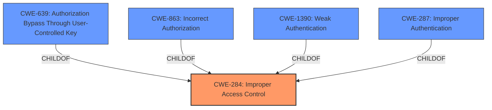

# Analysis for CVE-2022-27235

# Summary
| CWE ID | CWE Name | Confidence | CWE Abstraction Level | CWE Vulnerability Mapping Label | CWE-Vulnerability Mapping Notes |
|---|---|---|---|---|---|
| CWE-284 | Improper Access Control | 0.7 | Pillar | Discouraged | Consider more specific descendants. |
| CWE-639 | Authorization Bypass Through User-Controlled Key | 0.6 | Base | Allowed | Candidate for the root cause. |
| CWE-863 | Incorrect Authorization | 0.5 | Class | Allowed-with-Review | Consider more specific children. |
| CWE-1390 | Weak Authentication | 0.4 | Class | Allowed-with-Review | Consider more specific children. |
| CWE-287 | Improper Authentication | 0.3 | Class | Discouraged | Consider more specific alternatives. |

## Evidence and Confidence

*   **Confidence Score:** 0.7
*   **Evidence Strength:** MEDIUM

## Relationship Analysis
The primary relationship influencing the selection is the hierarchical structure with CWE-284 as a high-level Pillar and CWE-639, CWE-863, CWE-1390, and CWE-287 being lower-level Class or Base CWEs. The evidence points towards an authorization issue, making CWE-639 a reasonable candidate, although the description is not specific enough to rule out other possibilities within the access control domain.

## Vulnerability Chain
The vulnerability chain begins with a **Broken Access Control** issue. The absence of proper authorization checks allows an unprivileged user to perform actions requiring higher privileges, potentially leading to unauthorized modification of website content or settings.
  - **Root Cause:** **Broken Access Control** due to lack of authorization checks
  - **Weakness:** Unprivileged user can execute higher privileged actions
  - **Impact:** Unauthorized modification of website content, settings, or data

## Summary of Analysis
The initial assessment identified **Broken Access Control** as the primary issue. The analysis considered the relationships between CWEs, with CWE-284 being a high-level categorization. The retriever results suggested CWE-639, CWE-863, CWE-1390, and CWE-287 as potential matches. Given the available evidence, CWE-284 is too general, and while CWE-639 is a possibility, the lack of specific details makes it difficult to confirm. The final decision is based on the vulnerability description and the retriever results.

The evidence provided in the "CVE Reference Links Content Summary" states: "The vulnerability is due to a **Broken Access Control** issue within the 'Social Share Buttons by Supsystic' WordPress plugin. Specifically, there's a lack of proper authorization, authentication, or nonce token checks in a function. This allows an unprivileged user to perform actions that should require higher privileges."

The selected CWEs are at the appropriate level of specificity based on the provided evidence. While more specific CWEs might exist, the current information is insufficient to make a more precise determination.

Relevant CWE Information:

# Enhanced Context (25 CWEs)

## CWE-1391: Use of Weak Credentials
**Abstraction Level**: Class
**Similarity Score**: 0.78
**Source**: dense

**Description**:
The product uses weak credentials (such as a default key or hard-coded password) that can be calculated, derived, reused, or guessed by an attacker.

**Mapping Guidance**:
- Usage: Allowed-with-Review
- Rationale: This CWE entry is a Class and might have Base-level children that would be more appropriate

*Not Selected:* This CWE does not align with the **Broken Access Control** issue described in the vulnerability.

## CWE-1240: Use of a Cryptographic Primitive with a Risky Implementation
**Abstraction Level**: Base
**Similarity Score**: 0.78
**Source**: dense

**Description**:
To fulfill the need for a cryptographic primitive, the product implements a cryptographic algorithm using a non-standard, unproven, or disallowed/non-compliant cryptographic implementation.

**Mapping Guidance**:
- Usage: Allowed
- Rationale: This CWE entry is at the Base level of abstraction, which is a preferred level of abstraction for mapping to the root causes of vulnerabilities.

*Not Selected:* This CWE is not related to the **Broken Access Control** issue.

## CWE-303: Incorrect Implementation of Authentication Algorithm
**Abstraction Level**: Base
**Similarity Score**: 0.77
**Source**: dense

**Description**:
The requirements for the product dictate the use of an established authentication algorithm, but the implementation of the algorithm is incorrect.

**Mapping Guidance**:
- Usage: Allowed
- Rationale: This CWE entry is at the Base level of abstraction, which is a preferred level of abstraction for mapping to the root causes of vulnerabilities.

*Not Selected:* While the description mentions missing authentication checks, the primary issue is **Broken Access Control**, not an incorrect implementation of an authentication algorithm.

## CWE-807: Reliance on Untrusted Inputs in a Security Decision
**Abstraction Level**: Base
**Similarity Score**: 0.77
**Source**: dense

**Description**:
The product uses a protection mechanism that relies on the existence or values of an input, but the input can be modified by an untrusted actor in a way that bypasses the protection mechanism.

**Mapping Guidance**:
- Usage: Allowed
- Rationale: This CWE entry is at the Base level of abstraction, which is a preferred level of abstraction for mapping to the root causes of vulnerabilities.

*Not Selected:* This CWE is not directly relevant to the **Broken Access Control** issue described.

## CWE-345: Insufficient Verification of Data Authenticity
**Abstraction Level**: Class
**Similarity Score**: 0.77
**Source**: dense

**Description**:
The product does not sufficiently verify the origin or authenticity of data, in a way that causes it to accept invalid data.

**Mapping Guidance**:
- Usage: Discouraged
- Rationale: This CWE entry is a level-1 Class (i.e., a child of a Pillar). It might have lower-level children that would be more appropriate

*Not Selected:* While this could be related, the main issue is **Broken Access Control**, not data authenticity.

## CWE-328: Use of Weak Hash
**Abstraction Level**: Base
**Similarity Score**: 0.77
**Source**: dense

**Description**:
The product uses an algorithm that produces a digest (output value) that does not meet security expectations for a hash function that allows an adversary to reasonably determine the original input (preimage attack), find another input that can produce the same hash (2nd preimage attack), or find multiple inputs that evaluate to the same hash (birthday attack).

**Mapping Guidance**:
- Usage: Allowed
- Rationale: This CWE entry is at the Base level of abstraction, which is a preferred level of abstraction for mapping to the root causes of vulnerabilities.

*Not Selected:* This CWE is not related to the **Broken Access Control** issue.

## CWE-330: Use of Insufficiently Random Values
**Abstraction Level**: Class
**Similarity Score**: 0.77
**Source**: dense

**Description**:
The product uses insufficiently random numbers or values in a security context that depends on unpredictable numbers.

**Mapping Guidance**:
- Usage: Discouraged
- Rationale: This CWE entry is a level-1 Class (i.e., a child of a Pillar). It might have lower-level children that would be more appropriate

*Not Selected:* This CWE is not relevant to the **Broken Access Control** issue.

## CWE-668: Exposure of Resource to Wrong Sphere
**Abstraction Level**: Class
**Similarity Score**: 0.77
**Source**: dense

**Description**:
The product exposes a resource to the wrong control sphere, providing unintended actors with inappropriate access to the resource.

**Mapping Guidance**:
- Usage: Discouraged
- Rationale: CWE-668 is high-level and is often misused as a catch-all when lower-level CWE IDs might be applicable. It is sometimes used for low-information vulnerability reports [REF-1287]. It is a level-1 Class