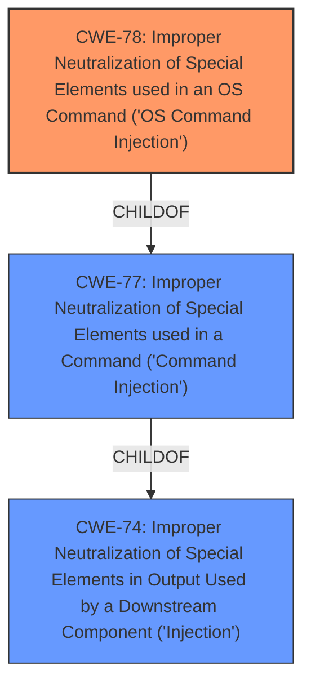

# Analysis for CVE-2022-27268

# Summary
| CWE ID | CWE Name | Confidence | CWE Abstraction Level | CWE Vulnerability Mapping Label | CWE-Vulnerability Mapping Notes |
|---|---|---|---|---|---|
| CWE-78 | Improper Neutralization of Special Elements used in an OS Command ('OS Command Injection') | 0.8 | Base | Allowed | Primary CWE. The application constructs an OS command using external input, but it does not neutralize special elements that could modify the intended OS command. |

## Evidence and Confidence

*   **Confidence Score:** 0.8
*   **Evidence Strength:** MEDIUM

## Relationship Analysis
The primary relationship that influenced the decision was the ChildOf relationship between CWE-78 and CWE-77. While CWE-77 (Improper Neutralization of Special Elements used in a Command) is a more general class, CWE-78 (Improper Neutralization of Special Elements used in an OS Command) is a specific base case that is applicable given the context of a remote code execution vulnerability. The other relationships, such as CanFollow and CanAlsoBe, were not directly relevant in this case, as they describe potential follow-on or alternative weaknesses rather than hierarchical relationships. The abstraction level of CWE-78 (Base) is more specific than CWE-77 (Class) and is thus a more appropriate match for the vulnerability description.

## Vulnerability Chain
The vulnerability chain begins with the **improper neutralization** of special elements in the crafted packet. This leads to OS command injection, resulting in remote code execution.
  - **Root Cause:** Improper Neutralization (implicit in the description)
  - **Weakness:** CWE-78 Improper Neutralization of Special Elements used in an OS Command ('OS Command Injection')
  - **Impact:** Remote Code Execution

## Summary of Analysis
The initial assessment, based on the provided evidence, points to CWE-78 as the most appropriate classification. The vulnerability description explicitly mentions remote code execution via a crafted packet in the `get_cgi_from_memory` component, which strongly suggests OS command injection.

The primary evidence for this is:
*   **Vulnerability Description Key Phrases:**
    *   **impact:** remote code execution
    *   **vector:** crafted packet

This aligns with the description of CWE-78: "The product constructs all or part of an OS command using externally-influenced input from an upstream component, but it does not neutralize or incorrectly neutralizes special elements that could modify the intended OS command when it is sent to a downstream component."

The graph relationships also support this decision, as CWE-78 is a child of CWE-77 and CWE-74, indicating a more specific type of command injection.

Other CWEs were considered, but ultimately deemed less appropriate:

*   CWE-77: While also related to command injection, it is a more general class and does not specifically refer to OS commands.
*   CWE-94: Code Injection is a broader category, and OS command injection is a more precise description in this case.
*   CWE-121: Stack-based Buffer Overflow is a possibility, but the description focuses on command execution rather than memory corruption.
*   CWE-184: Incomplete List of Disallowed Inputs is a potential contributing factor, but not the primary weakness.

The selected CWE is at the optimal level of specificity because it directly addresses the root cause of the vulnerability: the **improper neutralization** of special elements leading to OS command injection and subsequent remote code execution. It is a Base-level CWE, which is the preferred level of abstraction for mapping to root causes.