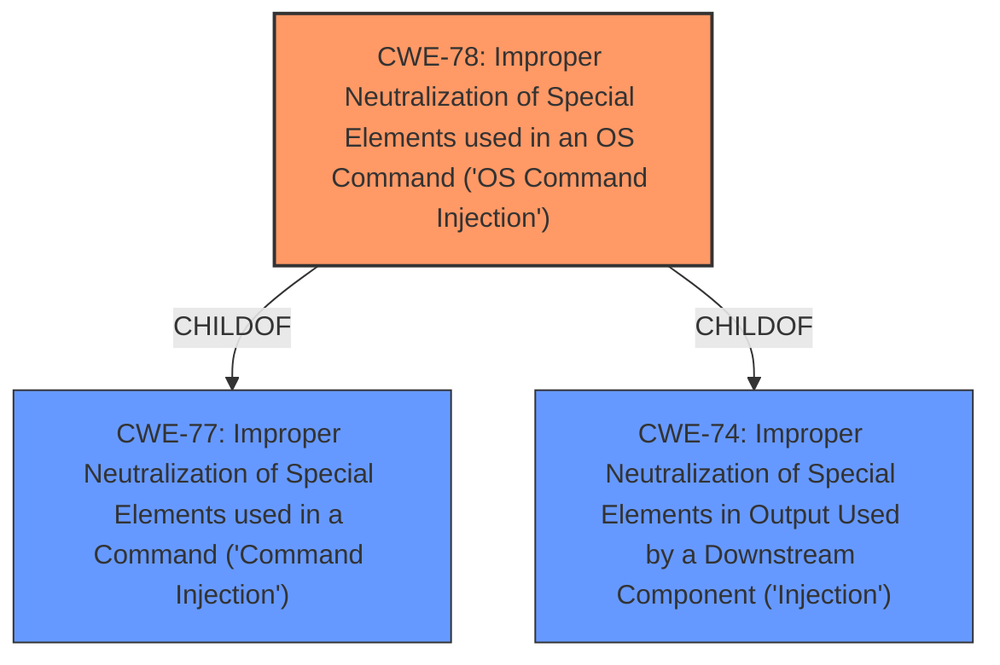

# Enhanced Analysis for CVE-2022-27270

# Summary
| CWE ID | CWE Name | Confidence | CWE Abstraction Level | CWE Vulnerability Mapping Label | CWE-Vulnerability Mapping Notes |
|---|---|---|---|---|---|
| CWE-78 | Improper Neutralization of Special Elements used in an OS Command ('OS Command Injection') | 0.8 | Base | Allowed | Primary CWE |

## Evidence and Confidence

*   **Confidence Score:** 0.8
*   **Evidence Strength:** MEDIUM

## Relationship Analysis
The primary CWE selected is CWE-78, which is a Base level CWE. It is a child of CWE-77 and CWE-74, representing command injection vulnerabilities. The relationship analysis confirms that CWE-78 is the most specific and appropriate choice given the vulnerability description.



## Vulnerability Chain
The vulnerability chain starts with the **improper neutralization** of special elements in a crafted packet, leading to OS Command Injection and ultimately resulting in Remote Code Execution.

## Summary of Analysis
The initial analysis identified CWE-78 as the primary candidate based on the vulnerability description and the provided context. The description clearly states a remote code execution vulnerability triggered via a **crafted packet** within the `ipsec_secrets` component. The CWE for similar CVE Descriptions also lists CWE-78 as the primary match.

The retriever results further support this selection, with CWE-78 being the top combined result. The complete CWE specifications confirm that CWE-78 accurately describes the vulnerability, as it involves the product constructing an OS command using externally influenced input without proper neutralization of special elements. The evidence in the vulnerability description combined with the retriever results and CWE specifications allows me to confidently select CWE-78 as the primary CWE for this vulnerability.

Relevant CWE Information:

# Enhanced Context (25 CWEs)
The following CWEs were identified as potentially relevant to this vulnerability:

## CWE-74: Improper Neutralization of Special Elements in Output Used by a Downstream Component ('Injection')
**Abstraction Level**: Class
**Similarity Score**: 0.76
**Source**: dense

**Description**:
The product constructs all or part of a command, data structure, or record using externally-influenced input from an upstream component, but it does not neutralize or incorrectly neutralizes special elements that could modify how it is parsed or interpreted when it is sent to a downstream component.

**Mapping Guidance**:
- Usage: Discouraged
- Rationale: CWE-74 is high-level and often misused when lower-level weaknesses are more appropriate.

## CWE-78: Improper Neutralization of Special Elements used in an OS Command ('OS Command Injection')
**Abstraction Level**: base
**Similarity Score**: 5.03
**Source**: graph

**Description**:
CWE-78: Improper Neutralization of Special Elements used in an OS Command ('OS Command Injection')

**Mapping Guidance**:
- Usage: Allowed
- Rationale: This CWE entry is at the Base level of abstraction, which is a preferred level of abstraction for mapping to the root causes of vulnerabilities.

**Relationships**:
- CANFOLLOW -> CWE-184
- CANALSOBE -> CWE-88
- CHILDOF -> CWE-77
- CHILDOF -> CWE-77
- CHILDOF -> CWE-74

The analysis and final conclusion were based on the provided evidence. CWE-78 is at the optimal level of specificity as it accurately reflects the root cause of the vulnerability: the **improper neutralization** of special elements leading to OS command injection.


## CWE Relationship Analysis

Current CWEs represent these abstraction levels: .


### Vulnerability Chain Analysis

**Chain starting from CWE-184:**
- 184 (Incomplete List of Disallowed Inputs) - ROOT


**Chain starting from CWE-78:**
- 78 (Improper Neutralization of Special Elements used in an OS Command ('OS Command Injection')) - ROOT


### CWE Relationship Diagram

```mermaid
graph TD
    classDef primary fill:#f96,stroke:#333,stroke-width:2px
    classDef secondary fill:#69f,stroke:#333
    classDef tertiary fill:#9e9,stroke:#333
```