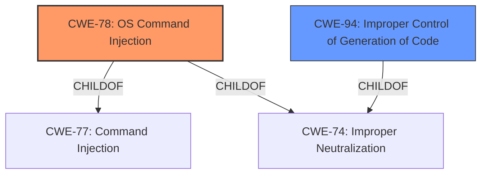

# Raw Analyzer Response for CVE-2022-27271

# Summary
| CWE ID | CWE Name | Confidence | CWE Abstraction Level | CWE Vulnerability Mapping Label | CWE-Vulnerability Mapping Notes |
|---|---|---|---|---|---|
| CWE-78 | Improper Neutralization of Special Elements used in an OS Command ('OS Command Injection') | 0.8 | Base | Allowed | Primary CWE: The router constructs an OS command using externally-influenced input from a crafted packet, but it does not neutralize or incorrectly neutralizes special elements that could modify the intended OS command. |
| CWE-94 | Improper Control of Generation of Code ('Code Injection') | 0.6 | Base | Allowed-with-Review | Secondary CWE: The router constructs a code segment using externally-influenced input from a crafted packet, but it does not neutralize or incorrectly neutralizes special elements that could modify the syntax or behavior of the intended code segment. |

## Evidence and Confidence

*   **Confidence Score:** 0.7
*   **Evidence Strength:** MEDIUM

## Relationship Analysis
The primary CWE is CWE-78, which represents the injection of OS commands due to **improper neutralization**. CWE-78 is a base CWE, providing a good level of specificity. CWE-78 is a child of CWE-77 (Command Injection) and CWE-74 (Improper Neutralization of Special Elements in Output Used by a Downstream Component ('Injection')).

The secondary CWE is CWE-94, which represents code injection. CWE-94 is also a base CWE. CWE-94 is a child of CWE-74.

## Vulnerability Chain
The vulnerability chain begins with the receipt of a crafted packet. Due to **improper access control**, the crafted packet is processed by the python-lib component. The python-lib component then constructs an OS command or code segment using the data from the crafted packet without properly neutralizing special elements, leading to command or code injection, and resulting in remote code execution.

## Summary of Analysis
The vulnerability description states that there is a remote code execution (RCE) vulnerability via the component python-lib, and that the vulnerability is triggered via a crafted packet. The key phrase is "**improper access control**". The primary CWE match from similar CVE descriptions is CWE-78 (Improper Neutralization of Special Elements used in an OS Command).

CWE-78 aligns well because the vulnerability involves a crafted packet being used to inject OS commands due to the python-lib component **improperly neutralizing special elements**. This could lead to the execution of arbitrary commands. CWE-78 is a base CWE, which is the preferred level of abstraction. The mapping guidance for CWE-78 states that it is allowed.

CWE-94 (Improper Control of Generation of Code ('Code Injection')) is also considered because python-lib is mentioned as a component. If the crafted packet is used to inject code segments that are then executed, CWE-94 would be appropriate. This CWE is considered as a secondary candidate.

The retriever results also list other CWEs such as CWE-121 (Stack-based Buffer Overflow), CWE-125 (Out-of-bounds Read), and CWE-259 (Use of Hard-coded Password). These CWEs are not selected because there is no direct evidence in the vulnerability description to support them. The vulnerability description mentions RCE via a crafted packet, and **improper access control**, which is more aligned with injection-related CWEs rather than memory corruption or hard-coded credentials.

The selection of CWE-78 and CWE-94 is based on the available evidence and the relationships between the CWEs. Both CWEs represent the **improper neutralization** or control of special elements within commands or code, leading to RCE. They are at the base level of abstraction.