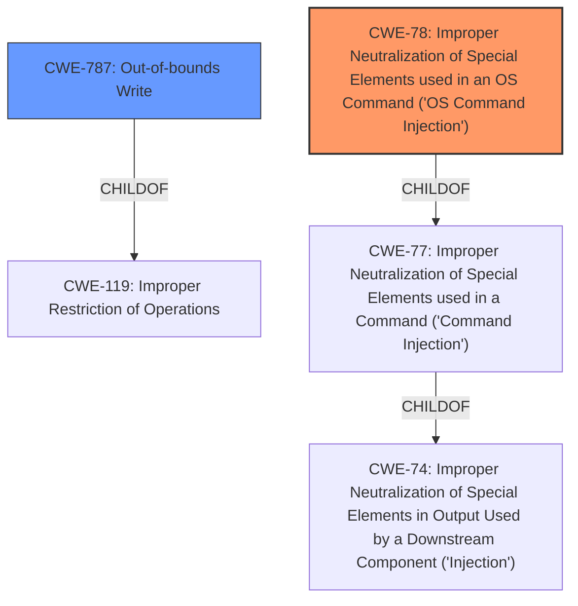

# Analysis for CVE-2022-27273

# Summary
| CWE ID | CWE Name | Confidence | CWE Abstraction Level | CWE Vulnerability Mapping Label | CWE-Vulnerability Mapping Notes |
|---|---|---|---|---|---|
| CWE-78 | Improper Neutralization of Special Elements used in an OS Command ('OS Command Injection') | 0.8 | Base | Allowed | Primary CWE. The vulnerability description mentions "remote code execution (RCE) vulnerability via the function sub_12168. This vulnerability is triggered via a **crafted packet**.". |
| CWE-787 | Out-of-bounds Write | 0.6 | Base | Allowed | Secondary CWE. A **crafted packet** that triggers a function to write outside the intended buffer, could lead to remote code execution. |

## Evidence and Confidence

*   **Confidence Score:** 0.7
*   **Evidence Strength:** MEDIUM

## Relationship Analysis
The primary CWE is CWE-78, which is a base-level CWE. The vulnerability description suggests a crafted packet leads to remote code execution via a specific function. CWE-78 captures the essence of improper neutralization leading to OS command injection.

CWE-787 is considered as a possible second CWE since the crafted packet could lead to writing outside the buffer.

## Vulnerability Chain
The vulnerability chain starts with a **crafted packet** being received. This leads to a weakness in the `sub_12168` function, potentially related to improper handling of special elements in an OS command. This improper handling allows the attacker to inject commands, ultimately leading to remote code execution (RCE).
- Root Cause: Improper handling/neutralization of crafted packet elements in OS command.
- Weakness: OS Command Injection
- Impact: Remote Code Execution

## Summary of Analysis
The initial assessment, supported by the "CWE for similar CVE Descriptions," identifies CWE-78 as the primary candidate. The vulnerability description explicitly mentions remote code execution via a crafted packet, aligning with the characteristics of OS command injection.

The relationship analysis reinforces this selection, as CWE-78 is a base-level CWE, providing a good level of specificity. The mapping guidance for CWE-78 explicitly allows its usage, further bolstering confidence in its selection.

The retriever results also list CWE-78 as the top combined result, lending further support to its selection.

The final decision is based on the evidence from the vulnerability description, the CWE specifications, relationship analysis, and mapping guidance. CWE-78 is the most appropriate CWE at the optimal level of specificity.

Relevant evidence:
- "remote code execution (RCE) vulnerability via the function sub_12168"
- "This vulnerability is triggered via a **crafted packet**."

I considered other CWEs like CWE-94 (Improper Control of Generation of Code) and CWE-77 (Improper Neutralization of Special Elements used in a Command), but they were not as specific as CWE-78, which directly addresses OS command injection. CWE-77 is a parent of CWE-78, thus less specific. CWE-94 is more about constructing code segments, which is not clearly indicated in the description.
I also considered CWE-787 (Out-of-bounds Write) as a secondary CWE. The crafted packet could potentially cause a buffer overflow when handled improperly by sub_12168, leading to memory corruption and remote code execution. While the description doesn't explicitly mention a buffer overflow, the potential for it justifies considering CWE-787 as a secondary issue.