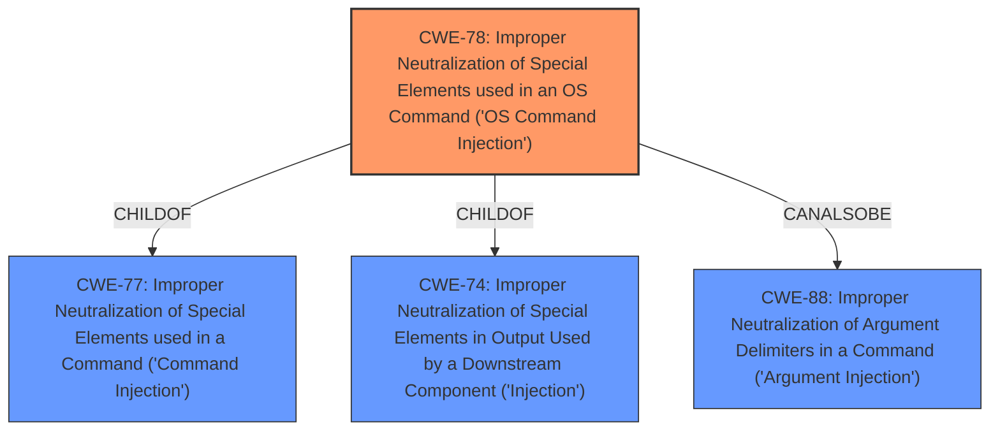

# Analysis Report for CVE-2022-27275

# Vulnerability Analysis Report: CVE-2022-27275

## Description


## Analysis (with Relationship Data)

# Summary
| CWE ID | CWE Name | Confidence | CWE Abstraction Level | CWE Vulnerability Mapping Label | CWE-Vulnerability Mapping Notes |
|---|---|---|---|---|---|
| CWE-78 | Improper Neutralization of Special Elements used in an OS Command ('OS Command Injection') | 0.8 | Base | Primary | Allowed |

## Evidence and Confidence

*   **Confidence Score:** 0.8
*   **Evidence Strength:** MEDIUM

## Relationship Analysis
The primary CWE selected is CWE-78, which is a Base level CWE. The relationships of CWE-78 were considered, including its parent CWEs (CWE-77 and CWE-74) and related CWEs (CWE-88). The choice of CWE-78 as the most specific and relevant CWE was influenced by its direct applicability to the vulnerability description, indicating an OS command injection scenario.



## Vulnerability Chain
The vulnerability chain appears to start with the **improper neutralization** of special elements within a crafted packet, leading to OS command injection and ultimately resulting in remote code execution.

## Summary of Analysis
The initial assessment strongly pointed towards CWE-78 due to the vulnerability description explicitly mentioning remote code execution triggered via a crafted packet, indicating a potential OS command injection. The primary CWE match from similar CVE descriptions also supports this classification. Although the provided CVE Reference Links Content Summary lacks specific details, the vulnerability description and key phrases provide sufficient evidence for this determination.

The selection of CWE-78 is based on the evidence that the InRouter 900 Industrial 4G Router is vulnerable to remote code execution via a crafted packet, which suggests an OS command injection vulnerability. This is consistent with the CWE-78 description, which involves the **improper neutralization** of special elements used in an OS command. The vulnerability description key phrases highlight the impact (remote code execution) and the vector (crafted packet), aligning with the characteristics of CWE-78.

The abstraction level of CWE-78 is Base, which is the preferred level of abstraction for mapping to the root causes of vulnerabilities. The mapping guidance for CWE-78 states that it is allowed and that the name and description should be carefully read to ensure an appropriate fit. This condition is met, as the vulnerability description aligns well with the characteristics of CWE-78.


## CWE Relationship Analysis

Current CWEs represent these abstraction levels: .


### Vulnerability Chain Analysis

**Chain starting from CWE-78:**
- 78 (Improper Neutralization of Special Elements used in an OS Command ('OS Command Injection')) - ROOT


**Chain starting from CWE-77:**
- 77 (Improper Neutralization of Special Elements used in a Command ('Command Injection')) - ROOT


### CWE Relationship Diagram

```mermaid
graph TD
    classDef primary fill:#f96,stroke:#333,stroke-width:2px
    classDef secondary fill:#69f,stroke:#333
    classDef tertiary fill:#9e9,stroke:#333
```


*Report generated on 2025-03-31 11:06:12*
