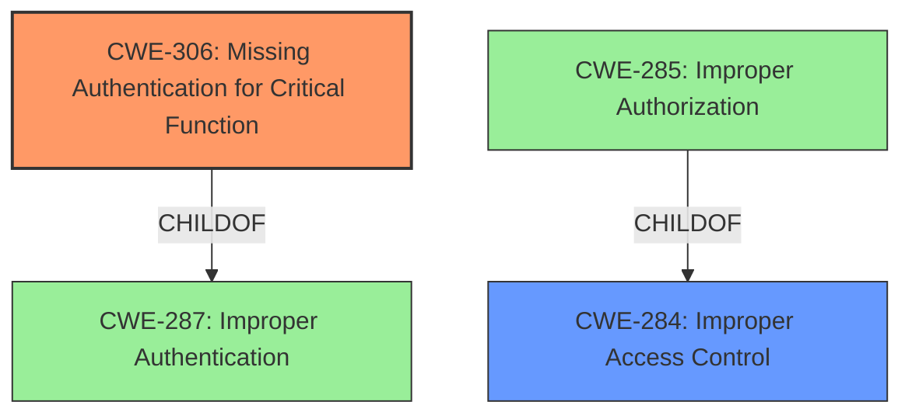

# Analysis for CVE-2022-27332

# Summary
| CWE ID | CWE Name | Confidence | CWE Abstraction Level | CWE Vulnerability Mapping Label | CWE-Vulnerability Mapping Notes |
|---|---|---|---|---|---|
| CWE-306 | Missing Authentication for Critical Function | 1.0 | Base | Allowed | Primary CWE |
| CWE-284 | Improper Access Control | 0.5 | Pillar | Discouraged | Secondary Candidate |

## Evidence and Confidence

*   **Confidence Score:** 1.0
*   **Evidence Strength:** HIGH

## Relationship Analysis
The primary CWE selected is CWE-306, which is a Base level CWE and a child of CWE-287 (Improper Authentication). CWE-284 (Improper Access Control) is a high-level Pillar and a parent of CWE-285 (Improper Authorization). CWE-306 is a more specific case of missing authentication. The vulnerability description clearly states that the issue is the **lack of authentication**, making CWE-306 the more precise choice.

## Vulnerability Chain
The vulnerability chain begins with the **missing authentication** (**CWE-306**) for writing entries to the CTI caller log. This leads to unauthorized access, enabling attackers to write entries without authentication. The impact includes potential phishing attacks and denial of service.

## Summary of Analysis
The initial assessment considered multiple CWEs, primarily focusing on the "Retriever Results." However, after analyzing the vulnerability description and available evidence, the most relevant CWE is **CWE-306 (Missing Authentication for Critical Function)**. This is due to the explicit mention of writing entries to the CTI caller log **without authentication**. The "CVE Reference Links Content Summary" also confirms the **root cause** as incorrect access checking.

The selection is heavily based on the vulnerability description and the CVE reference summary, both of which clearly point to the absence of authentication as the primary issue.

The evidence supporting this decision comes directly from the vulnerability description: "An **access control issue** in Zammad v5.0.3 allows attackers to write entries to the CTI caller log **without authentication**."

The graph relationships further support this, as CWE-306 is a base CWE, offering the most specific classification. The retriever scores also list CWE-306 as the top candidate.

The selected CWEs are at the optimal level of specificity because CWE-306 precisely describes the **root cause**: the **lack of authentication** for a critical function. This directly enables the vulnerability.

Relevant CWE Information:

# Enhanced Context (25 CWEs)

## CWE-306: Missing Authentication for Critical Function
**Abstraction:** Base
**Status:** Draft

### Description
The product does not perform any authentication for functionality that requires a provable user identity or consumes a significant amount of resources.

### Extended Description
Not provided

### Alternative Terms
None

### Relationships
ChildOf -> CWE-287
ChildOf -> CWE-287

### Mapping Guidance
**Usage:** Allowed
**Rationale:** This CWE entry is at the Base level of abstraction, which is a preferred level of abstraction for mapping to the root causes of vulnerabilities.
**Comments:** Carefully read both the name and description to ensure that this mapping is an appropriate fit. Do not try to 'force' a mapping to a lower-level Base/Variant simply to comply with this preferred level of abstraction.
**Reasons:**
- Acceptable-Use

### Observed Examples
- **CVE-2022-31260:** Chain: a digital asset management program has an undisclosed backdoor in the legacy version of a PHP script (CWE-912) that could allow an unauthenticated user to export metadata (CWE-306)
- **CVE-2022-29951:** TCP-based protocol in Programmable Logic Controller (PLC) has no authentication.
- **CVE-2022-29952:** Condition Monitor firmware uses a protocol that does not require authentication.

### How the vulnerability's details match the CWE's characteristics:
The vulnerability allows attackers to write entries to the CTI caller log without any authentication, directly matching the description of CWE-306.
### The security implications and potential impact:
The security implications include the ability for attackers to execute phishing attacks and cause a Denial of Service (DoS).
### Any parent-child relationships or chain patterns that influenced your mapping:
CWE-306 is a child of CWE-287 (Improper Authentication). While CWE-287 could be considered, CWE-306 is more specific, focusing on the "missing" aspect of authentication.
### Whether the weakness is primary or secondary in the vulnerability:
The weakness is primary, as the missing authentication is the direct cause of the vulnerability.
### How the official MITRE mapping guidance influenced your decision:
The MITRE mapping guidance allows the use of CWE-306 and indicates that it is at a preferred level of abstraction.

## CWE-284: Improper Access Control
**Abstraction:** Pillar
**Status:** Incomplete

### Description
The product does not restrict or incorrectly restricts access to a resource from an unauthorized actor.

### Extended Description

Access control involves the use of several protection mechanisms such as:
  - Authentication (proving the identity of an actor)
  - Authorization (ensuring that a given actor can access a resource), and
  - Accountability (tracking of activities that were performed)

When any mechanism is not applied or otherwise fails, attackers can compromise the security of the product by gaining privileges, reading sensitive information, executing commands, evading detection, etc.

There are two distinct behaviors that can introduce access control weaknesses:
  - Specification: incorrect privileges, permissions, ownership, etc. are explicitly specified for either the user or the resource (for example, setting a password file to be world-writable, or giving administrator capabilities to a guest user). This action could be performed by the program or the administrator.
  - Enforcement: the mechanism contains errors that prevent it from properly enforcing the specified access control requirements (e.g., allowing the user to specify their own privileges, or allowing a syntactically-incorrect ACL to produce insecure settings). This problem occurs within the program itself, in that it does not actually enforce the intended security policy that the administrator specifies.

### Alternative Terms
Authorization: The terms "access control" and "authorization" are often used interchangeably, although many people have distinct definitions. The CWE usage of "access control" is intended as a general term for the various mechanisms that restrict which users can access which resources, and "authorization" is more narrowly defined. It is unlikely that there will be community consensus on the use of these terms.

### Relationships
None

### Mapping Guidance
**Usage:** Discouraged
**Rationale:** CWE-284 is extremely high-level, a Pillar. Its name, "Improper Access Control," is often misused in low-information vulnerability reports or by active use of the OWASP Top Ten, such as "A01:2021-Broken Access Control". It is not useful for trend analysis.
**Comments:** Consider using descendants of CWE-284 that are more specific to the kind of access control involved, such as those involving authorization (Missing Authorization (CWE-862), Incorrect Authorization (CWE-863), Incorrect Permission Assignment for Critical Resource (CWE-732), etc.); authentication (Missing Authentication (CWE-306) or Weak Authentication (CWE-1390)); Incorrect User Management (CWE-286); Improper Restriction of Communication Channel to Intended Endpoints (CWE-923); etc.
**Reasons:**
- Frequent Misuse
- Abstraction
**Suggested Alternatives:**
- CWE-862: Missing Authorization
- CWE-863: Incorrect Authorization
- CWE-732: Incorrect Permission Assignment for Critical Resource
- CWE-306: Missing Authentication
- CWE-1390: Weak Authentication
- CWE-923: Improper Restriction of Communication Channel to Intended Endpoints

### Additional Notes
**[Maintenance]** 
This entry needs more work. Possible sub-categories include:
  - Trusted group includes undesired entities (partially covered by CWE-286)
  - Group can perform undesired actions
  - ACL parse error does not fail closed

### Observed Examples
- **CVE-2022-24985:** A form hosting website only checks the session authentication status for a single form, making it possible to bypass authentication when there are multiple forms
- **CVE-