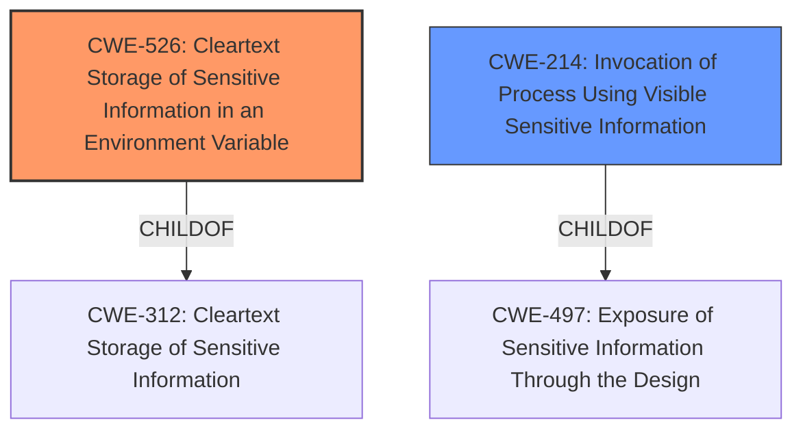

# Analysis Report for CVE-2022-2739

# Vulnerability Analysis Report: CVE-2022-2739

## Description


## Analysis (with Relationship Data)

# Summary
| CWE ID | CWE Name | Confidence | CWE Abstraction Level | CWE Vulnerability Mapping Label | CWE-Vulnerability Mapping Notes |
|---|---|---|---|---|---|
| CWE-526 | Cleartext Storage of Sensitive Information in an Environment Variable | 0.9 | Variant | Allowed | Primary CWE. The vulnerability allows an attacker to gain access to sensitive information stored in environment variables. |
| CWE-214 | Invocation of Process Using Visible Sensitive Information | 0.6 | Base | Allowed | Secondary CWE. An attacker could view the sensitive information if it was visible in the process invocation. |

## Evidence and Confidence

*   **Confidence Score:** 0.8
*   **Evidence Strength:** HIGH

## Relationship Analysis
The primary CWE is CWE-526 (Cleartext Storage of Sensitive Information in an Environment Variable), a Variant of CWE-312 (Cleartext Storage of Sensitive Information). CWE-214 (Invocation of Process Using Visible Sensitive Information) is a Base CWE and a ChildOf CWE-497 (Exposure of Sensitive Information Through the Design). CWE-526 and CWE-214 are related because sensitive information stored in environment variables (CWE-526) might be exposed during process invocation (CWE-214).



## Vulnerability Chain
The vulnerability chain starts with the **incorrect** version of podman being included in the RHSA-2022:2190 advisory, which leads to the **failure to include the necessary fix for CVE-2020-14370**. This missing fix allows an attacker to gain access to sensitive information stored in environment variables (CWE-526) if an attacker has control over subsequent containers. It is also possible that the sensitive information in environment variables could be exposed during process invocation (CWE-214).

## Summary of Analysis
The initial assessment focused on the root cause, which is the inclusion of an **incorrect** podman version and the **failure to include the necessary fix** for CVE-2020-14370. The primary weakness is that this allows an attacker to gain access to sensitive information stored in environment variables.

The evidence for CWE-526 is strong: "This issue could possibly allow an attacker to gain access to sensitive information stored in environment variables." The CVE Reference Links Content Summary also states: "This vulnerability allows an attacker with control over subsequent containers to access sensitive information stored in environment variables."

CWE-526 (Cleartext Storage of Sensitive Information in an Environment Variable) is chosen as the primary CWE because it directly addresses the core issue: the exposure of sensitive information through environment variables. This is a Variant level CWE, providing a specific classification.

CWE-214 (Invocation of Process Using Visible Sensitive Information) is a secondary consideration, since it's possible the environment variables could be visible during process invocation, though this is not explicitly stated. This is a Base level CWE.

CWEs like CWE-22 (Improper Limitation of a Pathname to a Restricted Directory ('Path Traversal')), CWE-918 (Server-Side Request Forgery (SSRF)), and CWE-863 (Incorrect Authorization) were considered but rejected because they don't directly relate to the core issue of sensitive information exposure via environment variables. They have different mechanisms and attack vectors than the described vulnerability.


## CWE Relationship Analysis

Current CWEs represent these abstraction levels: .


### Vulnerability Chain Analysis

**Chain starting from CWE-918:**
- 918 (Server-Side Request Forgery (SSRF)) - ROOT


**Chain starting from CWE-312:**
- 312 (Cleartext Storage of Sensitive Information) - ROOT


### CWE Relationship Diagram

```mermaid
graph TD
    classDef primary fill:#f96,stroke:#333,stroke-width:2px
    classDef secondary fill:#69f,stroke:#333
    classDef tertiary fill:#9e9,stroke:#333
```


*Report generated on 2025-03-30 16:26:41*
