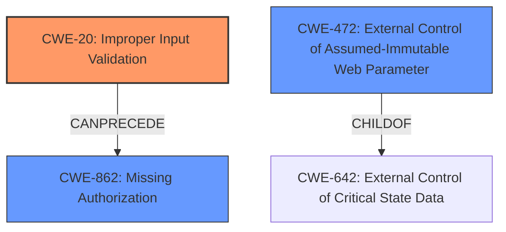

# Enhanced Analysis for CVE-2022-27421

# Summary
| CWE ID  | CWE Name                                                        | Confidence | CWE Abstraction Level | CWE Vulnerability Mapping Label | CWE-Vulnerability Mapping Notes |
| :-------- | :-------------------------------------------------------------- | :--------- | :---------------------- | :------------------------------ | :------------------------------ |
| CWE-20   | Improper Input Validation  | 0.75       | Class                   | Discouraged |  The product **lacks validation** on the user modification form, allowing attackers to escalate privileges to Platform Admin. |
| CWE-862 | Missing Authorization                                             | 0.50       | Class                   | Allowed-with-Review  | Secondary Candidate: Could also be related to **missing authorization** when modifying user roles. |
| CWE-472 | External Control of Assumed-Immutable Web Parameter                                             | 0.50       | Base                   | Allowed  | Secondary Candidate: The user modification form may have hidden fields that are not properly validated. |

## Evidence and Confidence

*   **Confidence Score:** 0.6
*   **Evidence Strength:** MEDIUM

## Relationship Analysis
The primary relationship influencing the decision is that CWE-20 [Improper Input Validation] can lead to various downstream consequences, including privilege escalation. Additionally, CWE-862 [Missing Authorization] and CWE-472 [External Control of Assumed-Immutable Web Parameter] were considered as potential contributing factors due to the context of user modification and privilege management. The abstraction levels were considered to find the most specific CWE, with CWE-20 being a class level and CWE-472 a base level.



## Vulnerability Chain
The vulnerability chain starts with **lacking validation** (CWE-20) on the user modification form. This allows attackers to manipulate input and ultimately escalate their privileges to Platform Admin. The chain could involve missing authorization checks (CWE-862) or manipulation of assumed-immutable parameters (CWE-472) if these are part of the user modification process.

## Summary of Analysis
Initially, the vulnerability description indicated a **lack of validation** on the user modification form, which allows attackers to escalate privileges.

The primary assessment is based on the phrase "**lacks validation**" in the vulnerability description. This points directly to CWE-20 [Improper Input Validation]. The other CWEs considered were CWE-862 [Missing Authorization] and CWE-472 [External Control of Assumed-Immutable Web Parameter].

CWE-20 is a class-level CWE, and the description states, "The product receives input or data, but it does not validate or incorrectly validates that the input has the properties that are required to process the data safely and correctly." This aligns with the vulnerability description, as the user modification form **lacks validation**, leading to a security vulnerability. Although CWE-20 is discouraged, the evidence points to it as the primary weakness.

CWE-862 [Missing Authorization] was considered because privilege escalation often involves authorization bypass. However, the description lacks explicit mention of missing authorization checks, making it a less direct fit.

CWE-472 [External Control of Assumed-Immutable Web Parameter] was also considered, particularly if hidden form fields are used to store user roles or permissions. If these fields are not validated, attackers could potentially modify them to escalate their privileges.

The relationships in the graph influenced the decision to include CWE-862 and CWE-472 as secondary candidates, as improper input validation can often lead to authorization bypass or manipulation of critical state data.

The selected CWEs are at the optimal level of specificity given the available information. While more specific variants of CWE-20 might exist, the description does not provide enough detail to pinpoint the exact type of input validation failure.

Relevant CWE Information:

# Enhanced Context (25 CWEs)
The following CWEs were identified as potentially relevant to this vulnerability:

## CWE-1220: Insufficient Granularity of Access Control
**Abstraction Level**: Base
**Similarity Score**: 0.80
**Source**: dense

**Description**:
The product implements access controls via a policy or other feature with the intention to disable or restrict accesses (reads and/or writes) to assets in a system from untrusted agents. However, implemented access controls lack required granularity, which renders the control policy too broad because it allows accesses from unauthorized agents to the security-sensitive assets.

**Mapping Guidance**:
- Usage: Allowed
- Rationale: This CWE entry is at the Base level of abstraction, which is a preferred level of abstraction for mapping to the root causes of vulnerabilities.


## CWE-653: Improper Isolation or Compartmentalization
**Abstraction Level**: Class
**Similarity Score**: 0.78
**Source**: dense

**Description**:
The product does not properly compartmentalize or isolate functionality, processes, or resources that require different privilege levels, rights, or permissions.

**Mapping Guidance**:
- Usage: Allowed
- Rationale: This CWE entry is at the Base level of abstraction, which is a preferred level of abstraction for mapping to the root causes of vulnerabilities.


## CWE-807: Reliance on Untrusted Inputs in a Security Decision
**Abstraction Level**: Base
**Similarity Score**: 0.78
**Source**: dense

**Description**:
The product uses a protection mechanism that relies on the existence or values of an input, but the input can be modified by an untrusted actor in a way that bypasses the protection mechanism.

**Mapping Guidance**:
- Usage: Allowed
- Rationale: This CWE entry is at the Base level of abstraction, which is a preferred level of abstraction for mapping to the root causes of vulnerabilities.


## CWE-274: Improper Handling of Insufficient Privileges
**Abstraction Level**: Base
**Similarity Score**: 0.78
**Source**: dense

**Description**:
The product does not handle or incorrectly handles when it has insufficient privileges to perform an operation, leading to resultant weaknesses.

**Mapping Guidance**:
- Usage: Discouraged
- Rationale: This CWE entry could be deprecated in a future version of CWE.


## CWE-472: External Control of Assumed-Immutable Web Parameter
**Abstraction Level**: Base
**Similarity Score**: 0.77
**Source**: dense

**Description**:
The web application does not sufficiently verify inputs that are assumed to be immutable but are actually externally controllable, such as hidden form fields.

**Mapping Guidance**:
- Usage: Allowed
- Rationale: This CWE entry is at the Base level of abstraction, which is a preferred level of abstraction for mapping to the root causes of vulnerabilities.


## CWE-1289: Improper Validation of Unsafe Equivalence in Input
**Abstraction Level**: Base
**Similarity Score**: 0.77
**Source**: dense

**Description**:
The product receives an input value that is used as a resource identifier or other type of reference, but it does not validate or incorrectly validates that the input is equivalent to a potentially-unsafe value.

**Mapping Guidance**:
- Usage: Allowed
- Rationale: This CWE entry is at the Base level of abstraction, which is a preferred level of abstraction for mapping to the root causes of vulnerabilities.


## CWE-280: Improper Handling of Insufficient Permissions or Privileges 
**Abstraction Level**: Base
**Similarity Score**: 0.76
**Source**: dense

**Description**:
The product does not handle or incorrectly handles when it has insufficient privileges to access resources or functionality as specified by their permissions. This may cause it to follow unexpected code paths that may leave the product in an invalid state.

**Mapping Guidance**:
- Usage: Allowed
- Rationale: This CWE entry is at the Base level of abstraction, which is a preferred level of abstraction for mapping to the root causes of vulnerabilities.


## CWE-267: Privilege Defined With Unsafe Actions
**Abstraction Level**: Base
**Similarity Score**: 0.76
**Source**: dense

**Description**:
A particular privilege, role, capability, or right can be used to perform unsafe actions that were not intended, even when it is assigned to the correct entity.

**Mapping Guidance**:
- Usage: Allowed
- Rationale: This CWE entry is at the Base level of abstraction, which is a preferred level of abstraction for mapping to the root causes of vulnerabilities.


## CWE-266: Incorrect Privilege Assignment
**Abstraction Level**: Base
**Similarity Score**: 0.76
**Source**: dense

**Description**:
A product incorrectly assigns a privilege to a particular actor, creating an unintended sphere of control for that actor.

**Mapping Guidance**:
- Usage: Allowed
- Rationale: This CWE entry is at the Base level of abstraction


## CWE Relationship Analysis

Current CWEs represent these abstraction levels: .


### Vulnerability Chain Analysis

**Chain starting from CWE-862:**
- 862 (Missing Authorization) - ROOT


**Chain starting from CWE-472:**
- 472 (External Control of Assumed-Immutable Web Parameter) - ROOT


### CWE Relationship Diagram

```mermaid
graph TD
    classDef primary fill:#f96,stroke:#333,stroke-width:2px
    classDef secondary fill:#69f,stroke:#333
    classDef tertiary fill:#9e9,stroke:#333
```