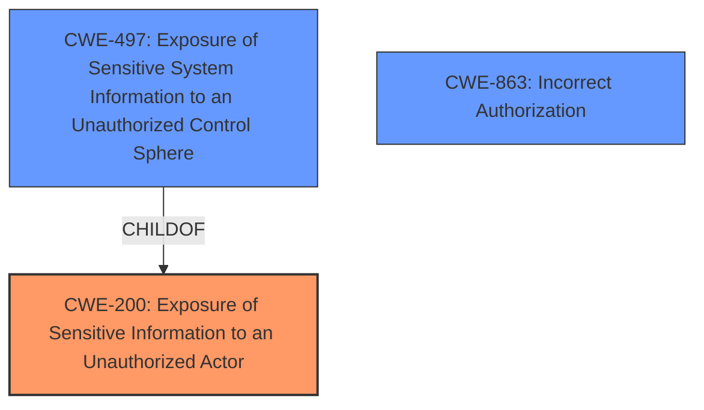

# Analysis for CVE-2022-27490

# Summary

| CWE ID | CWE Name | Confidence | CWE Abstraction Level | CWE Vulnerability Mapping Label | CWE-Vulnerability Mapping Notes |
|---|---|---|---|---|---|
| CWE-200 | Exposure of Sensitive Information to an Unauthorized Actor | 0.9 | Class | Primary | Discouraged due to being a high-level class, but most applicable based on the evidence. |
| CWE-497 | Exposure of Sensitive System Information to an Unauthorized Control Sphere | 0.7 | Base | Secondary | Allowed; a more specific type of CWE-200, but evidence is less direct. |
| CWE-863 | Incorrect Authorization | 0.6 | Class | Secondary | Allowed-with-Review; considered as a potential root cause but the description focuses more on information exposure. |

## Evidence and Confidence

*   **Confidence Score:** 0.8
*   **Evidence Strength:** MEDIUM

## Relationship Analysis
The primary CWE is CWE-200 [CWE-200: Exposure of Sensitive Information to an Unauthorized Actor], which is a Class-level CWE. CWE-497 [CWE-497: Exposure of Sensitive System Information to an Unauthorized Control Sphere] is a Base-level CWE and a child of CWE-200. CWE-863 [CWE-863: Incorrect Authorization] is a Class-level CWE, representing an authorization issue, but it's not a direct parent/child relationship with CWE-200. The choice of CWE-200 as primary is due to the explicit mention of "exposure of sensitive information" in both the vulnerability description and the CVE Reference Links Content Summary. While CWE-497 is more specific, the evidence to support it is less direct. CWE-863 was considered as a potential root cause due to **insufficient access controls**, but the description focuses more on the information exposure itself.

## Vulnerability Chain
The vulnerability chain starts with **insufficient access controls** on `diagnose debug` commands, which leads to the exposure of sensitive information to an unauthorized actor [CWE-200]. A restricted administrative account being able to use these commands highlights a potential **incorrect authorization** issue.
  - Root Cause: **Insufficient Access Controls**
  - Weakness: Exposure of sensitive information to unauthorized actor [CWE-200]
  - Impact: An attacker with restricted access can obtain sensitive information.

## Summary of Analysis
Initially, the vulnerability was assessed based on the description which clearly indicates an exposure of sensitive information due to **insufficient access controls**. The CVE Reference Links Content Summary explicitly states that an unauthorized information disclosure vulnerability exists due to **insufficient access controls** on `diagnose debug` commands and that weaknesses present include: exposure of sensitive information to an unauthorized actor [CWE-200].

The retriever results show several potentially relevant CWEs, including CWE-200 [CWE-200: Exposure of Sensitive Information to an Unauthorized Actor], CWE-497 [CWE-497: Exposure of Sensitive System Information to an Unauthorized Control Sphere], and CWE-863 [CWE-863: Incorrect Authorization]. While CWE-200 is discouraged due to being a high-level class, the description closely matches the vulnerability. CWE-497 is more specific, but the evidence is not as strong. CWE-863 is considered as a potential root cause.

The final decision is to assign CWE-200 as the primary weakness due to the explicit statement of "exposure of sensitive information" in the vulnerability description and CVE Reference Links Content Summary: "An unauthorized information disclosure vulnerability exists due to **insufficient access controls** on `diagnose debug` commands" and "Weaknesses/vulnerabilities present: Exposure of sensitive information to an unauthorized actor [CWE-200]." CWE-497 and CWE-863 are considered secondary candidates.

Relevant CWE Information:

# Enhanced Context (25 CWEs)
The following CWEs were identified as potentially relevant to this vulnerability:

## CWE-274: Improper Handling of Insufficient Privileges
**Abstraction Level**: Base
**Similarity Score**: 0.77
**Source**: dense

**Description**:
The product does not handle or incorrectly handles when it has insufficient privileges to perform an operation, leading to resultant weaknesses.

**Mapping Guidance**:
- Usage: Discouraged
- Rationale: This CWE entry could be deprecated in a future version of CWE.

## CWE-668: Exposure of Resource to Wrong Sphere
**Abstraction Level**: Class
**Similarity Score**: 0.76
**Source**: dense

**Description**:
The product exposes a resource to the wrong control sphere, providing unintended actors with inappropriate access to the resource.

**Mapping Guidance**:
- Usage: Discouraged
- Rationale: CWE-668 is high-level and is often misused as a catch-all when lower-level CWE IDs might be applicable. It is sometimes used for low-information vulnerability reports [REF-1287]. It is a level-1 Class (i.e., a child of a Pillar). It is not useful for trend analysis.

## CWE-653: Improper Isolation or Compartmentalization
**Abstraction Level**: Class
**Similarity Score**: 0.76
**Source**: dense

**Description**:
The product does not properly compartmentalize or isolate functionality, processes, or resources that require different privilege levels, rights, or permissions.

**Mapping Guidance**:
- Usage: Allowed
- Rationale: This CWE entry is at the Base level of abstraction, which is a preferred level of abstraction for mapping to the root causes of vulnerabilities.

## CWE-280: Improper Handling of Insufficient Permissions or Privileges 
**Abstraction Level**: Base
**Similarity Score**: 0.76
**Source**: dense

**Description**:
The product does not handle or incorrectly handles when it has insufficient privileges to access resources or functionality as specified by their permissions. This may cause it to follow unexpected code paths that may leave the product in an invalid state.

**Mapping Guidance**:
- Usage: Allowed
- Rationale: This CWE entry is at the Base level of abstraction, which is a preferred level of abstraction for mapping to the root causes of vulnerabilities.

## CWE-664: Improper Control of a Resource Through its Lifetime
**Abstraction Level**: Pillar
**Similarity Score**: 0.75
**Source**: dense

**Description**:
The product does not maintain or incorrectly maintains control over a resource throughout its lifetime of creation, use, and release.

**Mapping Guidance**:
- Usage: Discouraged
- Rationale: This CWE entry is high-level when lower-level children are available.

## CWE-497: Exposure of Sensitive System Information to an Unauthorized Control Sphere
**Abstraction Level**: Base
**Similarity Score**: 0.75
**Source**: dense

**Description**:
The product does not properly prevent sensitive system-level information from being accessed by unauthorized actors who do not have the same level of access to the underlying system as the product does.

**Mapping Guidance**:
- Usage: Allowed
- Rationale: This CWE entry is at the Base level of abstraction, which is a preferred level of abstraction for mapping to the root causes of vulnerabilities.

## CWE-1220: Insufficient Granularity of Access Control
**Abstraction Level**: Base
**Similarity Score**: 0.75
**Source**: dense

**Description**:
The product implements access controls via a policy or other feature with the intention to disable or restrict accesses (reads and/or writes) to assets in a system from untrusted agents. However, implemented access controls lack required granularity, which renders the control policy too broad because it allows accesses from unauthorized agents to the security-sensitive assets.

**Mapping Guidance**:
- Usage: Allowed
- Rationale: This CWE entry is at the Base level of abstraction, which is a preferred level of abstraction for mapping to the root causes of vulnerabilities.

## CWE-266: Incorrect Privilege Assignment
**Abstraction Level**: Base
**Similarity Score**: 0.74
**Source**: dense

**Description**:
A product incorrectly assigns a privilege to a particular actor, creating an unintended sphere of control for that actor.

**Mapping Guidance**:
- Usage: Allowed
- Rationale: This CWE entry is at the Base level of abstraction, which is a preferred level of abstraction for mapping to the root causes of vulnerabilities.

## CWE-73: External Control of File Name or Path
**Abstraction Level**: Base
**Similarity Score**: 0.74
**Source**: dense

**Description**:
The product allows user input to control or influence paths or file names that are