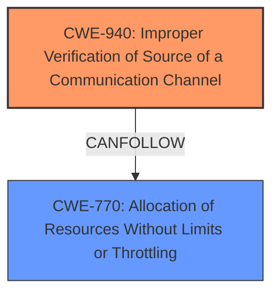

# Raw Analyzer Response for CVE-2022-27491

# Summary
| CWE ID | CWE Name | Confidence | CWE Abstraction Level | CWE Vulnerability Mapping Label | CWE-Vulnerability Mapping Notes |
|---|---|---|---|---|---|
| CWE-940 | Improper Verification of Source of a Communication Channel | 1.0 | Base | Allowed | Primary CWE |
| CWE-770 | Allocation of Resources Without Limits or Throttling | 0.6 | Base | Allowed | Secondary Candidate |

## Evidence and Confidence

*   **Confidence Score:** 0.8
*   **Evidence Strength:** HIGH

## Relationship Analysis
The primary relationship is that **CWE-940 (Improper Verification of Source of a Communication Channel)** is the root cause. While not explicitly in a parent-child relationship with **CWE-770 (Allocation of Resources Without Limits or Throttling)**, the impact of the improper verification leads to resource exhaustion, making it a potential following weakness in a chain. The abstraction levels are both Base, making them suitable for direct mapping.

## Vulnerability Chain
The vulnerability chain starts with the **improper verification of the source of a communication channel (CWE-940)**. This allows a remote attacker to send crafted TCP requests, which in turn triggers the FortiOS device to send blocked page HTML data to an arbitrary victim. The flooding of the victim with this data results in a denial-of-service, indicating a possible **allocation of resources without limits or throttling (CWE-770)**.

## Summary of Analysis
The initial analysis correctly identifies the root cause as an **improper verification of source of communication channel (CWE-940)**. This is based on the "Vulnerability Description Key Phrases" that indicates **improper verification of source of a communication channel** is the rootcause, and the "CVE Reference Links Content Summary" that states "The vulnerability stems from an improper verification of the source of a communication channel within FortiOS. This allows an attacker to manipulate TCP requests.". The retriever results also list **CWE-940** as the top candidate with the highest score.

The secondary analysis considers the impact of the vulnerability. The vulnerability allows a remote unauthenticated attacker to trigger the sending of blocked page HTML data to an arbitrary victim via crafted TCP requests, potentially flooding the victim, indicating a possible **allocation of resources without limits or throttling (CWE-770)**.

**CWE-940 (Improper Verification of Source of a Communication Channel)** is selected as the primary CWE because it directly reflects the **root cause** described in the vulnerability report.
**CWE-770 (Allocation of Resources Without Limits or Throttling)** is considered as a secondary weakness due to the impact of the vulnerability that leads to DoS.

Relevant CWE Information:

# Enhanced Context (25 CWEs)

## CWE-1289: Improper Validation of Unsafe Equivalence in Input
**Abstraction Level**: Base
**Similarity Score**: 0.80
**Source**: dense

**Description**:
The product receives an input value that is used as a resource identifier or other type of reference, but it does not validate or incorrectly validates that the input is equivalent to a potentially-unsafe value.

**Mapping Guidance**:
- Usage: Allowed
- Rationale: This CWE entry is at the Base level of abstraction, which is a preferred level of abstraction for mapping to the root causes of vulnerabilities.

*Rationale for not selecting:* The vulnerability doesn't focus on input that is compared to unsafe values. Instead it deals with improper validation of the origin of the communication channel.

## CWE-843: Access of Resource Using Incompatible Type ('Type Confusion')
**Abstraction Level**: Base
**Similarity Score**: 0.80
**Source**: dense

**Description**:
The product allocates or initializes a resource such as a pointer, object, or variable using one type, but it later accesses that resource using a type that is incompatible with the original type.

**Mapping Guidance**:
- Usage: Allowed
- Rationale: This CWE entry is at the Base level of abstraction, which is a preferred level of abstraction for mapping to the root causes of vulnerabilities.

*Rationale for not selecting:* The vulnerability does not involve type confusion.

## CWE-681: Incorrect Conversion between Numeric Types
**Abstraction Level**: Base
**Similarity Score**: 0.77
**Source**: dense

**Description**:
When converting from one data type to another, such as long to integer, data can be omitted or translated in a way that produces unexpected values. If the resulting values are used in a sensitive context, then dangerous behaviors may occur.

**Mapping Guidance**:
- Usage: Allowed
- Rationale: This CWE entry is at the Base level of abstraction, which is a preferred level of abstraction for mapping to the root causes of vulnerabilities.

*Rationale for not selecting:* This vulnerability does not involve incorrect numeric type conversions.

## CWE-754: Improper Check for Unusual or Exceptional Conditions
**Abstraction Level**: Class
**Similarity Score**: 0.76
**Source**: dense

**Description**:
The product does not check or incorrectly checks for unusual or exceptional conditions that are not expected to occur frequently during day to day operation of the product.

**Mapping Guidance**:
- Usage: Allowed-with-Review
- Rationale: This CWE entry is a Class and might have Base-level children that would be more appropriate

*Rationale for not selecting:* Too generic, the root cause is related to improper source verification.

## CWE-404: Improper Resource Shutdown or Release
**Abstraction Level**: Class
**Similarity Score**: 0.76
**Source**: dense

**Description**:
The product does not release or incorrectly releases a resource before it is made available for re-use.

**Mapping Guidance**:
- Usage: Allowed-with-Review
- Rationale: This CWE entry is a Class and might have Base-level children that would be more appropriate

*Rationale for not selecting:* This vulnerability doesn't relate to improper shutdown or release of resources.

## CWE-41: Improper Resolution of Path Equivalence
**Abstraction Level**: Base
**Similarity Score**: 0.76
**Source**: dense

**Description**:
The product is vulnerable to file system contents disclosure through path equivalence. Path equivalence involves the use of special characters in file and directory names. The associated manipulations are intended to generate multiple names for the same object.

**Mapping Guidance**:
- Usage: Allowed
- Rationale: This CWE entry is at the Base level of abstraction, which is a preferred level of abstraction for mapping to the root causes of vulnerabilities.

*Rationale for not selecting:* This vulnerability is not related to file system path equivalence issues.

## CWE-703: Improper Check or Handling of Exceptional Conditions
**Abstraction Level**: Pillar
**Similarity Score**: 0.76
**Source**: dense

**Description**:
The product does not properly anticipate or handle exceptional conditions that rarely occur during normal operation of the product.

**Mapping Guidance**:
- Usage: Discouraged
- Rationale: This CWE entry is extremely high-level, a Pillar.

*Rationale for not selecting:* This is a very high-level CWE and not specific enough to describe the vulnerability.

## CWE-131: Incorrect Calculation of Buffer Size
**Abstraction Level**: Base
**Similarity Score**: 0.76
**Source**: dense

**Description**:
The product does not correctly calculate the size to be used when allocating a buffer, which could lead to a buffer overflow.

**Mapping Guidance**:
- Usage: Allowed
- Rationale: This CWE entry is at the Base level of abstraction, which is a preferred level of abstraction for mapping to the root causes of vulnerabilities.

*Rationale for not selecting:* This vulnerability does not involve incorrect buffer size calculations.

## CWE-704: Incorrect Type Conversion or Cast
**Abstraction Level**: Class
**Similarity Score**: 0.76
**Source**: dense

**Description**:
The product does not correctly convert an object, resource, or structure from one type to a different type.

**Mapping Guidance**:
- Usage: Allowed-with-Review
- Rationale: This CWE entry is a Class and might have Base-level children that would be more appropriate

*Rationale for not selecting:* This vulnerability does not involve incorrect type conversions.

## CWE-125: Out-of-bounds Read
**Abstraction Level**: Base
**Similarity Score**: 0.76
**Source**: dense

**Description**:
The product reads data past the end, or before the beginning, of the intended buffer.

**Mapping Guidance**:
- Usage: Allowed
- Rationale: This CWE entry is at the Base level of abstraction, which is a preferred level of abstraction for mapping to the root causes of vulnerabilities.

*Rationale for not selecting:* This vulnerability is not related to out-of-bounds reads.

## CWE-119: Improper Restriction of Operations within the Bounds of a Memory