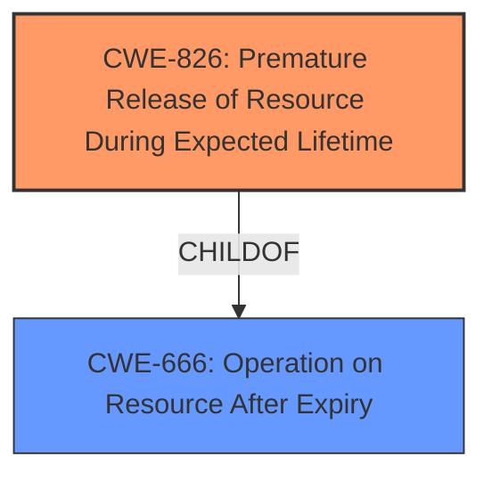

# Analysis for CVE-2022-27499

# Summary
| CWE ID | CWE Name | Confidence | CWE Abstraction Level | CWE Vulnerability Mapping Label | CWE-Vulnerability Mapping Notes |
|---|---|---|---|---|---|
| CWE-826 | Premature Release of Resource During Expected Lifetime | 1.0 | Base | Allowed | Primary CWE |

## Evidence and Confidence

*   **Confidence Score:** 1.0
*   **Evidence Strength:** HIGH

## Relationship Analysis
The primary relationship influencing the decision is the ChildOf relationship between CWE-826 and CWE-666 (Operation on Resource After Expiry). While CWE-666 isn't directly suggested, the description of CWE-826 indicates that performing actions on an already released resource may have issues similar to CWE-825 (Access of Resource After Expiry). In this case, the **premature release of the resource** is the central issue, leading to potential information disclosure if accessed after release.

## Vulnerability Chain
The vulnerability chain starts with the **premature release of a resource** (CWE-826), potentially leading to information disclosure if the released resource is accessed later.

## Summary of Analysis
The initial assessment and final conclusion are highly based on the explicit details in the vulnerability description and the "CVE Reference Links Content Summary." The description clearly states "**premature release of resource during expected lifetime**." The summary reinforces this by highlighting the root cause as the premature release of a resource.

The graph relationships, particularly the ChildOf relationship with CWE-666, confirm the possibility of issues arising from operating on the resource after its premature release.

The selected CWE, CWE-826, is at the optimal level of specificity because it directly addresses the **root cause** of the vulnerability.

Relevant CWE Information:

# Enhanced Context (25 CWEs)

## CWE-826: Premature Release of Resource During Expected Lifetime
**Abstraction:** Base
**Status:** Incomplete

### Description
The product releases a resource that is still intended to be used by itself or another actor.

### Extended Description
This weakness focuses on errors in which the product should not release a resource, but performs the release anyway. This is different than a weakness in which the product releases a resource at the appropriate time, but it maintains a reference to the resource, which it later accesses. For this weakness, the resource should still be valid upon the subsequent access.
## Other CWEs Considered and Rejected:

*   **CWE-404: Improper Resource Shutdown or Release:** While related to resource management, this CWE is more general. The vulnerability description specifically mentions **premature release**, making CWE-826 a better fit.
*   **CWE-664: Improper Control of a Resource Through its Lifetime:** This is a high-level Pillar CWE and less specific than CWE-826, which directly describes the **premature release** issue.
*   **CWE-772: Missing Release of Resource after Effective Lifetime:** This CWE describes a missing release, while the current vulnerability is about releasing the resource too early.
*   **CWE-911: Improper Update of Reference Count:** While reference counting issues can lead to **premature release**, the description doesn't explicitly mention reference counts, making CWE-826 a more direct and suitable mapping.
*   **CWE-1421: Exposure of Sensitive Information in Shared Microarchitectural Structures during Transient Execution:** This is a very specific hardware-level weakness, and the vulnerability description doesn't provide any information to support this mapping. The information disclosure in the description is at a much higher level.
*   **CWE-691: Insufficient Control Flow Management, CWE-693: Protection Mechanism Failure, CWE-284: Improper Access Control:** These are very high level "Pillar" CWEs and are too general for the given vulnerability description.