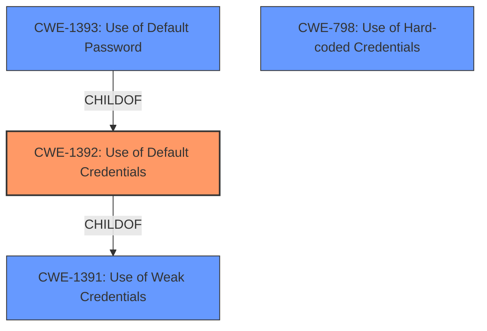

# Analysis Report for CVE-2022-27511

# Vulnerability Analysis Report: CVE-2022-27511

## Description


## Analysis (with Relationship Data)

# Summary
| CWE ID  | CWE Name                                      | Confidence | CWE Abstraction Level | CWE Vulnerability Mapping Label | CWE-Vulnerability Mapping Notes |
|---------|-----------------------------------------------|------------|-----------------------|---------------------------------|-----------------------------------|
| CWE-1392 | Use of Default Credentials                  | 0.8        | Base                  | Allowed                         | Primary CWE                       |
| CWE-1393 | Use of Default Password                     | 0.7        | Base                  | Allowed                         | Secondary Candidate             |
| CWE-798  | Use of Hard-coded Credentials               | 0.6        | Base                  | Allowed                         | Secondary Candidate             |

## Evidence and Confidence

*   **Confidence Score:** 0.8
*   **Evidence Strength:** MEDIUM

## Relationship Analysis
The primary CWE, CWE-1392 (Use of Default Credentials), is a base CWE, which makes it more specific. CWE-1392 is a child of CWE-1391 (Use of Weak Credentials), which is a class. The relationship between CWE-1392 and CWE-1393 (Use of Default Password) is also important, as CWE-1393 is a child of CWE-1392, indicating an even more specific case of using default credentials, specifically passwords.



## Vulnerability Chain
The vulnerability chain starts with the **use of default credentials**, leading to an **unauthenticated user** gaining **ssh access**, which then allows the **reset of the administrator password** and ultimately leads to the attacker connecting with the **default administrator credentials** after a device reboot.

## Summary of Analysis
The initial analysis focused on identifying the root cause of the vulnerability, which is the **use of default credentials**. The provided description clearly states that the impact is the reset of the administrator password, allowing an unauthenticated user with SSH access to connect using these **default credentials** after a reboot.

The retriever results and the vulnerability description both point towards CWE-1392 (Use of Default Credentials) as the primary weakness. The description mentions the impact is "reset of the administrator password at the next device reboot, allowing an attacker with ssh access to connect with the default administrator credentials after the device has rebooted." This directly aligns with the definition of CWE-1392, where the product uses default credentials for critical functionality. The relationship graph reinforces this by showing the hierarchy of related CWEs, further solidifying the selection of CWE-1392 as the most appropriate and specific classification. Other CWEs like CWE-798 (Use of Hard-coded Credentials) and CWE-1393 (Use of Default Password) were considered, but they are less fitting as they don't fully capture the scenario of an administrator password being reset to a default value.

The selection of CWE-1392 is at the optimal level of specificity because it directly addresses the root cause (use of default credentials) and its immediate consequence (allowing unauthorized access).

Relevant CWE Information:

## CWE-1392: Use of Default Credentials
**Abstraction:** Base
**Status:** Incomplete

### Description
The product uses default credentials (such as passwords or cryptographic keys) for potentially critical functionality.

### Extended Description
It is common practice for products to be designed to use default keys, passwords, or other mechanisms for authentication. The rationale is to simplify the manufacturing process or the system administrator's task of installation and deployment into an enterprise. However, if admins do not change the defaults, it is easier for attackers to bypass authentication quickly across multiple organizations.

### Alternative Terms
None

### Relationships
ChildOf -> CWE-1391

### Mapping Guidance
**Usage:** Allowed
**Rationale:** This CWE entry is at the Base level of abstraction, which is a preferred level of abstraction for mapping to the root causes of vulnerabilities.
**Comments:** Carefully read both the name and description to ensure that this mapping is an appropriate fit. Do not try to 'force' a mapping to a lower-level Base/Variant simply to comply with this preferred level of abstraction.
**Reasons:**
- Acceptable-Use

### Observed Examples
- **CVE-2022-30270:** Remote Terminal Unit (RTU) uses default credentials for some SSH accounts
- **CVE-2021-41192:** data visualization/sharing package uses default secret keys or cookie values if they are not specified in environment variables
- **CVE-2021-38759:** microcontroller board has default password

**Explanation:**
The vulnerability description clearly states the attacker can connect with **default administrator credentials** after the device reboots which aligns directly with CWE-1392, where default credentials are used for critical functionality. The security implication is a complete bypass of authentication, leading to unauthorized access. The CWE is at the Base level of abstraction, which is preferred, and the usage is Allowed. Confidence is high due to the direct match of the vulnerability description to the CWE definition.

## CWE-1393: Use of Default Password
**Abstraction:** Base
**Status:** Incomplete

### Description
The product uses default passwords for potentially critical functionality.

### Extended Description
It is common practice for products to be designed to use default passwords for authentication. The rationale is to simplify the manufacturing process or the system administrator's task of installation and deployment into an enterprise. However, if admins do not change the defaults, then it makes it easier for attackers to quickly bypass authentication across multiple organizations. There are many lists of default passwords and default-password scanning tools that are easily available from the World Wide Web.

### Alternative Terms
None

### Relationships
ChildOf -> CWE-1392

### Mapping Guidance
**Usage:** Allowed
**Rationale:** This CWE entry is at the Base level of abstraction, which is a preferred level of abstraction for mapping to the root causes of vulnerabilities.
**Comments:** Carefully read both the name and description to ensure that this mapping is an appropriate fit. Do not try to 'force' a mapping to a lower-level Base/Variant simply to comply with this preferred level of abstraction.
**Reasons:**
- Acceptable-Use

### Observed Examples
- **CVE-2022-30270:** Remote Terminal Unit (RTU) uses default credentials for some SSH accounts
- **CVE-2022-2336:** OPC Unified Architecture (OPC UA) industrial automation product has a default password
- **CVE-2021-38759:** microcontroller board has default password

**Explanation:**
CWE-1393 is considered because the description focuses on the administrator password being reset to a default. Since it is a child of CWE-1392, it is a more specific case. However, since the initial flaw is the broader 'default credentials' that enable the password reset, CWE-1392 remains the primary.

## CWE-798: Use of Hard-coded Credentials
**Abstraction:** Base
**Status:** Draft

### Description
The product contains hard-coded credentials, such as a password or cryptographic key.

### Extended Description
Not provided

### Alternative Terms
None

### Relationships
PARENTOF -> CWE-321
PARENTOF -> CWE-259
PEEROF -> CWE-257
CHILDOF -> CWE-671
CHILDOF -> CWE-344

### Mapping Guidance
**Usage:** Allowed
**Rationale:** This CWE entry is at the Base level of abstraction, which is a preferred level of abstraction for mapping to the root causes of vulnerabilities.
**Comments:** Carefully read both the name and description to ensure that this mapping is an appropriate fit. Do not try to 'force' a mapping to a lower-level Base/Variant simply to comply with this preferred level of abstraction.
**Reasons:**
- Acceptable-Use

**Explanation:**
CWE-798 was considered because the vulnerability ultimately allows access with default credentials after a reboot. This could be seen as a form of hard-coded credentials being used. However, the key aspect of the vulnerability is the *reset* to default credentials, making CWE-1392 a better fit.


## CWE Relationship Analysis

Current CWEs represent these abstraction levels: .


### Vulnerability Chain Analysis

**Chain starting from CWE-671:**
- 671 (Lack of Administrator Control over Security) - ROOT


**Chain starting from CWE-344:**
- 344 (Use of Invariant Value in Dynamically Changing Context) - ROOT


### CWE Relationship Diagram

```mermaid
graph TD
    classDef primary fill:#f96,stroke:#333,stroke-width:2px
    classDef secondary fill:#69f,stroke:#333
    classDef tertiary fill:#9e9,stroke:#333
```


*Report generated on 2025-03-31 07:47:27*
