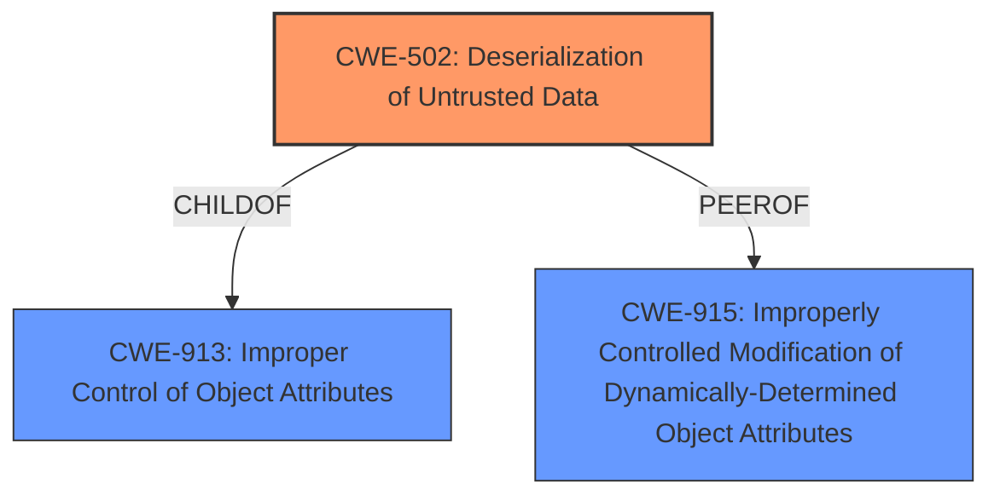

# Enhanced Analysis for CVE-2022-27518

# Summary
| CWE ID  | CWE Name                                                                              | Confidence | CWE Abstraction Level | CWE Vulnerability Mapping Label | CWE-Vulnerability Mapping Notes |
| :-------- | :------------------------------------------------------------------------------------ | :--------- | :---------------------- | :------------------------------ | :------------------------------ |
| CWE-502   | Deserialization of Untrusted Data                                                     | 0.8        | Base                    | Primary CWE                     | Allowed                       |

## Evidence and Confidence

*   **Confidence Score:** 0.8
*   **Evidence Strength:** LOW

## Relationship Analysis
The primary relationship that influenced the decision was the ChildOf relationship between CWE-502 and CWE-913, suggesting that deserialization issues often stem from broader problems with controlling object state. This relationship reinforces the selection of CWE-502 as the appropriate base-level weakness. Additionally, the PeerOf relationship between CWE-502 and CWE-915 indicates related issues in dynamically determined object attributes, providing context for the vulnerability's potential impact.



## Vulnerability Chain
The vulnerability chain involves **deserialization of untrusted data** (CWE-502) leading directly to remote code execution. The untrusted data is not validated during the deserialization process, allowing for the execution of arbitrary code.

## Summary of Analysis
The vulnerability description indicates an "Unauthenticated remote arbitrary code execution" vulnerability. The key phrase extracted is "impact: remote code execution".

The top retriever result is CWE-502 (Deserialization of Untrusted Data), which has a base abstraction level and allowed usage. The description of CWE-502 states: "The product deserializes untrusted data without sufficiently ensuring that the resulting data will be valid." This aligns with the provided vulnerability description, as deserializing untrusted data can lead to arbitrary code execution if not properly validated.

Other CWEs considered but not used:

*   CWE-787 (Out-of-bounds Write): While remote code execution could involve memory corruption, the primary mechanism described in the retriever results and vulnerability description points to deserialization.
*   CWE-95 (Improper Neutralization of Directives in Dynamically Evaluated Code ('Eval Injection')): Similar to CWE-787, this is a potential outcome of the vulnerability but not the root cause.
*   CWE-78 (Improper Neutralization of Special Elements used in an OS Command ('OS Command Injection')): OS Command Injection is a potential impact, but deserialization is the root cause.
*   CWE-20 (Improper Input Validation): This is a class-level CWE and too general. Deserialization of untrusted data is a more specific weakness.
*   CWE-494 (Download of Code Without Integrity Check): This CWE applies to situations where code is downloaded without proper validation, which isn't explicitly mentioned in the vulnerability description, but the code in this case is already present, just serialized.
*   CWE-113 (Improper Neutralization of CRLF Sequences in HTTP Headers ('HTTP Request/Response Splitting')): This vulnerability is specific to HTTP headers and not relevant to the general case of remote code execution.
*   CWE-138 (Improper Neutralization of Special Elements): This is a class-level CWE and too general.
*   CWE-74 (Improper Neutralization of Special Elements in Output Used by a Downstream Component ('Injection')): This is a class-level CWE and too general.
*   CWE-434 (Unrestricted Upload of File with Dangerous Type): This vulnerability relates to unrestricted file uploads, not deserialization.

The evidence is relatively weak, as it only states "Unauthenticated remote arbitrary code execution". However, the retriever results and the general knowledge that deserialization vulnerabilities often lead to remote code execution support the choice of CWE-502.


## CWE Relationship Analysis

Current CWEs represent these abstraction levels: .


### Vulnerability Chain Analysis

**Chain starting from CWE-434:**
- 434 (Unrestricted Upload of File with Dangerous Type) - ROOT


**Chain starting from CWE-913:**
- 913 (Improper Control of Dynamically-Managed Code Resources) - ROOT


### CWE Relationship Diagram

```mermaid
graph TD
    classDef primary fill:#f96,stroke:#333,stroke-width:2px
    classDef secondary fill:#69f,stroke:#333
    classDef tertiary fill:#9e9,stroke:#333
```