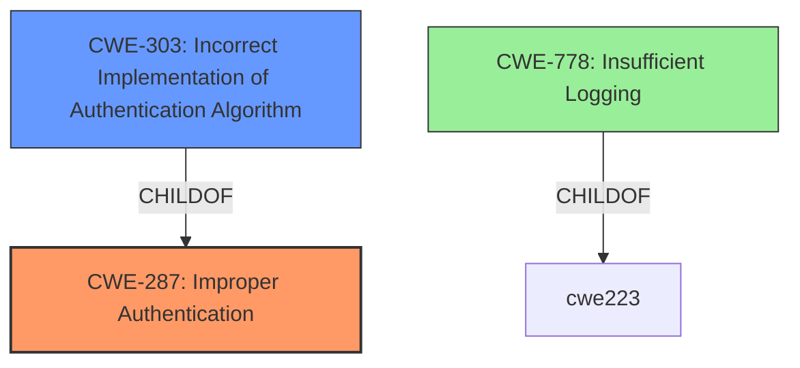

# Analysis Report for CVE-2022-2752

# Vulnerability Analysis Report: CVE-2022-2752

## Description


## Analysis (with Relationship Data)

# Summary
| CWE ID | CWE Name | Confidence | CWE Abstraction Level | CWE Vulnerability Mapping Label | CWE-Vulnerability Mapping Notes |
|---|---|---|---|---|---|
| CWE-287 | Improper Authentication | 0.75 | Class | Primary | Discouraged: Due to potential misuse, consider CWE-1390 or CWE-306 instead. However, these options do not fit as well. |
| CWE-303 | Incorrect Implementation of Authentication Algorithm | 0.60 | Base | Secondary | Allowed |
| CWE-778 | Insufficient Logging | 0.50 | Base | Secondary | Allowed |

## Evidence and Confidence

*   **Confidence Score:** 0.70
*   **Evidence Strength:** MEDIUM

## Relationship Analysis
The primary relationship considered was the parent-child relationship between CWE-287 (Improper Authentication) and potential child CWEs like CWE-1390 (Weak Authentication) and CWE-306 (Missing Authentication for Critical Function). While CWE-287 is a class-level CWE, the provided information does not clearly indicate weak authentication or missing authentication for a critical function, so CWE-287 is used.



## Vulnerability Chain
The vulnerability chain starts with a **failure in the authentication process** (root cause), leading to the ability of a local user to **impersonate a previous user** (impact). **Insufficient logging** exacerbates the problem by making it harder to detect the impersonation.

## Summary of Analysis
The initial analysis focused on finding a CWE that best described the **improper authentication** issue that allows a local user to impersonate another. The evidence for the root cause is present in the **Vulnerability Description**: "A vulnerability in the web server of Secomea GateManager allows a local user to **impersonate as the previous user** under some failed login conditions."

CWE-287 (Improper Authentication) was selected as the primary CWE because it broadly covers the scenario where the product does not sufficiently prove the claimed identity is correct.

CWE-303 (Incorrect Implementation of Authentication Algorithm) was considered because the description mentions "failed login conditions," suggesting a possible flaw in the authentication algorithm's implementation.

CWE-778 (Insufficient Logging) was added as a secondary CWE because the lack of proper logging can make it more difficult to detect the malicious activity. The retriever results also identified this CWE.

CWE-287 is the most appropriate because it directly addresses the authentication **failure**, even though it is discouraged. The others are less descriptive.

Relevant CWE Information:

# Enhanced Context (25 CWEs)
The following CWEs were identified as potentially relevant to this vulnerability:

## CWE-303: Incorrect Implementation of Authentication Algorithm
**Abstraction Level**: Base
**Similarity Score**: 0.80
**Source**: dense

**Description**:
The requirements for the product dictate the use of an established authentication algorithm, but the implementation of the algorithm is incorrect.

**Mapping Guidance**:
- Usage: Allowed
- Rationale: This CWE entry is at the Base level of abstraction, which is a preferred level of abstraction for mapping to the root causes of vulnerabilities.

## CWE-287: Improper Authentication
**Abstraction Level**: Class
**Similarity Score**: 3363.37
**Source**: sparse

**Description**:
When an actor claims to have a given identity, the product does not prove or insufficiently proves that the claim is correct.

**Mapping Guidance**:
- Usage: Discouraged
- Rationale: This CWE entry might be misused when lower-level CWE entries are likely to be applicable. It is a level-1 Class (i.e., a child of a Pillar).


## CWE Relationship Analysis

Current CWEs represent these abstraction levels: .


### Vulnerability Chain Analysis

**Chain starting from CWE-1390:**
- 1390 (Weak Authentication) - ROOT


**Chain starting from CWE-287:**
- 287 (Improper Authentication) - ROOT


### CWE Relationship Diagram

```mermaid
graph TD
    classDef primary fill:#f96,stroke:#333,stroke-width:2px
    classDef secondary fill:#69f,stroke:#333
    classDef tertiary fill:#9e9,stroke:#333
```


*Report generated on 2025-03-30 19:31:13*
