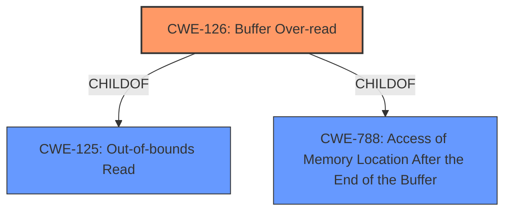

# Raw Analyzer Response for CVE-2022-27523

# Summary
| CWE ID | CWE Name | Confidence | CWE Abstraction Level | CWE Vulnerability Mapping Label | CWE-Vulnerability Mapping Notes |
|---|---|---|---|---|---|
| CWE-126 | Buffer Over-read | 1.0 | Variant | Allowed | Primary CWE |

## Evidence and Confidence

*   **Confidence Score:** 1.0
*   **Evidence Strength:** HIGH

## Relationship Analysis
The primary relationship that impacted my decision was the ChildOf relationship between CWE-126 (Buffer Over-read) and CWE-125 (Out-of-bounds Read). While both could be considered, CWE-126 is a more specific variant that better reflects the nature of the vulnerability. There isn't a clear chain relationship present in this case, but understanding that a buffer over-read can lead to other issues like information disclosure helps to contextualize the vulnerability. The Variant abstraction level of CWE-126 is appropriate as it gives a more detailed description of the **buffer over-read** than the Base level CWE-125.

## Vulnerability Chain
The vulnerability chain starts with a maliciously crafted DWG file. This file, when processed by Autodesk TrueView 2022, triggers a **buffer over-read**. This **buffer over-read** then leads to the exposure of sensitive information or a crash. If combined with other vulnerabilities, it could lead to arbitrary code execution.

## Summary of Analysis
The initial analysis correctly identified the **buffer over-read** as the root cause of the vulnerability. The selection of CWE-126 is strongly supported by the "Vulnerability Description Key Phrases" which explicitly mentions "**buffer over-read**". Additionally, the "CVE Reference Links Content Summary" confirms that an **out-of-bounds read** is the weakness present. CWE-126 is a more specific variant of CWE-125, making it the more accurate choice. The evidence provided is sufficient and directly supports the classification. The confidence in this assessment is high (1.0) due to the clear and direct evidence. The provided retriever results also listed CWE-126 as the top result. The selection of CWE-126 at the Variant level is justified due to the clear description of the **buffer over-read** mechanism.

Relevant CWE Information:

# Enhanced Context (25 CWEs)

## CWE-126: Buffer Over-read
**Abstraction:** Variant
**Status:** Draft

### Description
The product reads from a buffer using buffer access mechanisms such as indexes or pointers that reference memory locations after the targeted buffer.

### Extended Description
This typically occurs when the pointer or its index is incremented to a position beyond the bounds of the buffer or when pointer arithmetic results in a position outside of the valid memory location to name a few. This may result in exposure of sensitive information or possibly a crash.

### Alternative Terms
None

### Relationships
ChildOf -> CWE-125
ChildOf -> CWE-788

### Mapping Guidance
**Usage:** Allowed
**Rationale:** This CWE entry is at the Variant level of abstraction, which is a preferred level of abstraction for mapping to the root causes of vulnerabilities.
**Comments:** Carefully read both the name and description to ensure that this mapping is an appropriate fit. Do not try to 'force' a mapping to a lower-level Base/Variant simply to comply with this preferred level of abstraction.
**Reasons:**
- Acceptable-Use

### Additional Notes
**[Relationship]** These problems may be resultant from missing sentinel values (CWE-463) or trusting a user-influenced input length variable.

### Observed Examples
- **CVE-2022-1733:** Text editor has out-of-bounds read past end of line while indenting C code
- **CVE-2014-0160:** Chain: "Heartbleed" bug receives an inconsistent length parameter (CWE-130) enabling an out-of-bounds read (CWE-126), returning memory that could include private cryptographic keys and other sensitive data.
- **CVE-2009-2523:** Chain: product does not handle when an input string is not NULL terminated, leading to buffer over-read or heap-based buffer overflow.

CWE-125 (Out-of-bounds Read) was considered, but CWE-126 is more specific. Other CWEs like CWE-787 (Out-of-bounds Write), CWE-122 (Heap-based Buffer Overflow), CWE-1284 (Improper Validation of Specified Quantity in Input), and CWE-124 (Buffer Underwrite ('Buffer Underflow')) were considered but did not directly match the vulnerability description as closely as CWE-126.