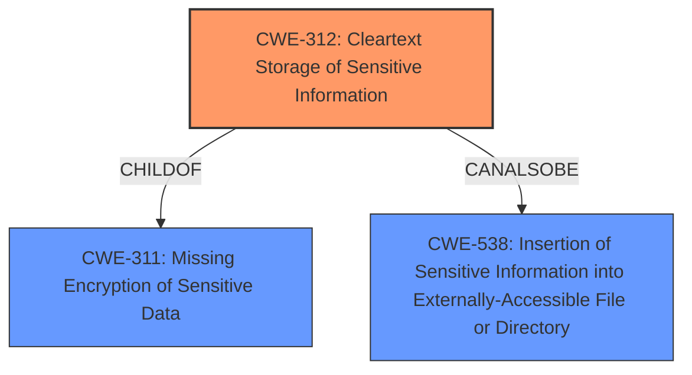

# Enhanced Analysis for CVE-2022-27544

# Summary
| CWE ID  | CWE Name                                          | Confidence | CWE Abstraction Level | CWE Vulnerability Mapping Label | CWE-Vulnerability Mapping Notes |
| ------- | ------------------------------------------------- | ---------- | ----------------------- | ------------------------------- | ------------------------------- |
| CWE-312 | Cleartext Storage of Sensitive Information        | 0.9        | Base                    | Allowed                         | Primary CWE                     |
| CWE-538 | Insertion of Sensitive Information into Externally-Accessible File or Directory | 0.7        | Base                    | Allowed                         | Secondary Candidate                    |

## Evidence and Confidence

*   **Confidence Score:** 0.8
*   **Evidence Strength:** HIGH

## Relationship Analysis
The primary relationship influencing the CWE selection is the ChildOf relationship, where CWE-312 is a child of CWE-311 (Missing Encryption of Sensitive Data). While CWE-311 is a higher-level class, CWE-312 provides a more specific description of the **cleartext storage** issue. CWE-538, while not directly related to CWE-312 in a parent-child manner, shares a peer relationship, indicating the sensitive information is accessible externally. The base abstraction level of CWE-312 and CWE-538 makes them suitable for pinpointing the vulnerability's root cause.



## Vulnerability Chain
The vulnerability chain begins with the **lack of encryption** for SMTP credentials, leading to the **storage of these credentials in cleartext**. Authorized users can then access these credentials, resulting in a **potential compromise** of the SMTP server and related systems.
Root Cause: **Missing Encryption** -> **Cleartext Storage** -> Impact: **Exposure to authorized users**.

## Summary of Analysis
The initial assessment focused on identifying the most specific CWE that accurately describes the vulnerability. The vulnerability description states that "BigFix Web Reports authorized users may see SMTP credentials in clear text." This directly points to a problem with how sensitive information is stored and accessed.

The Retriever Results suggested several CWEs, including:
*   CWE-311: Missing Encryption of Sensitive Data (Class, Discouraged)
*   CWE-522: Insufficiently Protected Credentials (Class, Allowed-with-Review)
*   CWE-256: Plaintext Storage of a Password (Base, Allowed)
*   CWE-532: Insertion of Sensitive Information into Log File (Base, Allowed)
*   CWE-319: Cleartext Transmission of Sensitive Information (Base, Allowed)
*   CWE-550: Server-generated Error Message Containing Sensitive Information (Variant, Allowed)
*   CWE-359: Exposure of Private Personal Information to an Unauthorized Actor (Base, Allowed)
*   CWE-316: Cleartext Storage of Sensitive Information in Memory (Variant, Allowed)
*   CWE-1392: Use of Default Credentials (Base, Allowed)
*   CWE-312: Cleartext Storage of Sensitive Information (Base, Allowed)

CWE-311 is too general (Class level). CWE-522 is about credentials generally, but not necessarily storage. CWE-256 is specific to passwords, and while SMTP credentials include passwords, they also include usernames and server details. CWE-532 involves log files, which isn't specified here. CWE-319 is about transmission, not storage. CWE-550 is about error messages. CWE-359 is about personal information. CWE-316 is about storage in memory. CWE-1392 is about *default* credentials.

CWE-312 (Cleartext Storage of Sensitive Information) is the most accurate because it directly addresses the **root cause** of the vulnerability: the **storage of sensitive SMTP credentials in cleartext**. The phrase "see SMTP credentials in clear text" from the "Vulnerability Description Key Phrases" explicitly supports this. CWE-312 is at the Base level of abstraction, which is preferred.

CWE-538 (Insertion of Sensitive Information into Externally-Accessible File or Directory) is also considered because the vulnerability description states that "authorized users may see...". This implies the **cleartext** credentials are in a location that is externally accessible to authorized users.

Therefore, the final decision is to assign CWE-312 as the primary CWE and CWE-538 as the secondary CWE. These are at the optimal level of specificity (Base) and directly relate to the **cleartext storage** and accessibility aspects of the vulnerability.

Relevant CWE Information:

# Enhanced Context (25 CWEs)

## CWE-312: Cleartext Storage of Sensitive Information
**Abstraction Level**: Base
**Similarity Score**: 0.83
**Source**: dense

**Description**:
The product stores sensitive information in cleartext within a resource that might be accessible to another control sphere.

**Mapping Guidance**:
- Usage: Allowed
- Rationale: This CWE entry is at the Base level of abstraction, which is a preferred level of abstraction for mapping to the root causes of vulnerabilities.

## CWE-311: Missing Encryption of Sensitive Data
**Abstraction Level**: Class
**Similarity Score**: 0.79
**Source**: dense

**Description**:
The product does not encrypt sensitive or critical information before storage or transmission.

**Mapping Guidance**:
- Usage: Discouraged
- Rationale: CWE-311 is high-level with more precise children available. It is a level-1 Class (i.e., a child of a Pillar).

## CWE-316: Cleartext Storage of Sensitive Information in Memory
**Abstraction Level**: Variant
**Similarity Score**: 0.79
**Source**: dense

**Description**:
The product stores sensitive information in cleartext in memory.

**Mapping Guidance**:
- Usage: Allowed
- Rationale: This CWE entry is at the Variant level of abstraction, which is a preferred level of abstraction for mapping to the root causes of vulnerabilities.

## CWE-319: Cleartext Transmission of Sensitive Information
**Abstraction Level**: Base
**Similarity Score**: 0.77
**Source**: dense

**Description**:
The product transmits sensitive or security-critical data in cleartext in a communication channel that can be sniffed by unauthorized actors.

**Mapping Guidance**:
- Usage: Allowed
- Rationale: This CWE entry is at the Base level of abstraction, which is a preferred level of abstraction for mapping to the root causes of vulnerabilities.

## CWE-313: Cleartext Storage in a File or on Disk
**Abstraction Level**: Variant
**Similarity Score**: 0.76
**Source**: dense

**Description**:
The product stores sensitive information in cleartext in a file, or on disk.

**Mapping Guidance**:
- Usage: Allowed
- Rationale: This CWE entry is at the Variant level of abstraction, which is a preferred level of abstraction for mapping to the root causes of vulnerabilities.

## CWE-538: Insertion of Sensitive Information into Externally-Accessible File or Directory
**Abstraction Level**: Base
**Similarity Score**: 0.76
**Source**: dense

**Description**:
The product places sensitive information into files or directories that are accessible to actors who are allowed to have access to the files, but not to the sensitive information.

**Mapping Guidance**:
- Usage: Allowed
- Rationale: This CWE entry is at the Base level of abstraction, which is a preferred level of abstraction for mapping to the root causes of vulnerabilities.

## CWE-226: Sensitive Information in Resource Not Removed Before Reuse
**Abstraction Level**: Base
**Similarity Score**: 0.76
**Source**: dense

**Description**:
The product releases a resource such as memory or a file so that it can be made available for reuse, but it does not clear or "zeroize" the information contained in the resource before the product performs a critical state transition or makes the resource available for reuse by other entities.

**Mapping Guidance**:
- Usage: Allowed
- Rationale: This CWE entry is at the Base level of abstraction, which is a preferred level of abstraction for mapping to the root causes of vulnerabilities.

## CWE-922: Insecure Storage of Sensitive Information
**Abstraction Level**: Class
**Similarity Score**: 0.75
**Source**: dense

**Description**:
The product stores sensitive information without properly limiting read or write access by unauthorized actors.

**Mapping Guidance**:
- Usage: Allowed-with-Review
- Rationale: This CWE entry is a Class and might have Base-level children that would be more appropriate

## CWE-212: Improper Removal of Sensitive Information Before Storage or


## CWE Relationship Analysis

Current CWEs represent these abstraction levels: .


### Vulnerability Chain Analysis

**Chain starting from CWE-212:**
- 212 (Improper Removal of Sensitive Information Before Storage or Transfer) - ROOT


**Chain starting from CWE-319:**
- 319 (Cleartext Transmission of Sensitive Information) - ROOT


### CWE Relationship Diagram

```mermaid
graph TD
    classDef primary fill:#f96,stroke:#333,stroke-width:2px
    classDef secondary fill:#69f,stroke:#333
    classDef tertiary fill:#9e9,stroke:#333
```