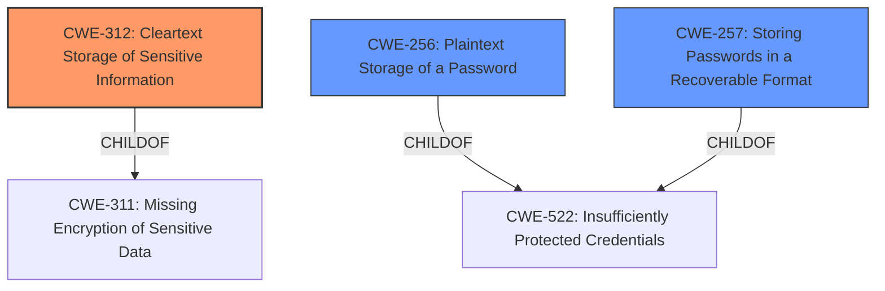

# Analysis for CVE-2022-27549

# Summary
| CWE ID | CWE Name | Confidence | CWE Abstraction Level | CWE Vulnerability Mapping Label | CWE-Vulnerability Mapping Notes |
|---|---|---|---|---|---|
| CWE-312 | Cleartext Storage of Sensitive Information | 1.0 | Base | Allowed | Primary CWE |
| CWE-256 | Plaintext Storage of a Password | 0.7 | Base | Allowed | Secondary Candidate |
| CWE-257 | Storing Passwords in a Recoverable Format | 0.6 | Base | Allowed | Secondary Candidate |

## Evidence and Confidence

*   **Confidence Score:** 0.9
*   **Evidence Strength:** HIGH

## Relationship Analysis
The primary relationship is that CWE-312 **Cleartext Storage of Sensitive Information** is a parent of CWE-316 **Cleartext Storage of Sensitive Information in Memory**, but the description does not specify that the data is specifically stored in memory, so CWE-312 is a better fit. CWE-312 is also a peer of CWE-256 **Plaintext Storage of a Password** and CWE-257 **Storing Passwords in a Recoverable Format**, but the vulnerability description doesn't explicitly state that passwords are being stored, just "certain data".

## Vulnerability Chain
The vulnerability chain consists of:
1.  **Root Cause:** **Improper data storage** in a plain text format.
2.  **Weakness:** **Cleartext Storage of Sensitive Information**.
3.  **Impact:** Unauthorized access to sensitive data.

## Summary of Analysis
The analysis is primarily based on the provided evidence, which includes the vulnerability description and the retriever results.

The vulnerability description states that HCL Launch may store certain data for recurring activities in a plain text format. The key phrase "rootcause: **improper data storage**" strongly suggests a storage-related weakness.

The retriever results identify several candidate CWEs, with CWE-312 **Cleartext Storage of Sensitive Information** having the highest relevance score. The CWE description aligns well with the vulnerability description, as it states that the product stores sensitive information in cleartext within a resource that might be accessible to another control sphere.

The relationship graph shows that CWE-312 is a parent of CWE-316, but CWE-316 is not selected because the vulnerability description does not specify that the data is stored in memory. CWE-312 is also a peer of CWE-256 and CWE-257, which are related to password storage, but these are not selected because the vulnerability description does not explicitly mention passwords.

The final selection of CWE-312 is based on the direct evidence from the vulnerability description and the high relevance score from the retriever results. The CWE is at the optimal level of specificity, as it accurately represents the weakness without being overly specific.