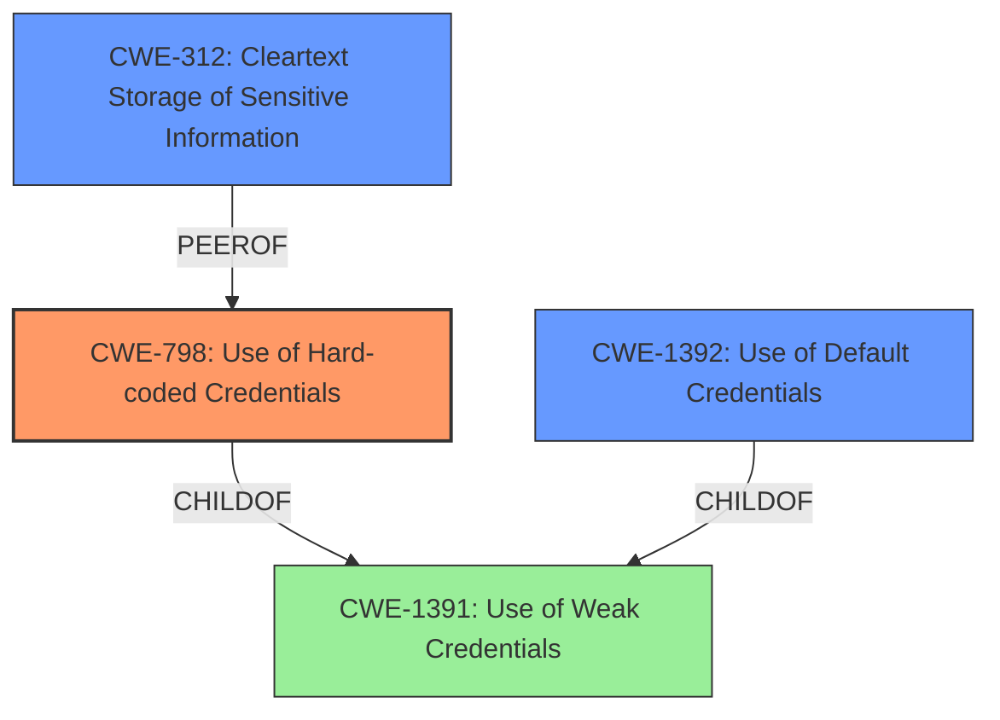

# Raw Analyzer Response for CVE-2022-27560

# Summary
| CWE ID  | CWE Name                                                    | Confidence | CWE Abstraction Level | CWE Vulnerability Mapping Label | CWE-Vulnerability Mapping Notes |
| :------- | :---------------------------------------------------------- | :--------- | :---------------------- | :------------------------------ | :------------------------------ |
| CWE-798  | Use of Hard-coded Credentials                               | 0.9        | Base                    | Primary                         | Allowed                       |
| CWE-312  | Cleartext Storage of Sensitive Information                | 0.6        | Base                    | Secondary                       | Allowed                       |
| CWE-1392 | Use of Default Credentials                                  | 0.5        | Base                    | Secondary                       | Allowed                       |

## Evidence and Confidence

*   **Confidence Score:** 0.7
*   **Evidence Strength:** MEDIUM

## Relationship Analysis
The primary weakness appears to be the **use of hard-coded credentials**, classified as CWE-798. This can sometimes lead to credentials being stored in cleartext (CWE-312) or the use of default credentials (CWE-1392).

## Vulnerability Chain
The vulnerability chain starts with the **use of hard-coded credentials** (CWE-798). If these credentials are not properly protected, they might be stored in **cleartext** (CWE-312). Alternatively, the system might be using **default credentials** (CWE-1392), which are a type of hard-coded credential that is widely known.

## Summary of Analysis
The primary vulnerability is the **exposure of administrator credentials** in HCL VersionVault Express. This is most directly related to the **use of hard-coded credentials** (CWE-798). The vulnerability description states "**impact:** expose administrator credentials", which is a direct consequence of using hard-coded credentials.

CWE-798 is a Base level CWE, which is preferred. The retriever results also list CWE-798 with a high score. The description of CWE-798, "The product contains hard-coded credentials, such as a password or cryptographic key," directly applies to this vulnerability.

CWE-312 (Cleartext Storage of Sensitive Information) and CWE-1392 (Use of Default Credentials) were also considered. While the vulnerability description doesn't explicitly state that the credentials are stored in cleartext or are default credentials, these are potential secondary weaknesses that could be present.

CWE-311 (Missing Encryption of Sensitive Data) was considered, but it is a class level CWE and less specific than CWE-312.

Relevant CWE Information:

# Enhanced Context (25 CWEs)

## CWE-311: Missing Encryption of Sensitive Data
**Abstraction Level**: Class

## CWE-522: Insufficiently Protected Credentials
**Abstraction Level**: Class

## CWE-1392: Use of Default Credentials
**Abstraction Level**: Base

## CWE-312: Cleartext Storage of Sensitive Information
**Abstraction Level**: Base

## CWE-259: Use of Hard-coded Password
**Abstraction Level**: Variant

## CWE-256: Plaintext Storage of a Password
**Abstraction Level**: Base

## CWE-321: Use of Hard-coded Cryptographic Key
**Abstraction Level**: Variant

## CWE-1336: Improper Neutralization of Special Elements Used in a Template Engine
**Abstraction Level**: Base

## CWE-798: Use of Hard-coded Credentials
**Abstraction Level**: Base

## CWE-1299: Missing Protection Mechanism for Alternate Hardware Interface
**Abstraction Level**: Base