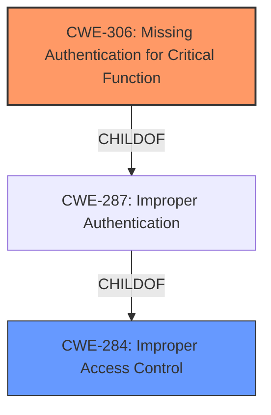

# Analysis Report for CVE-2022-2757

# Vulnerability Analysis Report: CVE-2022-2757

## Description


## Analysis (with Relationship Data)

# Summary

| CWE ID  | CWE Name                                   | Confidence | CWE Abstraction Level | CWE Vulnerability Mapping Label | CWE-Vulnerability Mapping Notes |
|---------|--------------------------------------------|------------|-----------------------|-----------------------------------|---------------------------------|
| CWE-306 | Missing Authentication for Critical Function | 0.9        | Base                  | Allowed                           | Primary CWE                     |
| CWE-284 | Improper Access Control                    | 0.6        | Pillar                 | Discouraged                       | Secondary Candidate             |

## Evidence and Confidence

*   **Confidence Score:** 0.9
*   **Evidence Strength:** HIGH

## Relationship Analysis

The primary CWE, CWE-306 (Missing Authentication for Critical Function), is a child of CWE-287 (Improper Authentication), which itself is a child of CWE-284 (Improper Access Control). This hierarchical relationship indicates that CWE-306 is a more specific instance of the broader access control issues. CWE-284 is too high-level and discouraged, while CWE-287 is a class and could be used, however, CWE-306 is a base level and therefore most appropriate.



## Vulnerability Chain

The vulnerability chain starts with the **missing authentication** (**CWE-306**) for accessing application settings via a specific URL, which allows an attacker to **view and modify these settings without authenticating**. The lack of access control enables the attacker to bypass the intended security mechanisms, directly leading to unauthorized configuration changes.

## Summary of Analysis

The initial analysis focused on identifying the root cause of the vulnerability. The vulnerability description clearly states that the Kingspan TMS300 CS system lacks adequate access control rules, allowing unauthorized access to application settings. The provided "CVE Reference Links Content Summary" explicitly mentions "**Improper Authentication (CWE-287)**" as a weakness, further supporting this assessment.

The retriever results suggest several potential CWEs, including CWE-284 (Improper Access Control), CWE-287 (Improper Authentication), CWE-639 (Authorization Bypass Through User-Controlled Key), and CWE-425 (Direct Request ('Forced Browsing')). However, considering the specific details of the vulnerability, CWE-306 (Missing Authentication for Critical Function) is the most accurate. The vulnerability allows an attacker to access a specific URL on the webserver to **view and modify application settings without authenticating**.

The hierarchical relationships between CWEs, as depicted in the graph, influenced the final selection. While CWE-284 (Improper Access Control) is a parent of CWE-287 (Improper Authentication), CWE-306 (Missing Authentication for Critical Function) provides the most specific and detailed representation of the vulnerability. The MITRE mapping guidance supports this decision, as CWE-306 is a Base-level CWE with an Allowed usage designation. I am overriding the retriever results that placed CWE-284 and CWE-287 higher because those are higher level abstractions and the more specific CWE-306 is a better fit.

The selected CWEs are at the optimal level of specificity because they accurately reflect the core weakness: the **absence of authentication** for a critical function. This allows an attacker to bypass security mechanisms and directly access sensitive settings.

Relevant CWE Information:

# Enhanced Context (25 CWEs)

## CWE-807: Reliance on Untrusted Inputs in a Security Decision
**Abstraction Level**: Base
**Similarity Score**: 0.77
**Source**: dense
*Not Selected*: This CWE focuses on reliance on untrusted inputs, which isn't the primary issue here. The main problem is the lack of authentication.

## CWE-472: External Control of Assumed-Immutable Web Parameter
**Abstraction Level**: Base
**Similarity Score**: 0.77
**Source**: dense
*Not Selected*: This CWE relates to modifying assumed-immutable parameters, but the core issue is the lack of authentication to begin with.

## CWE-668: Exposure of Resource to Wrong Sphere
**Abstraction Level**: Class
**Similarity Score**: 0.77
**Source**: dense
*Not Selected*: This is a high-level CWE and not specific enough for this vulnerability.

## CWE-1299: Missing Protection Mechanism for Alternate Hardware Interface
**Abstraction Level**: Base
**Similarity Score**: 0.77
**Source**: dense
*Not Selected*: This is specific to hardware interfaces, which is not relevant to this vulnerability.

## CWE-1220: Insufficient Granularity of Access Control
**Abstraction Level**: Base
**Similarity Score**: 0.77
**Source**: dense
*Not Selected*: The issue is not the granularity of access control, but the complete lack of authentication.

## CWE-302: Authentication Bypass by Assumed-Immutable Data
**Abstraction Level**: Base
**Similarity Score**: 0.76
**Source**: dense
*Not Selected*: The vulnerability is about missing authentication, not bypassing it through assumed-immutable data.

## CWE-303: Incorrect Implementation of Authentication Algorithm
**Abstraction Level**: Base
**Similarity Score**: 0.76
**Source**: dense
*Not Selected*: There's no mention of an authentication algorithm being incorrectly implemented, only that it's missing.

## CWE-639: Authorization Bypass Through User-Controlled Key
**Abstraction Level**: Base
**Similarity Score**: 0.76
**Source**: dense
*Not Selected*: This CWE is about bypassing authorization using user-controlled keys, which isn't the case here, as authentication is missing entirely.

## CWE-274: Improper Handling of Insufficient Privileges
**Abstraction Level**: Base
**Similarity Score**: 0.76
**Source**: dense
*Not Selected*: The vulnerability isn't about handling insufficient privileges, but about the lack of authentication.

## CWE-345: Insufficient Verification of Data Authenticity
**Abstraction Level**: Class
**Similarity Score**: 0.76
**Source**: dense
*Not Selected*: This CWE is too general and doesn't specifically address the missing authentication.

## CWE-639: Authorization Bypass Through User-Controlled Key
**Abstraction Level**: Base
**Similarity Score**: 6749.25
**Source**: sparse
*Not Selected*: Again, this CWE is about bypassing authorization using user-controlled keys, not the absence of authentication.

## CWE-472: External Control of Assumed-Immutable Web Parameter
**Abstraction Level**: Base
**Similarity Score**: 6459.05
**Source**: sparse
*Not Selected*: The issue is not about external control of parameters but the absence of authentication.

## CWE-863: Incorrect Authorization
**Abstraction Level**: Class
**Similarity Score**: 6447.53
**Source**: sparse
*Not Selected*: The vulnerability isn't about incorrect authorization but the absence of any authentication.

## CWE-425: Direct Request ('Forced Browsing')
**Abstraction Level**: Base
**Similarity Score**: 6402.26
**Source**: sparse
*Not Selected*: While direct request is a factor, the root cause is the lack of authentication.

## CWE-285: Improper Authorization
**Abstraction Level**: Class
**Similarity Score**: 6268.61
**Source**: sparse
*Not Selected*: This CWE is too general and doesn't capture the specific issue of missing authentication.

## CWE-425: Direct Request ('Forced Browsing')
**Abstraction Level**: base
**Similarity Score**: 4.33
**Source**: graph
*Not Selected*: Direct request is a contributing factor, but the root cause is the missing authentication.

## CWE-471: Modification of Assumed-Immutable Data (MAID)
**Abstraction Level**: base
**Similarity Score**: 4.33
**Source**: graph
*Not Selected*: This is not about modification of data, but access without authentication.

## CWE-98: Improper Control of Filename for Include/Require Statement in PHP Program ('PHP Remote File Inclusion')
**Abstraction Level**: variant
**Similarity Score**: 3.88
**Source**: graph
*Not Selected*: This CWE is specific to PHP file inclusion and is not relevant.

## CWE-178: Improper Handling of Case Sensitivity
**Abstraction Level**: base
**Similarity Score**: 3.76
**Source**: graph
*Not Selected*: This CWE is about case sensitivity, which is not relevant here.

## CWE-288: Authentication Bypass Using an Alternate Path or Channel
**Abstraction Level**: base
**Similarity Score**: 3.64
**Source**: graph
*Not


## CWE Relationship Analysis

Current CWEs represent these abstraction levels: .


### Vulnerability Chain Analysis

**Chain starting from CWE-807:**
- 807 (Reliance on Untrusted Inputs in a Security Decision) - ROOT


**Chain starting from CWE-668:**
- 668 (Exposure of Resource to Wrong Sphere) - ROOT


### CWE Relationship Diagram

```mermaid
graph TD
    classDef primary fill:#f96,stroke:#333,stroke-width:2px
    classDef secondary fill:#69f,stroke:#333
    classDef tertiary fill:#9e9,stroke:#333
```


*Report generated on 2025-03-30 22:32:32*
