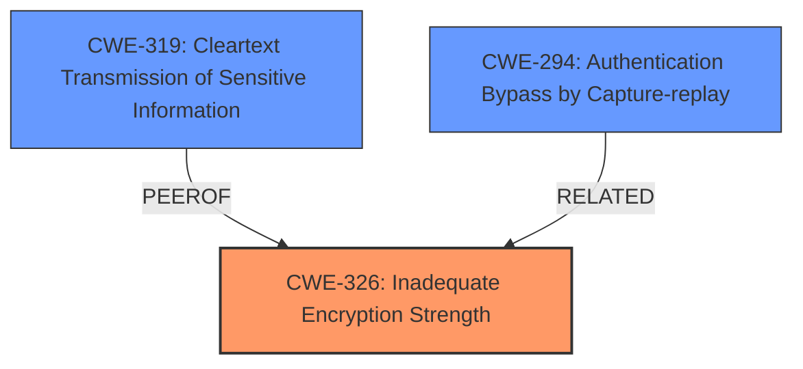

# Analysis for CVE-2022-2758

# Summary
| CWE ID | CWE Name | Confidence | CWE Abstraction Level | CWE Vulnerability Mapping Label | CWE-Vulnerability Mapping Notes |
|---|---|---|---|---|---|
| CWE-326 | Inadequate Encryption Strength | 1.0 | Class | Allowed-with-Review | Primary CWE |
| CWE-319 | Cleartext Transmission of Sensitive Information | 0.7 | Base | Allowed | Secondary Candidate |
| CWE-294 | Authentication Bypass by Capture-replay | 0.6 | Base | Allowed | Secondary Candidate |

## Evidence and Confidence

*   **Confidence Score:** 0.8
*   **Evidence Strength:** HIGH

## Relationship Analysis
The primary CWE is CWE-326, a Class that could have more specific children. CWE-319, Cleartext Transmission, could be a more specific issue since the password was transmitted in cleartext, but the description focuses on the inadequate encryption. CWE-294 (Authentication Bypass by Capture-replay) is also related since an attacker can replay the captured (weakly) encrypted password.

## Vulnerability Chain
The vulnerability chain starts with **inadequate encryption** (CWE-326). This leads to the ability to **sniff the communication traffic** and **decrypt the password**, ultimately granting unauthorized access to the PLC.

## Summary of Analysis
The initial analysis pointed to CWE-326 due to the **rootcause** being that "**Passwords are not adequately encrypted**". The "CVE Reference Links Content Summary" section reinforces this by stating, "Passwords are not encrypted strongly enough which could allow for decryption", and identifying "**CWE-326: Inadequate Encryption Strength**" as a weakness.

The relationship graph shows that CWE-326 is a class, and could have a more specific child. The retriever results also show that CWE-319 (Cleartext Transmission of Sensitive Information) is a candidate. However, since the description specifically mentions "**Passwords are not adequately encrypted**", it is most accurately represented by CWE-326. Even if the passwords were encrypted and transmitted in cleartext, the weakness is that the encryption is inadequate.

Therefore, CWE-326 is the most appropriate CWE because it directly addresses the root cause of the vulnerability, which is the use of weak encryption.

Relevant CWE Information:

# Enhanced Context (25 CWEs)

## CWE-807: Reliance on Untrusted Inputs in a Security Decision
**Abstraction Level**: Base
**Similarity Score**: 0.78
**Source**: dense

**Description**:
The product uses a protection mechanism that relies on the existence or values of an input, but the input can be modified by an untrusted actor in a way that bypasses the protection mechanism.
**Why it was not selected:** This CWE focuses on relying on untrusted inputs, which is not the core issue here. The problem is the inadequate encryption, not the reliance on untrusted inputs for a security decision.

## CWE-1391: Use of Weak Credentials
**Abstraction Level**: Class
**Similarity Score**: 0.78
**Source**: dense

**Description**:
The product uses weak credentials (such as a default key or hard-coded password) that can be calculated, derived, reused, or guessed by an attacker.
**Why it was not selected:** This CWE is about the use of weak credentials themselves. While the weak encryption allows the credentials to be compromised, the root cause isn't about the weakness of the credentials, but rather about the **inadequate encryption**.

## CWE-303: Incorrect Implementation of Authentication Algorithm
**Abstraction Level**: Base
**Similarity Score**: 0.78
**Source**: dense

**Description**:
The requirements for the product dictate the use of an established authentication algorithm, but the implementation of the algorithm is incorrect.
**Why it was not selected:** The description doesn't indicate an incorrect implementation of a specific authentication algorithm, but rather a general **lack of adequate encryption**.

## CWE-1240: Use of a Cryptographic Primitive with a Risky Implementation
**Abstraction Level**: Base
**Similarity Score**: 0.78
**Source**: dense

**Description**:
To fulfill the need for a cryptographic primitive, the product implements a cryptographic algorithm using a non-standard, unproven, or disallowed/non-compliant cryptographic implementation.
**Why it was not selected:** There's no mention of a risky or non-standard cryptographic implementation, only that the encryption is not strong enough.

## CWE-345: Insufficient Verification of Data Authenticity
**Abstraction Level**: Class
**Similarity Score**: 0.77
**Source**: dense

**Description**:
The product does not sufficiently verify the origin or authenticity of data, in a way that causes it to accept invalid data.
**Why it was not selected:** This CWE is about verifying the authenticity of data, which is not the primary issue here. The problem is **inadequate encryption**.

## CWE-657: Violation of Secure Design Principles
**Abstraction Level**: Class
**Similarity Score**: 0.76
**Source**: dense

**Description**:
The product violates well-established principles for secure design.
**Why it was not selected:** This is a very broad CWE. The issue is more specific than simply violating secure design principles.

## CWE-798: Use of Hard-coded Credentials
**Abstraction Level**: Base
**Similarity Score**: 0.76
**Source**: dense

**Description**:
The product contains hard-coded credentials, such as a password or cryptographic key.
**Why it was not selected:** The vulnerability doesn't involve hard-coded credentials. It's about **inadequate encryption** during communication.

## CWE-319: Cleartext Transmission of Sensitive Information
**Abstraction Level**: Base
**Similarity Score**: 0.76
**Source**: dense

**Description**:
The product transmits sensitive or security-critical data in cleartext in a communication channel that can be sniffed by unauthorized actors.
**Why it was considered:** The passwords are being transmitted in a way that is easily intercepted and decrypted by sniffing network traffic.
**Why it was not selected as the primary:** While cleartext transmission could be a factor, the primary weakness is that the passwords are not *adequately* encrypted in the first place. If the passwords were encrypted with a strong algorithm, then simply sniffing the traffic would not be sufficient to compromise the credentials.

## CWE-1289: Improper Validation of Unsafe Equivalence in Input
**Abstraction Level**: Base
**Similarity Score**: 0.75
**Source**: dense

**Description**:
The product receives an input value that is used as a resource identifier or other type of reference, but it does not validate or incorrectly validates that the input is equivalent to a potentially-unsafe value.
**Why it was not selected:** This CWE is not relevant to the vulnerability described.

## CWE-294: Authentication Bypass by Capture-replay
**Abstraction Level**: Base
**Similarity Score**: 0.75
**Source**: dense

**Description**:
A capture-replay flaw exists when the design of the product makes it possible for a malicious user to sniff network traffic and bypass authentication by replaying it to the server in question to the same effect as the original message (or with minor changes).
**Why it was considered:** An attacker could sniff the traffic and replay the password to authenticate, due to the **inadequate encryption**.
**Why it was not selected as the primary:** The root cause is not the ability to replay the authentication traffic, but the fact that the password can be decrypted in the first place.

## CWE-327: Use of a Broken or Risky Cryptographic Algorithm
**Abstraction Level**: Class
**Similarity Score**: 7527.15
**Source**: sparse

**Description**:
The product uses a broken or risky cryptographic algorithm or protocol.
**Why it was not selected:** The description doesn't indicate the use of a broken or risky cryptographic algorithm; it says the encryption is inadequate, which is a more general statement.

## CWE-259: Use of Hard-coded Password
**Abstraction Level**: Variant
**Similarity Score**: 7436.21
**Source**: sparse

**Description**:
The product contains a hard-coded password, which it uses for its own inbound authentication or for outbound communication to external components.
**Why it was not selected:** The description doesn't indicate the use of a hard-coded password.

## CWE-321: Use of Hard-coded Cryptographic Key
**Abstraction Level**: Variant
**Similarity Score**: 7415.73
**Source