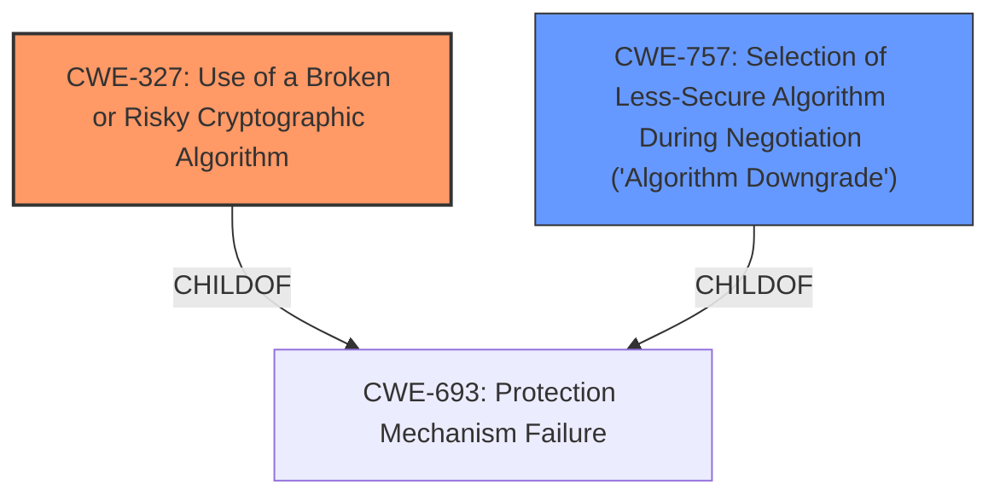

# Analysis for CVE-2022-27581

# Summary
| CWE ID | CWE Name | Confidence | CWE Abstraction Level | CWE Vulnerability Mapping Label | CWE-Vulnerability Mapping Notes |
|---|---|---|---|---|---|
| CWE-327 | Use of a Broken or Risky Cryptographic Algorithm | 1.0 | Class | Allowed-with-Review | Primary CWE |
| CWE-757 | Selection of Less-Secure Algorithm During Negotiation ('Algorithm Downgrade') | 0.7 | Base | Allowed | Secondary Candidate |

## Evidence and Confidence

*   **Confidence Score:** 0.9
*   **Evidence Strength:** HIGH

## Relationship Analysis
The primary CWE, CWE-327, is a Class-level CWE. It has a parent CWE of CWE-693 (Protection Mechanism Failure). The secondary CWE, CWE-757 is a Base level CWE and a ChildOf CWE-693. Choosing CWE-327 as primary captures the general use of a risky algorithm. If the negotiation aspect was clearer, I might have chosen CWE-757 as primary since it is more specific.

## Vulnerability Chain
The vulnerability chain starts with the **use of a broken or risky cryptographic algorithm**. This leads to the ability of a low-privileged remote attacker to **decrypt the encrypted data**.
  - The root cause is the **Use of a Broken or Risky Cryptographic Algorithm**.
  - The impact is the ability to decrypt the encrypted data.

## Summary of Analysis
The initial analysis strongly pointed towards CWE-327, "Use of a Broken or Risky Cryptographic Algorithm," which aligns perfectly with the vulnerability description's key phrase: "**rootcause:** **Use of a Broken or Risky Cryptographic Algorithm**". The retriever results also listed CWE-327 as the top candidate.

The vulnerability description states: "**Use of a Broken or Risky Cryptographic Algorithm** in SICK RFU61x firmware version <v2.25 allows a low-privileged remote attacker to decrypt the encrypted data if the user requested weak cipher suites to be used for encryption via the SSH interface."

CWE-327 is a Class-level CWE, and the mapping guidance suggests examining its children for a better fit. One potential child is CWE-1240, "Use of a Cryptographic Primitive with a Risky Implementation," which is a Base-level CWE. However, CWE-327 is more appropriate because it directly addresses the use of a broken or risky algorithm, while CWE-1240 is more about the implementation of the primitive.

CWE-757, "Selection of Less-Secure Algorithm During Negotiation ('Algorithm Downgrade')" was also considered as the vulnerability description mentions "if the user requested weak cipher suites to be used for encryption via the SSH interface." This suggests that the algorithm downgrade could be a factor. However, the primary weakness is the existence and use of the broken or risky cryptographic algorithm in the first place. Therefore, CWE-327 is chosen as the primary, with CWE-757 as a possible contributing factor if the root cause was the selection of weak ciphers.

The final decision is based on the evidence that the **rootcause** is the **Use of a Broken or Risky Cryptographic Algorithm**, making CWE-327 the most appropriate primary classification. CWE-327 is at the optimal level of specificity as it captures the core weakness described in the vulnerability.

Relevant CWE Information:

# Enhanced Context (25 CWEs)
The following CWEs were identified as potentially relevant to this vulnerability:

## CWE-1240: Use of a Cryptographic Primitive with a Risky Implementation
**Abstraction Level**: Base
**Similarity Score**: 0.82
**Source**: dense

**Description**:
To fulfill the need for a cryptographic primitive, the product implements a cryptographic algorithm using a non-standard, unproven, or disallowed/non-compliant cryptographic implementation.

**Mapping Guidance**:
- Usage: Allowed
- Rationale: This CWE entry is at the Base level of abstraction, which is a preferred level of abstraction for mapping to the root causes of vulnerabilities.

## CWE-338: Use of Cryptographically Weak Pseudo-Random Number Generator (PRNG)
**Abstraction Level**: Base
**Similarity Score**: 0.80
**Source**: dense

**Description**:
The product uses a Pseudo-Random Number Generator (PRNG) in a security context, but the PRNG's algorithm is not cryptographically strong.

**Mapping Guidance**:
- Usage: Allowed
- Rationale: This CWE entry is at the Base level of abstraction, which is a preferred level of abstraction for mapping to the root causes of vulnerabilities.

## CWE-335: Incorrect Usage of Seeds in Pseudo-Random Number Generator (PRNG)
**Abstraction Level**: Base
**Similarity Score**: 0.80
**Source**: dense

**Description**:
The product uses a Pseudo-Random Number Generator (PRNG) but does not correctly manage seeds.

**Mapping Guidance**:
- Usage: Allowed
- Rationale: This CWE entry is at the Base level of abstraction, which is a preferred level of abstraction for mapping to the root causes of vulnerabilities.

## CWE-330: Use of Insufficiently Random Values
**Abstraction Level**: Class
**Similarity Score**: 0.79
**Source**: dense

**Description**:
The product uses insufficiently random numbers or values in a security context that depends on unpredictable numbers.

**Mapping Guidance**:
- Usage: Discouraged
- Rationale: This CWE entry is a level-1 Class (i.e., a child of a Pillar). It might have lower-level children that would be more appropriate

## CWE-328: Use of Weak Hash
**Abstraction Level**: Base
**Similarity Score**: 0.78
**Source**: dense

**Description**:
The product uses an algorithm that produces a digest (output value) that does not meet security expectations for a hash function that allows an adversary to reasonably determine the original input (preimage attack), find another input that can produce the same hash (2nd preimage attack), or find multiple inputs that evaluate to the same hash (birthday attack).

**Mapping Guidance**:
- Usage: Allowed
- Rationale: This CWE entry is at the Base level of abstraction, which is a preferred level of abstraction for mapping to the root causes of vulnerabilities.

## CWE-331: Insufficient Entropy
**Abstraction Level**: Base
**Similarity Score**: 0.77
**Source**: dense

**Description**:
The product uses an algorithm or scheme that produces insufficient entropy, leaving patterns or clusters of values that are more likely to occur than others.

**Mapping Guidance**:
- Usage: Allowed
- Rationale: This CWE entry is at the Base level of abstraction, which is a preferred level of abstraction for mapping to the root causes of vulnerabilities.

## CWE-1391: Use of Weak Credentials
**Abstraction Level**: Class
**Similarity Score**: 0.76
**Source**: dense

**Description**:
The product uses weak credentials (such as a default key or hard-coded password) that can be calculated, derived, reused, or guessed by an attacker.

**Mapping Guidance**:
- Usage: Allowed-with-Review
- Rationale: This CWE entry is a Class and might have Base-level children that would be more appropriate

## CWE-1204: Generation of Weak Initialization Vector (IV)
**Abstraction Level**: Base
**Similarity Score**: 0.75
**Source**: dense

**Description**:
The product uses a cryptographic primitive that uses an Initialization
			Vector (IV), but the product does not generate IVs that are
			sufficiently unpredictable or unique according to the expected
			cryptographic requirements for that primitive.

**Mapping Guidance**:
- Usage: Allowed
- Rationale: This CWE entry is at the Base level of abstraction, which is a preferred level of abstraction for mapping to the root causes of vulnerabilities.

## CWE-345: Insufficient Verification of Data Authenticity
**Abstraction Level**: Class
**Similarity Score**: 0.75
**Source**: dense

**Description**:
The product does not sufficiently verify the origin or authenticity of data, in a way that causes it to accept invalid data.

**Mapping Guidance**:
- Usage: Discouraged
- Rationale: This CWE entry is a level-1 Class (i.e., a child of a Pillar). It might have lower-level children that would be more appropriate

## CWE-208: Observable Timing Discrepancy
**Abstraction Level**: Base
**Similarity Score**: 0.7