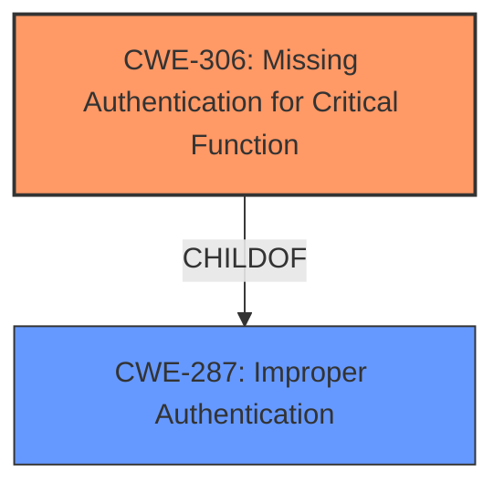

# Enhanced Analysis for CVE-2022-27583

# Summary
| CWE ID  | CWE Name                                            | Confidence | CWE Abstraction Level | CWE Vulnerability Mapping Label | CWE-Vulnerability Mapping Notes |
| :------- | :-------------------------------------------------- | :--------- | :-------------------- | :------------------------------ | :------------------------------ |
| CWE-306 | Missing Authentication for Critical Function | 0.75       | Base                  | Primary                         | Allowed                         |

## Evidence and Confidence

*   **Confidence Score:** 0.75
*   **Evidence Strength:** MEDIUM

## Relationship Analysis
The primary CWE selected is CWE-306, which is a Base level CWE. The retriever results listed several Class level CWEs (CWE-285, CWE-20, CWE-912). The choice of CWE-306 is because it is a Base level CWE and because the **missing authentication** is the root cause of the vulnerability.



## Vulnerability Chain
The chain of events is:
1.  **Missing authentication** (CWE-306) for the configuration interface.
2.  Remote unprivileged attacker interacts with the configuration interface.
3.  Impact on the availability of the FlexiCompact.

CWE-306 is the root cause and the impact is the availability.

## Summary of Analysis
The initial assessment was based on the vulnerability description stating that a remote unprivileged attacker can interact with the configuration interface. This immediately suggests an authentication or authorization issue.

The provided vulnerability description indicates a **lack of authentication** for a critical function, which leads to a potential impact on the availability of the FlexiCompact.

The evidence supporting this decision is:

*   The vulnerability description states: "A remote unprivileged attacker can interact with the configuration interface... to potentially impact the availability..."

Based on this evidence and the CWE descriptions, CWE-306 is the most appropriate and specific classification.

Relevant CWE Information:
*   CWE-306: Missing Authentication for Critical Function
    *   The product does not perform any authentication for functionality that requires a provable user identity or consumes a significant amount of resources.

CWEs considered but not used:

*   CWE-285: Improper Authorization - While authorization could be related, the description explicitly mentions an unprivileged attacker, indicating a lack of authentication as the primary issue. The description for CWE-285 is "The product does not perform or incorrectly performs an authorization check when an actor attempts to access a resource or perform an action."
*   CWE-20: Improper Input Validation - Input validation might be a secondary concern, but the primary issue is the **lack of authentication**. The description for CWE-20 is "The product receives input or data, but it does not validate or incorrectly validates that the input has the properties that are required to process the data safely and correctly."
*   CWE-912: Hidden Functionality - Irrelevant to the vulnerability description. The description for CWE-912 is "The product contains functionality that is not documented, not part of the specification, and not accessible through an interface or command sequence that is obvious to the product's users or administrators."


## CWE Relationship Analysis

Current CWEs represent these abstraction levels: .


### Vulnerability Chain Analysis

**Chain starting from CWE-20:**
- 20 (Improper Input Validation) - ROOT


**Chain starting from CWE-287:**
- 287 (Improper Authentication) - ROOT


### CWE Relationship Diagram

```mermaid
graph TD
    classDef primary fill:#f96,stroke:#333,stroke-width:2px
    classDef secondary fill:#69f,stroke:#333
    classDef tertiary fill:#9e9,stroke:#333
```