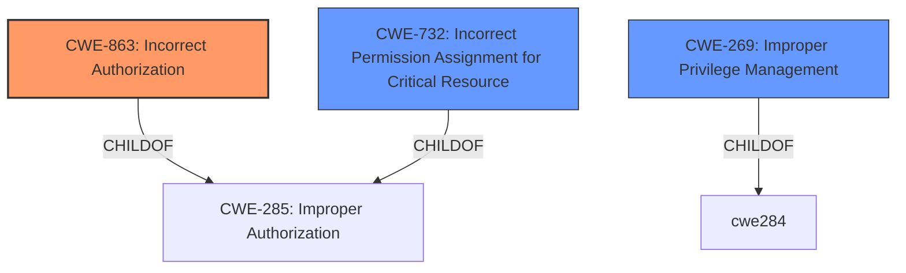

# Raw Analyzer Response for CVE-2022-27608

# Summary
| CWE ID | CWE Name | Confidence | CWE Abstraction Level | CWE Vulnerability Mapping Label | CWE-Vulnerability Mapping Notes |
|---|---|---|---|---|---|
| CWE-863 | Incorrect Authorization | 1.0 | Class | Allowed-with-Review | Primary CWE |
| CWE-732 | Incorrect Permission Assignment for Critical Resource | 0.7 | Class | Allowed-with-Review | Secondary Candidate |
| CWE-269 | Improper Privilege Management | 0.5 | Class | Discouraged | Secondary Candidate |

## Evidence and Confidence

*   **Confidence Score:** 0.9
*   **Evidence Strength:** HIGH

## Relationship Analysis
The primary CWE, CWE-863 **Incorrect Authorization**, is a Class-level CWE. The vulnerability involves a user with administrator privileges being able to tamper with registry keys, leading to the disabling of anti-tampering mechanisms and the Forcepoint One Endpoint. This aligns with the definition of **incorrect authorization**, where the product fails to correctly perform the authorization check.

CWE-732 **Incorrect Permission Assignment for Critical Resource** and CWE-269 **Improper Privilege Management** were considered as the vulnerability involves registry key tampering, suggesting potential issues with permission assignment or privilege management. However, the root cause is more directly related to the authorization check itself, making CWE-863 a more accurate fit.

The graph relationships influenced the decision to focus on authorization rather than general permission or privilege issues. While permission assignment and privilege management play a role, the core weakness is the **incorrect authorization** check that allows users with admin privileges to perform unauthorized actions.

## Vulnerability Chain
The vulnerability chain starts with the **incorrect authorization** (CWE-863), which leads to registry key tampering. This then allows the user to disable anti-tampering mechanisms, ultimately resulting in the disabling of Forcepoint One Endpoint and the protection it offers.

## Summary of Analysis
The initial analysis focused on the ability of administrator users to tamper with registry keys. The **CVE Reference Links Content Summary** explicitly mentions "**Incorrect authorization check when an actor attempts to access a resource or perform an action**" as the root cause. This, combined with the impact of disabling security measures, strongly points to CWE-863 **Incorrect Authorization** as the primary weakness.

The graph relationships and MITRE mapping guidance influenced the decision to select CWE-863 **Incorrect Authorization**. While other CWEs like CWE-732 **Incorrect Permission Assignment for Critical Resource** and CWE-269 **Improper Privilege Management** were considered, the core issue is the failed authorization check. The fact that CWE-863 is a child of CWE-285 **Improper Authorization**, further supports this selection.

The selected CWEs are at the optimal level of specificity because CWE-863 **Incorrect Authorization** directly addresses the **root cause** identified in the vulnerability description and the **CVE Reference Links Content Summary**. It accurately represents the **weakness** in the authorization process that allows administrator users to bypass security mechanisms.

Relevant CWE Information:

# Enhanced Context (25 CWEs)

## CWE-73: External Control of File Name or Path
**Abstraction Level**: Base
**Similarity Score**: 0.78
**Source**: dense

**Description**:
The product allows user input to control or influence paths or file names that are used in filesystem operations.
**Rationale for not selecting:** This vulnerability is not directly related to external control of file names or paths.

## CWE-41: Improper Resolution of Path Equivalence
**Abstraction Level**: Base
**Similarity Score**: 0.78
**Source**: dense

**Description**:
The product is vulnerable to file system contents disclosure through path equivalence. Path equivalence involves the use of special characters in file and directory names. The associated manipulations are intended to generate multiple names for the same object.
**Rationale for not selecting:** The vulnerability does not involve path equivalence or file system contents disclosure.

## CWE-74: Improper Neutralization of Special Elements in Output Used by a Downstream Component ('Injection')
**Abstraction Level**: Class
**Similarity Score**: 0.78
**Source**: dense

**Description**:
The product constructs all or part of a command, data structure, or record using externally-influenced input from an upstream component, but it does not neutralize or incorrectly neutralizes special elements that could modify how it is parsed or interpreted when it is sent to a downstream component.
**Rationale for not selecting:** This vulnerability is not related to injection vulnerabilities.

## CWE-184: Incomplete List of Disallowed Inputs
**Abstraction Level**: Base
**Similarity Score**: 0.78
**Source**: dense

**Description**:
The product implements a protection mechanism that relies on a list of inputs (or properties of inputs) that are not allowed by policy or otherwise require other action to neutralize before additional processing takes place, but the list is incomplete.
**Rationale for not selecting:** The vulnerability does not stem from an incomplete list of disallowed inputs.

## CWE-472: External Control of Assumed-Immutable Web Parameter
**Abstraction Level**: Base
**Similarity Score**: 0.78
**Source**: dense

**Description**:
The web application does not sufficiently verify inputs that are assumed to be immutable but are actually externally controllable, such as hidden form fields.
**Rationale for not selecting:** This vulnerability is not related to web parameters.

## CWE-807: Reliance on Untrusted Inputs in a Security Decision
**Abstraction Level**: Base
**Similarity Score**: 0.77
**Source**: dense

**Description**:
The product uses a protection mechanism that relies on the existence or values of an input, but the input can be modified by an untrusted actor in a way that bypasses the protection mechanism.
**Rationale for not selecting:** The vulnerability is not primarily about reliance on untrusted inputs in a security decision, but more directly about **incorrect authorization**.

## CWE-23: Relative Path Traversal
**Abstraction Level**: Base
**Similarity Score**: 0.77
**Source**: dense

**Description**:
The product uses external input to construct a pathname that should be within a restricted directory, but it does not properly neutralize sequences such as ".." that can resolve to a location that is outside of that directory.
**Rationale for not selecting:** This vulnerability is not related to path traversal.

## CWE-59: Improper Link Resolution Before File Access ('Link Following')
**Abstraction Level**: Base
**Similarity Score**: 0.77
**Source**: dense

**Description**:
The product attempts to access a file based on the filename, but it does not properly prevent that filename from identifying a link or shortcut that resolves to an unintended resource.
**Rationale for not selecting:** This vulnerability is not related to link following.

## CWE-668: Exposure of Resource to Wrong Sphere
**Abstraction Level**: Class
**Similarity Score**: 0.77
**Source**: dense

**Description**:
The product exposes a resource to the wrong control sphere, providing unintended actors with inappropriate access to the resource.
**Rationale for not selecting:** While this could be considered, CWE-863 **Incorrect Authorization** is a more direct classification.

## CWE-138: Improper Neutralization of Special Elements
**Abstraction Level**: Class
**Similarity Score**: 0.77
**Source**: dense

**Description**:
The product receives input from an upstream component, but it does not neutralize or incorrectly neutralizes special elements that could be interpreted as control elements or syntactic markers when they are sent to a downstream component.
**Rationale for not selecting:** This vulnerability is not related to improper neutralization of special elements.

## CWE-1386: Insecure Operation on Windows Junction / Mount Point
**Abstraction Level**: Base
**Similarity Score**: 0.515
**Source**: dense

**Description**:
The product opens a file or directory, but it does not properly prevent the name from being associated with a junction or mount point to a destination that is outside of the intended control sphere.
**Rationale for not selecting:** While the registry is being modified on Windows, this isn't related to junctions or mount points.

## CWE-613: Insufficient Session Expiration
**Abstraction Level**: base
**Similarity Score**: 4.33
**Source**: graph

**Description**:
CWE-613: Insufficient Session Expiration
**Rationale for not selecting:** This vulnerability is not related to session expiration.

## CWE-471: Modification of Assumed-Immutable Data