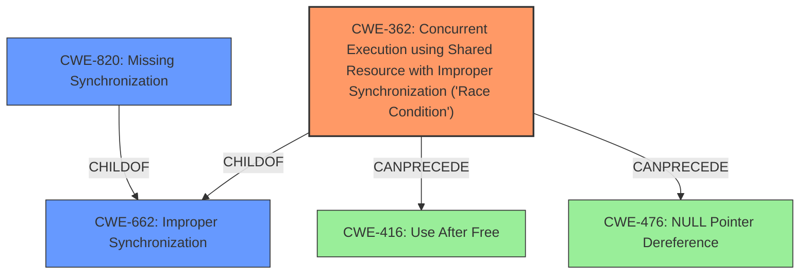

# Analysis for CVE-2022-27626

# Summary
| CWE ID  | CWE Name   | Confidence | CWE Abstraction Level | CWE Vulnerability Mapping Label | CWE-Vulnerability Mapping Notes |
|----------------|----------------------------------------------------------------------------------------------------------------|------------|-------------------------|-----------------------------------------------------------------|------------------------------------------------------------------------------------------------------------------------------------|
| CWE-362 | Concurrent Execution using Shared Resource with Improper Synchronization ('Race Condition') | 1 | Class | Primary | Allowed-with-Review |
| CWE-662 | Improper Synchronization | 0.7 | Class | Secondary | Discouraged |
| CWE-820 | Missing Synchronization | 0.7 | Base | Secondary | Allowed |

## Evidence and Confidence

*   **Confidence Score:** 0.8
*   **Evidence Strength:** HIGH

## Relationship Analysis
The primary CWE is CWE-362, which is a Class-level CWE. CWE-362 has child relationships with more specific synchronization issues, and it can precede CWE-416 (Use After Free) and CWE-476 (NULL Pointer Dereference). CWE-662 (Improper Synchronization) is a parent of CWE-362, representing a broader category of synchronization problems. CWE-820 (Missing Synchronization) is a child of CWE-662, providing a more specific view where synchronization is simply absent. The relationships influenced the decision to prioritize CWE-362 because it directly matches the described **race condition**.

## Vulnerability Chain
The chain of events starts with **concurrent execution using shared resources with improper synchronization (Race Condition)** (CWE-362), which can lead to exploitable conditions such as **use-after-free (CWE-416)** or **null pointer dereference (CWE-476)**, and ultimately, the **execution of arbitrary commands**. The root cause is the lack of proper synchronization leading to a race condition.

## Summary of Analysis
The initial assessment identifies a **race condition (concurrent execution using shared resource with improper synchronization)**, making CWE-362 the primary candidate. The evidence directly supports this, as the vulnerability description key phrases mention the **rootcause** as **concurrent execution using shared resource with improper synchronization (Race Condition)**. The CVE Reference Links Content Summary also explicitly states that the root cause is a **concurrent execution using shared resources with improper synchronization, specifically a race condition**.

The Retriever Results further support CWE-362 as the top candidate with a score of 0.800. The description of CWE-362, "The product contains a concurrent code sequence that requires temporary, exclusive access to a shared resource, but a timing window exists in which the shared resource can be modified by another code sequence operating concurrently," perfectly matches the vulnerability description.

CWE-662 (Improper Synchronization) and CWE-820 (Missing Synchronization) were considered as secondary candidates. While they are related to synchronization issues, they are less specific than CWE-362. CWE-662 is a class-level CWE and, according to its mapping guidance, might have more appropriate base-level children. CWE-820 (Missing Synchronization) describes a scenario where there is no synchronization at all, which is a possible cause of the race condition. However, the vulnerability description doesn't explicitly state that synchronization is missing; it states that the synchronization is improper.

The final decision is to use CWE-362 as the primary CWE because it precisely describes the **concurrent execution using shared resource with improper synchronization (Race Condition)**. This is at an appropriate level of specificity, addressing the core issue. CWE-662 and CWE-820 are retained as secondary CWEs to provide a broader context of the synchronization problems, with CWE-662 representing a general class of synchronization issues and CWE-820 highlighting the possibility of completely missing synchronization.

Relevant CWE Information:
### CWE-362: Concurrent Execution using Shared Resource with Improper Synchronization ('Race Condition')
**Abstraction:** Class
The product contains a concurrent code sequence that requires temporary, exclusive access to a shared resource, but a timing window exists in which the shared resource can be modified by another code sequence operating concurrently. The security implication is that a remote attacker can execute arbitrary commands, and the relationship is that CWE-362 is a more specific type of CWE-662 (Improper Synchronization) and can lead to CWE-416 (Use After Free) or CWE-476 (NULL Pointer Dereference).

### CWE-662: Improper Synchronization
**Abstraction:** Class
The product utilizes multiple threads or processes to allow temporary access to a shared resource that can only be exclusive to one process at a time, but it does not properly synchronize these actions, which might cause simultaneous accesses of this resource by multiple threads or processes. This CWE provides a broader context for the synchronization issue.

### CWE-820: Missing Synchronization
**Abstraction:** Base
The product utilizes a shared resource in a concurrent manner but does not attempt to synchronize access to the resource. Although the description specifies "improper synchronization", this CWE explains the case where the synchronization is missing.