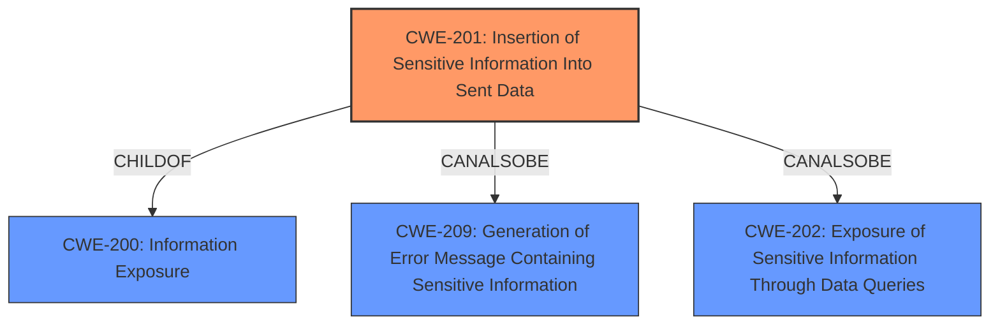

# Analysis Report for CVE-2022-27630

# Vulnerability Analysis Report: CVE-2022-27630

## Description


## Analysis (with Relationship Data)

# Summary
| CWE ID | CWE Name | Confidence | CWE Abstraction Level | CWE Vulnerability Mapping Label | CWE-Vulnerability Mapping Notes |
|---|---|---|---|---|---|
| CWE-201 | Insertion of Sensitive Information Into Sent Data | 0.9 | Base | Allowed | Primary CWE. The application sends sensitive information (Wi-Fi SSID and password) in a network packet, which constitutes an insertion of sensitive information into sent data. |

## Evidence and Confidence

*   **Confidence Score:** 0.9
*   **Evidence Strength:** HIGH

## Relationship Analysis
The primary CWE identified is CWE-201 (Insertion of Sensitive Information Into Sent Data), which is a base-level CWE. This CWE is directly related to CWE-200 (Information Exposure), which is a class-level CWE, via a ChildOf relationship (CWE-201 -> ChildOf -> CWE-200). The relationship indicates that CWE-201 is a specific type of information exposure, which aligns with the vulnerability description. There are also peer relationships with CWE-209 (Generation of Error Message Containing Sensitive Information) and CWE-202 (Exposure of Sensitive Information Through Data Queries). Since the information is sent in a network packet rather than an error message or a query response, CWE-201 is the most appropriate choice.



## Vulnerability Chain
The vulnerability chain starts with the **lack of proper input validation** in the `confctl_get_master_wlan` function. This leads to the retrieval of sensitive information (SSID and password) via `wlan_get_master_cfg` without proper authorization and subsequent sending of this data in a network packet, resulting in information disclosure.

## Summary of Analysis
The initial assessment identified CWE-201 as the primary weakness, based on the vulnerability description and the provided CVE Reference Links Content Summary. The evidence clearly indicates that the **root cause of the vulnerability** is the **improper handling of network packets** by the `confctl_get_master_wlan` function, which results in the **transmission of sensitive information** (Wi-Fi SSID and password) in the response. The "CVE Reference Links Content Summary" states: "The `confctl_get_master_wlan` function in the TCL LinkHub Mesh Wi-Fi system **does not properly validate or parse incoming network packets.** It retrieves sensitive information through `wlan_get_master_cfg` without any specific protobuf data being provided, and then **sends the data as a response**." This explicitly supports the selection of CWE-201.

The retriever results also list CWE-201 with a similarity score of 0.089. The abstraction level is Base, and the usage is allowed.

CWE-200 was the top CWE listed in the "CWE for similar CVE Descriptions" section and the retriever results confirm it to be a parent of CWE-201.

The selection of CWE-201 is at the optimal level of specificity, as it accurately represents the **insertion of sensitive information** into the sent data, rather than a more general information exposure.


## CWE Relationship Analysis

Current CWEs represent these abstraction levels: .


### Vulnerability Chain Analysis

**Chain starting from CWE-201:**
- 201 (Insertion of Sensitive Information Into Sent Data) - ROOT


**Chain starting from CWE-200:**
- 200 (Exposure of Sensitive Information to an Unauthorized Actor) - ROOT


### CWE Relationship Diagram

```mermaid
graph TD
    classDef primary fill:#f96,stroke:#333,stroke-width:2px
    classDef secondary fill:#69f,stroke:#333
    classDef tertiary fill:#9e9,stroke:#333
```


*Report generated on 2025-03-30 23:00:14*
