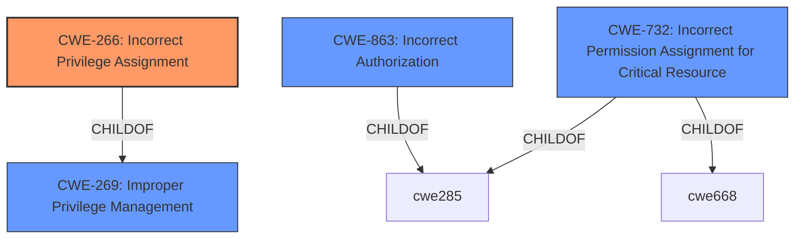

# Analysis for CVE-2022-27634

# Summary
| CWE ID  | CWE Name                                                                      | Confidence | CWE Abstraction Level | CWE Vulnerability Mapping Label | CWE-Vulnerability Mapping Notes |
| :-------- | :---------------------------------------------------------------------------- | :--------- | :---------------------- | :------------------------------ | :----------------------------- |
| CWE-266   | Incorrect Privilege Assignment                                                | 0.8        | Base                    | Primary CWE                     | Allowed                         |
| CWE-863   | Incorrect Authorization                                                       | 0.6        | Class                    | Secondary Candidate             | Allowed-with-Review           |
| CWE-269   | Improper Privilege Management                                                 | 0.4        | Class                    | Secondary Candidate             | Discouraged                     |
| CWE-732   | Incorrect Permission Assignment for Critical Resource                         | 0.3        | Class                    | Secondary Candidate             | Allowed-with-Review           |

## Evidence and Confidence

*   **Confidence Score:** 0.7
*   **Evidence Strength:** MEDIUM

## Relationship Analysis
The primary CWE selected is CWE-266, which focuses on **incorrect privilege assignment**. This is a base-level CWE and provides a more specific classification than its parent, CWE-269 (Improper Privilege Management), which is too general. CWE-863 (Incorrect Authorization) is considered as a closely related weakness, particularly because the **improper privilege assignment** could lead to **incorrect authorization** checks. CWE-732 is another alternative, but less likely because it explicitly mentions resources, which the description doesn't emphasize.

## Vulnerability Chain
The chain of events is as follows:
1.  **Root Cause:** **Improper configuration validation** in BIG-IP APM (likely due to CWE-266).
2.  **Weakness:** Allows manipulation of APM policy by an authenticated attacker.
3.  **Impact:** Privilege escalation and remote code execution.

## Summary of Analysis
The initial assessment focused on identifying the root cause of the vulnerability based on the description. The description clearly states that the BIG-IP APM **does not properly validate configurations**, which allows an attacker to manipulate the APM policy. This manipulation leads to privilege escalation and remote code execution.

The key phrase from the vulnerability description is **"improper configuration validation"**. This indicates that the system is not correctly checking the configurations, leading to the vulnerability.

CWE-266 (Incorrect Privilege Assignment) is the most appropriate primary CWE because the attacker, with high privileges, is able to escalate privileges, indicating a flaw in how privileges are assigned.

CWE-863 (Incorrect Authorization) is considered a secondary CWE because the **improper privilege assignment** directly leads to **incorrect authorization** checks. The attacker is able to bypass the intended authorization mechanism due to the initial **incorrect privilege assignment**.

CWE-269 (Improper Privilege Management) is considered but is too broad. While it's true that the vulnerability involves improper privilege management, CWE-266 provides a more specific classification by highlighting the **incorrect assignment** aspect. The mapping guidance for CWE-269 advises against using it when more specific CWEs are available.

CWE-732 (Incorrect Permission Assignment for Critical Resource) is also considered but is less likely because the vulnerability description does not explicitly mention resources or permissions. While the APM policy could be considered a resource, the emphasis is on the **improper validation** and subsequent **privilege escalation**, making CWE-266 and CWE-863 more fitting.

The selection of CWE-266 is at the optimal level of specificity because it directly addresses the root cause of the vulnerability, which is the **incorrect assignment of privileges** that allows an attacker to escalate privileges and execute code remotely. The other considered CWEs are either too broad (CWE-269) or focus on related but less central aspects of the vulnerability (CWE-863, CWE-732).