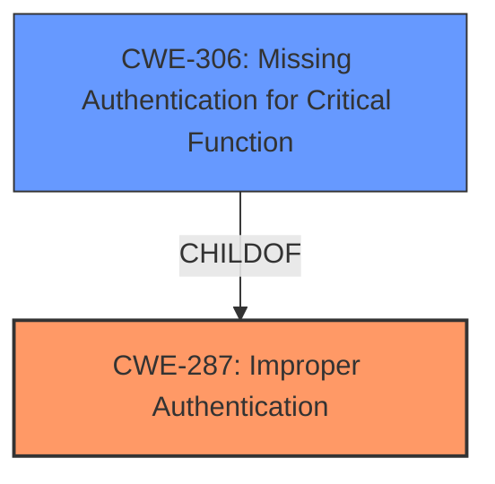

# Raw Analyzer Response for CVE-2022-2765

# Summary
| CWE ID | CWE Name | Confidence | CWE Abstraction Level | CWE Vulnerability Mapping Label | CWE-Vulnerability Mapping Notes |
|---|---|---|---|---|---|
| CWE-287 | Improper Authentication | 1.0 | Base | Primary | Allowed |
| CWE-306 | Missing Authentication for Critical Function | 0.8 | Base | Secondary | Allowed |

## Evidence and Confidence

*   **Confidence Score:** 0.9
*   **Evidence Strength:** HIGH

## Relationship Analysis
The primary CWE identified is CWE-287, **Improper Authentication**, which serves as a parent to CWE-306, **Missing Authentication for Critical Function**. The vulnerability description clearly indicates a failure in authentication mechanisms, making CWE-287 the most accurate high-level classification. Further analysis reveals that authentication is entirely missing for a critical function, refining the classification to the more specific CWE-306, which is a child of CWE-287. This relationship reinforces the selection of both CWEs, with CWE-287 capturing the general failure and CWE-306 highlighting the specific absence of authentication where it is required.

## Vulnerability Chain
The vulnerability chain starts with the **improper authentication**, leading to unauthorized access and modification of site settings.

1.  **Root Cause:** **Improper Authentication (CWE-287)** - The application fails to adequately verify the identity of the user.
2.  **Weakness:** **Missing Authentication for Critical Function (CWE-306)** - Specifically, the `/dashboard/settings` endpoint lacks any authentication checks.
3.  **Impact:** Unauthorized modification of site settings, potentially leading to defacement, malfunction, or unavailability of the website.

## Summary of Analysis
Initially, the vulnerability was identified as stemming from **improper authentication**, which is explicitly stated in the vulnerability description key phrases. The CVE Reference Links Content Summary provides more detailed evidence, emphasizing that the application **does not check if the user is logged in or has the correct permissions before allowing the update to the settings.** This lack of authentication directly leads to the selection of CWE-287, **Improper Authentication**, and the more specific CWE-306, **Missing Authentication for Critical Function**.

The graph relationships influenced the selection by highlighting the parent-child relationship between CWE-287 and CWE-306, allowing for a more precise classification of the vulnerability. The evidence clearly supports that authentication is not just improper but entirely missing for a critical function, making CWE-306 a suitable secondary classification.

The selected CWEs are at the optimal level of specificity because they accurately reflect the root cause and nature of the vulnerability, supported by direct evidence from the vulnerability description and CVE Reference Links Content Summary.

Relevant CWE Information:

# Enhanced Context (25 CWEs)
The following CWEs were identified as potentially relevant to this vulnerability:

## CWE-74: Improper Neutralization of Special Elements in Output Used by a Downstream Component ('Injection')
**Abstraction Level**: Class
**Similarity Score**: 0.77
**Source**: dense

**Description**:
The product constructs all or part of a command, data structure, or record using externally-influenced input from an upstream component, but it does not neutralize or incorrectly neutralizes special elements that could modify how it is parsed or interpreted when it is sent to a downstream component.

**Mapping Guidance**:
- Usage: Discouraged
- Rationale: CWE-74 is high-level and often misused when lower-level weaknesses are more appropriate.

*This CWE was considered but is not the primary issue. The **improper authentication** allows for potential injection vulnerabilities, but the primary flaw is the missing authentication.*

## CWE-1391: Use of Weak Credentials
**Abstraction Level**: Class
**Similarity Score**: 0.77
**Source**: dense

**Description**:
The product uses weak credentials (such as a default key or hard-coded password) that can be calculated, derived, reused, or guessed by an attacker.

**Mapping Guidance**:
- Usage: Allowed-with-Review
- Rationale: This CWE entry is a Class and might have Base-level children that would be more appropriate

*This CWE was considered but is not the primary issue. There is no mention of weak credentials being used; instead, authentication is entirely missing.*

## CWE-807: Reliance on Untrusted Inputs in a Security Decision
**Abstraction Level**: Base
**Similarity Score**: 0.76
**Source**: dense

**Description**:
The product uses a protection mechanism that relies on the existence or values of an input, but the input can be modified by an untrusted actor in a way that bypasses the protection mechanism.

**Mapping Guidance**:
- Usage: Allowed
- Rationale: This CWE entry is at the Base level of abstraction, which is a preferred level of abstraction for mapping to the root causes of vulnerabilities.

*This CWE was considered but is not the primary issue. While untrusted inputs are involved, the core problem is the absence of authentication, not the reliance on untrusted inputs for security decisions.*

## CWE-472: External Control of Assumed-Immutable Web Parameter
**Abstraction Level**: Base
**Similarity Score**: 0.76
**Source**: dense

**Description**:
The web application does not sufficiently verify inputs that are assumed to be immutable but are actually externally controllable, such as hidden form fields.

**Mapping Guidance**:
- Usage: Allowed
- Rationale: This CWE entry is at the Base level of abstraction, which is a preferred level of abstraction for mapping to the root causes of vulnerabilities.

*This CWE was considered but is not the primary issue. The vulnerability description doesn't focus on the manipulation of assumed-immutable parameters but rather on the lack of authentication to control access to settings.*

## CWE-639: Authorization Bypass Through User-Controlled Key
**Abstraction Level**: Base
**Similarity Score**: 0.76
**Source**: dense

**Description**:
The system's authorization functionality does not prevent one user from gaining access to another user's data or record by modifying the key value identifying the data.

**Mapping Guidance**:
- Usage: Allowed
- Rationale: This CWE entry is at the Base level of abstraction, which is a preferred level of abstraction for mapping to the root causes of vulnerabilities.

*This CWE was considered but is not the primary issue. This CWE relates to authorization bypass, which is a step further than authentication. Here, the authentication is missing entirely.*

## CWE-1289: Improper Validation of Unsafe Equivalence in Input
**Abstraction Level**: Base
**Similarity Score**: 0.76
**Source**: dense

**Description**:
The product receives an input value that is used as a resource identifier or other type of reference, but it does not validate or incorrectly validates that the input is equivalent to a potentially-unsafe value.

**Mapping Guidance**:
- Usage: Allowed
- Rationale: This CWE entry is at the Base level of abstraction, which is a preferred level of abstraction for mapping to the root causes of vulnerabilities.

*This CWE was considered but is not the primary issue. The problem isn't about validating equivalence of input, but the complete lack of authentication before modifying settings.*

## CWE-1390: Weak Authentication
**Abstraction Level**: Class
**Similarity Score**: 0.76
**Source**: dense

**Description**:
The product uses an authentication mechanism to restrict access to specific users or identities, but the mechanism does not sufficiently prove that the claimed identity is correct.

**Mapping Guidance**:
- Usage: Allowed-with-Review
- Rationale: This CWE entry is a Class and might have Base-level children that would be more appropriate

*This CWE was considered but is not the primary issue. There is no authentication mechanism to begin with; hence, it's not about weak authentication, but a complete absence of it.*

## CWE-330: Use of Insufficiently Random Values
**Abstraction Level**: Class
**Similarity Score**: 0.76
**Source**: dense

**Description**:
The product uses insufficiently random numbers or values in a security context that depends on unpredictable numbers.

**Mapping Guidance**:
- Usage: Discouraged
- Rationale: This CWE entry is a level-1 Class (i.e., a child of a Pillar). It might have lower-level children that would be more appropriate

*This CWE was considered but is not the primary issue. Random values are not part of the description.*

## CWE-319: Cleartext Transmission of Sensitive Information
**Abstraction Level**: Base
**Similarity Score**: 0.75
**Source**: dense

**Description**:
The product transmits sensitive or security-critical data in cleartext in a communication channel that can be sniffed by unauthorized actors.

**Mapping Guidance**:
- Usage: Allowed
- Rationale: This CWE entry is at the Base level of abstraction, which is a preferred level of abstraction for