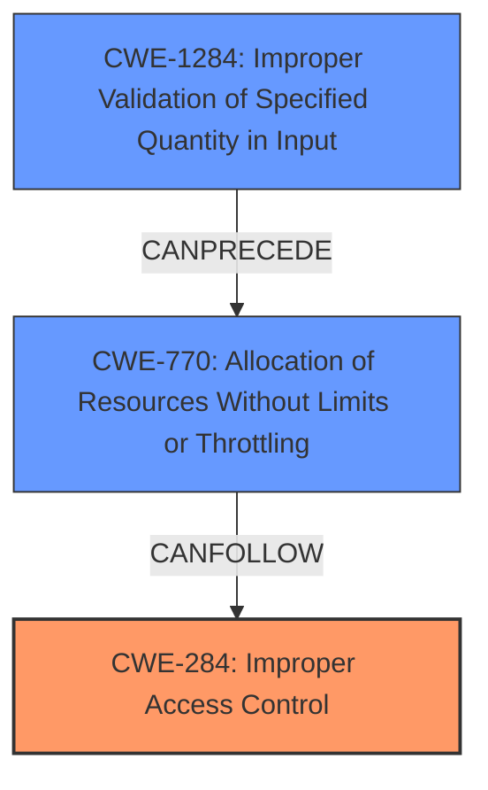

# Enhanced Analysis for CVE-2022-27660

# Summary
| CWE ID | CWE Name | Confidence | CWE Abstraction Level | CWE Vulnerability Mapping Label | CWE-Vulnerability Mapping Notes |
|---|---|---|---|---|---|
| CWE-284 | Improper Access Control | 0.9 | Base | Primary | Allowed |
| CWE-1284 | Improper Validation of Specified Quantity in Input | 0.6 | Base | Secondary | Allowed |
| CWE-770 | Allocation of Resources Without Limits or Throttling | 0.5 | Base | Secondary | Allowed |

## Evidence and Confidence

*   **Confidence Score:** 0.8
*   **Evidence Strength:** HIGH

## Relationship Analysis
The primary weakness is **CWE-284 [Improper Access Control]**, which indicates a fundamental flaw in how the system manages access to resources. This can lead to a chain of weaknesses, such as resource exhaustion or denial of service. **CWE-1284 [Improper Validation of Specified Quantity in Input]** and **CWE-770 [Allocation of Resources Without Limits or Throttling]** are potential related weaknesses, as the system might not properly validate the quantity of packets or the resources allocated to handle them. These relationships help to understand the broader context of the vulnerability and its potential impact.



## Vulnerability Chain
The vulnerability chain starts with **CWE-284 [Improper Access Control]**, which allows an attacker to send specially crafted network packets to the device without proper authentication or authorization. If the quantity of these packets is not validated (**CWE-1284 [Improper Validation of Specified Quantity in Input]**), it can lead to excessive resource allocation (**CWE-770 [Allocation of Resources Without Limits or Throttling]**), ultimately resulting in a denial-of-service condition.

## Summary of Analysis
The initial analysis focused on the **denial of service** impact and the lack of authentication, pointing towards access control issues. The retriever results suggested several input validation-related CWEs, but the root cause evidence strongly supports **CWE-284 [Improper Access Control]**, as the primary weakness.

The "CVE Reference Links Content Summary" clearly states:
- "**Improper Access Control (CWE-284):** The system allows unauthenticated users to modify guest Wi-Fi settings by sending specific packets to port 9003."
- "**Lack of Authentication/Authorization:** The system does not properly verify the source of the control messages."

This evidence directly supports the selection of **CWE-284 [Improper Access Control]**.

Additionally, the possibility of excessive resource allocation due to the lack of validation on the quantity of packets led to the consideration of **CWE-1284 [Improper Validation of Specified Quantity in Input]** and **CWE-770 [Allocation of Resources Without Limits or Throttling]**.

These CWEs are chosen to represent the root cause and potential consequences of the vulnerability, providing a comprehensive understanding of the security flaw.
The selected CWEs are at the optimal level of specificity, as they directly address the identified weaknesses and their potential impact.

Relevant CWE Information:

# Enhanced Context (25 CWEs)

## CWE-1289: Improper Validation of Unsafe Equivalence in Input
**Abstraction Level**: Base
**Similarity Score**: 0.80

## CWE-1288: Improper Validation of Consistency within Input
**Abstraction Level**: Base
**Similarity Score**: 0.78

## CWE-134: Use of Externally-Controlled Format String
**Abstraction Level**: Base
**Similarity Score**: 0.77

## CWE-184: Incomplete List of Disallowed Inputs
**Abstraction Level**: Base
**Similarity Score**: 0.76

## CWE-138: Improper Neutralization of Special Elements
**Abstraction Level**: Class
**Similarity Score**: 0.76

## CWE-183: Permissive List of Allowed Inputs
**Abstraction Level**: Base
**Similarity Score**: 0.76

## CWE-115: Misinterpretation of Input
**Abstraction Level**: Base
**Similarity Score**: 0.76

## CWE-807: Reliance on Untrusted Inputs in a Security Decision
**Abstraction Level**: Base
**Similarity Score**: 0.76

## CWE-606: Unchecked Input for Loop Condition
**Abstraction Level**: Base
**Similarity Score**: 0.76

## CWE-74: Improper Neutralization of Special Elements in Output Used by a Downstream Component ('Injection')
**Abstraction Level**: Class
**Similarity Score**: 0.76

## CWE-1284: Improper Validation of Specified Quantity in Input
**Abstraction Level**: Base
**Similarity Score**: 8487.05

## CWE-190: Integer Overflow or Wraparound
**Abstraction Level**: Base
**Similarity Score**: 8311.49

## CWE-125: Out-of-bounds Read
**Abstraction Level**: Base
**Similarity Score**: 8284.98

## CWE-789: Memory Allocation with Excessive Size Value
**Abstraction Level**: Variant
**Similarity Score**: 8046.71

## CWE-116: Improper Encoding or Escaping of Output
**Abstraction Level**: Class
**Similarity Score**: 8027.76

## CWE-78: Improper Neutralization of Special Elements used in an OS Command ('OS Command Injection')
**Abstraction Level**: base
**Similarity Score**: 5.03

## CWE-843: Access of Resource Using Incompatible Type ('Type Confusion')
**Abstraction Level**: base
**Similarity Score**: 5.03

## CWE-170: Improper Null Termination
**Abstraction Level**: base
**Similarity Score**: 5.03

## CWE-190: Integer Overflow or Wraparound
**Abstraction Level**: base
**Similarity Score**: 4.33

## CWE-120: Buffer Copy without Checking Size of Input ('Classic Buffer Overflow')
**Abstraction Level**: base
**Similarity Score**: 4.33

## CWE-123: Write-what-where Condition
**Abstraction Level**: base
**Similarity Score**: 4.33

## CWE-22: Improper Limitation of a Pathname to a Restricted Directory ('Path Traversal')
**Abstraction Level**: base
**Similarity Score**: 4.33

## CWE-770: Allocation of Resources Without Limits or Throttling
**Abstraction Level**: base
**Similarity Score**: 4.33

## CWE-1284: Improper Validation of Specified Quantity in Input
**Abstraction Level**: base
**Similarity Score**: 4.33

## CWE-321: Use of Hard-coded Cryptographic Key
**Abstraction Level**: variant
**Similarity Score**: 4.01

**CWE-259 [Use of Hard-coded Password]**, **CWE-201 [Insertion of Sensitive Information Into Sent Data]**, **CWE-1287 [Improper Validation of Specified Type of Input]**, and **CWE-1285 [Improper Validation of Specified Index, Position, or Offset in Input]** were considered but not used because they did not directly address the root cause of the vulnerability, which is the lack of access control. The vulnerability isn't about hardcoded passwords or sensitive data exposure.


## CWE Relationship Analysis

Current CWEs represent these abstraction levels: .


### Vulnerability Chain Analysis

**Chain starting from CWE-807:**
- 807 (Reliance on Untrusted Inputs in a Security Decision) - ROOT


**Chain starting from CWE-259:**
- 259 (Use of Hard-coded Password) - ROOT


### CWE Relationship Diagram

```mermaid
graph TD
    classDef primary fill:#f96,stroke:#333,stroke-width:2px
    classDef secondary fill:#69f,stroke:#333
    classDef tertiary fill:#9e9,stroke:#333
```