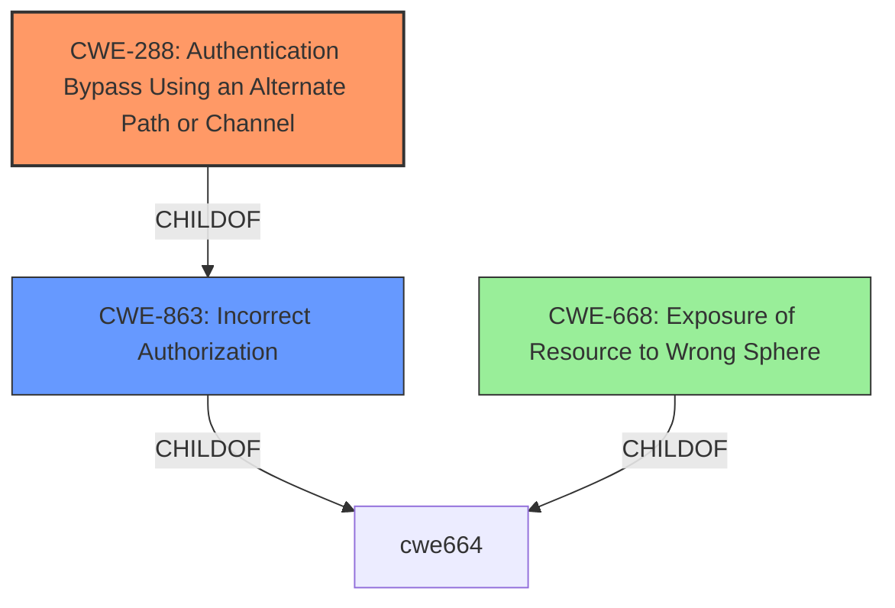

# Enhanced Analysis for CVE-2022-27668

# Summary
| CWE ID | CWE Name | Confidence | CWE Abstraction Level | CWE Vulnerability Mapping Label | CWE-Vulnerability Mapping Notes |
|---|---|---|---|---|---|
| CWE-288 | Authentication Bypass Using an Alternate Path or Channel | 0.9 | Base | Allowed | Primary CWE |
| CWE-863 | Incorrect Authorization | 0.7 | Class | Allowed-with-Review | Secondary Candidate |
| CWE-668 | Exposure of Resource to Wrong Sphere | 0.6 | Class | Discouraged | Secondary Candidate |

## Evidence and Confidence

*   **Confidence Score:** 0.8
*   **Evidence Strength:** HIGH

## Relationship Analysis
The primary CWE selected is CWE-288, which focuses on authentication bypass through an alternate path or channel. This is a base-level CWE, providing a specific description of the **insecure configuration** in the SAProuter. CWE-863 (Incorrect Authorization) is considered as a broader class-level CWE that could apply, but CWE-288 provides a more precise description of the vulnerability. CWE-668 (Exposure of Resource to Wrong Sphere) is a high-level class that is too general for the identified vulnerability.



## Vulnerability Chain
The chain starts with an **insecure configuration of the route permission table** (saprouttab), leading to the bypass of authentication checks, which allows an attacker to execute SAProuter administration commands and potentially impact system availability.

## Summary of Analysis
The vulnerability in SAP NetWeaver and ABAP Platform allows an unauthenticated attacker to execute SAProuter administration commands due to an **insecure configuration of the route permission table** (saprouttab). Specifically, the vulnerability lies in the SAProuter's handling of route requests where specifying a target destination of `0.0.0.0` bypasses the loopback prevention mechanism. This leads to unauthorized access to administrative functions.

The primary CWE, CWE-288 (Authentication Bypass Using an Alternate Path or Channel), accurately reflects this **insecure configuration** that allows bypassing authentication.

The evidence from the vulnerability description and CVE reference links directly supports this classification. The **root cause** is clearly identified as an **improper access control** leading to an authentication bypass.

CWE-863 (Incorrect Authorization) was considered but deemed less specific, as CWE-288 explicitly addresses the authentication bypass aspect. The description for CWE-863 notes that it is a Class and might have Base-level children that would be more appropriate. CWE-668 (Exposure of Resource to Wrong Sphere) was also considered but is too high-level and doesn't accurately capture the **root cause** of the vulnerability. The guidance for CWE-668 notes that it is frequently misused and that lower-level CWEs might be applicable.

The selection of CWE-288 is at the optimal level of specificity, as it accurately describes the **insecure configuration** leading to the authentication bypass, which is the **root cause** of the vulnerability.
Relevant CWE Information:
- **Vulnerability Description Key Phrases**:
  - **rootcause:** **insecure configuration of route permission table in saprouttab**
- **CVE Reference Links Content Summary:**
  - **Root Cause of Vulnerability:**
    - Improper access control in SAP Router.
  - **Weaknesses/Vulnerabilities Present:**
    - When a target destination of `0.0.0.0` (the IPv4 broadcast address) is specified, the intended loopback prevention mechanism is circumvented.


## CWE Relationship Analysis

Current CWEs represent these abstraction levels: .


### Vulnerability Chain Analysis

**Chain starting from CWE-288:**
- 288 (Authentication Bypass Using an Alternate Path or Channel) - ROOT


**Chain starting from CWE-668:**
- 668 (Exposure of Resource to Wrong Sphere) - ROOT


### CWE Relationship Diagram

```mermaid
graph TD
    classDef primary fill:#f96,stroke:#333,stroke-width:2px
    classDef secondary fill:#69f,stroke:#333
    classDef tertiary fill:#9e9,stroke:#333
```