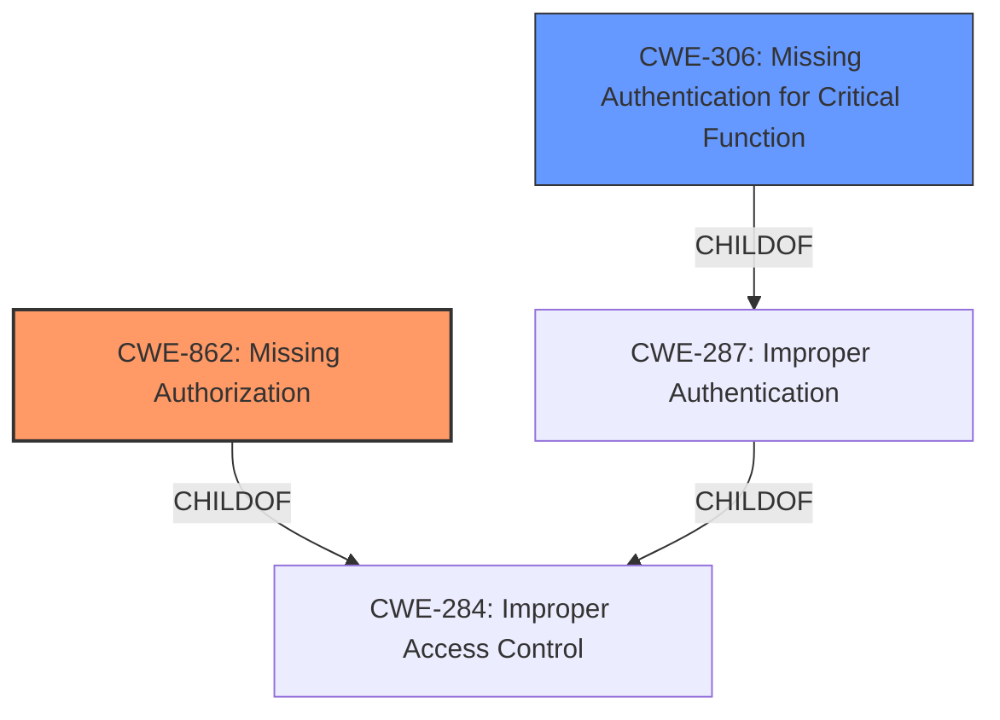

# Analysis Report for CVE-2022-27669

# Vulnerability Analysis Report: CVE-2022-27669

## Description


## Analysis (with Relationship Data)

# Summary
| CWE ID  | CWE Name                       | Confidence | CWE Abstraction Level | CWE Vulnerability Mapping Label | CWE-Vulnerability Mapping Notes |
| ------- | ------------------------------ | ---------- | --------------------- | ------------------------------- | ----------------------------- |
| CWE-862 | Missing Authorization          | 1.0        | Class                 | Primary                         | Allowed-with-Review           |
| CWE-306 | Missing Authentication for Critical Function | 0.75     | Base                  | Secondary                       | Allowed                       |

## Evidence and Confidence

*   **Confidence Score:** 0.9
*   **Evidence Strength:** MEDIUM

## Relationship Analysis
The primary CWE is CWE-862 **Missing Authorization**, which is a Class-level CWE. The retriever results suggest exploring its children for a more specific match. CWE-306 **Missing Authentication for Critical Function** is considered as a secondary CWE because the vulnerability involves an unauthenticated user accessing restricted functions, which implies a failure to establish user identity before granting access. CWE-306 is a child of CWE-287 **Improper Authentication**, which is related to CWE-862 **Incorrect Authorization** through a shared parent, CWE-284 **Improper Access Control**.



## Vulnerability Chain
The vulnerability chain starts with the **lack of authentication** and **missing authorization**, leading to an escalation of privileges.
  - **Root Cause:** **Missing Authentication** and **Missing Authorization**
  - **Impact:** Escalation of Privileges

## Summary of Analysis
The initial assessment identified CWE-862 **Missing Authorization** as a strong candidate due to the description mentioning unauthorized access to restricted functions. The description states: "An **unauthenticated user** can use functions of XML Data Archiving Service of SAP NetWeaver Application Server for Java - version 7.50, to which access should be restricted. This may result in an **escalation of privileges**."

The retriever results also suggested CWE-306 **Missing Authentication for Critical Function**. While the primary issue appears to be authorization (CWE-862), the fact that the user is unauthenticated is a significant factor. Therefore, CWE-306 is included as a secondary CWE.

The hierarchical relationships and chain patterns further support the selection of these CWEs. CWE-862 and CWE-306 are related through improper access control and authentication mechanisms.

The final selection of CWE-862 as the primary and CWE-306 as a secondary CWE is based on the evidence that the vulnerability involves both a **missing authorization** check and a **lack of authentication** for critical functions, ultimately leading to an **escalation of privileges**. CWE-862 is at the Class level while CWE-306 is at the Base level.

Relevant CWE Information:

# Enhanced Context (25 CWEs)
The following CWEs were identified as potentially relevant to this vulnerability:

## CWE-807: Reliance on Untrusted Inputs in a Security Decision
**Abstraction Level**: Base
**Similarity Score**: 0.78
**Source**: dense

**Description**:
The product uses a protection mechanism that relies on the existence or values of an input, but the input can be modified by an untrusted actor in a way that bypasses the protection mechanism.

**Mapping Guidance**:
- Usage: Allowed
- Rationale: This CWE entry is at the Base level of abstraction, which is a preferred level of abstraction for mapping to the root causes of vulnerabilities.

**Why Not Selected:**
This CWE is not selected because there's no evidence suggesting the reliance on untrusted inputs for security decisions. The core issue is the lack of authorization for critical functions.

## CWE-1289: Improper Validation of Unsafe Equivalence in Input
**Abstraction Level**: Base
**Similarity Score**: 0.77
**Source**: dense

**Description**:
The product receives an input value that is used as a resource identifier or other type of reference, but it does not validate or incorrectly validates that the input is equivalent to a potentially-unsafe value.

**Mapping Guidance**:
- Usage: Allowed
- Rationale: This CWE entry is at the Base level of abstraction, which is a preferred level of abstraction for mapping to the root causes of vulnerabilities.

**Why Not Selected:**
This CWE is not selected because the vulnerability description does not indicate improper validation of input equivalence. The primary issue is the **lack of authorization**, not input validation.

## CWE-274: Improper Handling of Insufficient Privileges
**Abstraction Level**: Base
**Similarity Score**: 0.76
**Source**: dense

**Description**:
The product does not handle or incorrectly handles when it has insufficient privileges to perform an operation, leading to resultant weaknesses.

**Mapping Guidance**:
- Usage: Discouraged
- Rationale: This CWE entry could be deprecated in a future version of CWE.

**Why Not Selected:**
This CWE is not selected because the core issue isn't about improper handling of insufficient privileges but the **absence of an authorization check**.

## CWE-184: Incomplete List of Disallowed Inputs
**Abstraction Level**: Base
**Similarity Score**: 0.76
**Source**: dense

**Description**:
The product implements a protection mechanism that relies on a list of inputs (or properties of inputs) that are not allowed by policy or otherwise require other action to neutralize before additional processing takes place, but the list is incomplete.

**Mapping Guidance**:
- Usage: Allowed
- Rationale: This CWE entry is at the Base level of abstraction, which is a preferred level of abstraction for mapping to the root causes of vulnerabilities.

**Why Not Selected:**
This CWE is not selected because the vulnerability is not related to an incomplete list of disallowed inputs. The problem stems from **missing authorization** to access functions.

## CWE-280: Improper Handling of Insufficient Permissions or Privileges
**Abstraction Level**: Base
**Similarity Score**: 0.76
**Source**: dense

**Description**:
The product does not handle or incorrectly handles when it has insufficient privileges to access resources or functionality as specified by their permissions. This may cause it to follow unexpected code paths that may leave the product in an invalid state.

**Mapping Guidance**:
- Usage: Allowed
- Rationale: This CWE entry is at the Base level of abstraction, which is a preferred level of abstraction for mapping to the root causes of vulnerabilities.

**Why Not Selected:**
This CWE is not selected because the issue is not about improper handling, but the **lack of authorization** in the first place.

## CWE-639: Authorization Bypass Through User-Controlled Key
**Abstraction Level**: Base
**Similarity Score**: 0.76
**Source**: dense

**Description**:
The system's authorization functionality does not prevent one user from gaining access to another user's data or record by modifying the key value identifying the data.

**Mapping Guidance**:
- Usage: Allowed
- Rationale: This CWE entry is at the Base level of abstraction, which is a preferred level of abstraction for mapping to the root causes of vulnerabilities.

**Why Not Selected:**
This CWE is not selected because there's no evidence of authorization bypass through user-controlled keys. The issue is related to **missing authorization** for functions.

## CWE-1220: Insufficient Granularity of Access Control
**Abstraction Level**: Base
**Similarity Score**: 0.76
**Source**: dense

**Description**:
The product implements access controls via a policy or other feature with the intention to disable or restrict accesses (reads and/or writes) to assets in a system from untrusted agents. However, implemented access controls lack required granularity, which renders the control policy too broad because it allows accesses from unauthorized agents to the security-sensitive assets.

**Mapping Guidance**:
- Usage: Allowed
- Rationale: This CWE entry is at the Base level of abstraction, which is a preferred level of abstraction for mapping to the root causes of vulnerabilities.

**Why Not Selected:**
This CWE is not selected because the vulnerability description does not mention insufficient granularity. The issue is the **absence of authorization**.

## CWE-74: Improper Neutralization of Special Elements in Output Used by a Downstream Component ('Injection')
**Abstraction Level**: Class
**Similarity Score**: 0.76
**Source**: dense

**Description**:
The product constructs all or part of a command, data structure, or record using externally-influenced input from an upstream component, but it does not neutralize or incorrectly neutralizes special elements that could modify how it is parsed or interpreted when it is sent to a downstream component.

**Mapping Guidance**:
- Usage: Disc


## CWE Relationship Analysis

Current CWEs represent these abstraction levels: .


### Vulnerability Chain Analysis

**Chain starting from CWE-862:**
- 862 (Missing Authorization) - ROOT


**Chain starting from CWE-280:**
- 280 (Improper Handling of Insufficient Permissions or Privileges ) - ROOT


### CWE Relationship Diagram

```mermaid
graph TD
    classDef primary fill:#f96,stroke:#333,stroke-width:2px
    classDef secondary fill:#69f,stroke:#333
    classDef tertiary fill:#9e9,stroke:#333
```


*Report generated on 2025-03-31 12:11:40*
