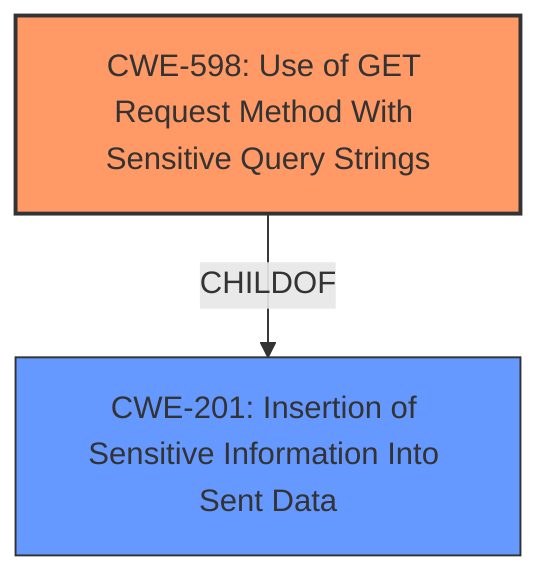

# Raw Analyzer Response for CVE-2022-27671

# Summary
| CWE ID | CWE Name | Confidence | CWE Abstraction Level | CWE Vulnerability Mapping Label | CWE-Vulnerability Mapping Notes |
|---|---|---|---|---|---|
| CWE-598 | Use of GET Request Method With Sensitive Query Strings | 0.8 | Variant | Allowed | Primary CWE |
| CWE-201 | Insertion of Sensitive Information Into Sent Data | 0.7 | Base | Allowed | Secondary CWE |

## Evidence and Confidence

*   **Confidence Score:** 0.75
*   **Evidence Strength:** MEDIUM

## Relationship Analysis
The primary CWE is CWE-598, a Variant of CWE-201. The relationship shows how a specific use of the GET method results in the insertion of sensitive information.

## Vulnerability Chain
The vulnerability chain starts with the **CSRF token visible in the URL** which leads to **Insertion of Sensitive Information Into Sent Data** which results in information disclosure.

## Summary of Analysis
The analysis concludes that the primary weakness is CWE-598, with CWE-201 as a related weakness. This is based on the vulnerability description of a **CSRF token visible in the URL**, which may lead to information disclosure. The retriever results also support this classification.

The **Vulnerability Description Key Phrases** section states that the **rootcause** is "**CSRF token visible in URL**" and the **impact** is "information disclosure". This aligns with CWE-598's description: "The web application uses the HTTP GET method to process a request and includes sensitive information in the query string of that request."

CWE-201 is a valid secondary CWE since it describes the insertion of sensitive information into sent data.

Relevant CWE Information:

# Enhanced Context (25 CWEs)

## CWE-201: Insertion of Sensitive Information Into Sent Data
**Abstraction Level**: Base
**Similarity Score**: 6017.09
**Source**: sparse

**Description**:
The code transmits data to another actor, but a portion of the data includes sensitive information that should not be accessible to that actor.

**Mapping Guidance**:
- Usage: Allowed
- Rationale: This CWE entry is at the Base level of abstraction, which is a preferred level of abstraction for mapping to the root causes of vulnerabilities.

## CWE-598: Use of GET Request Method With Sensitive Query Strings
**Abstraction Level**: Variant
**Similarity Score**: 0.129
**Source**: sparse

**Description**:
The web application uses the HTTP GET method to process a request and includes sensitive information in the query string of that request.

**Mapping Guidance**:
- Usage: Allowed
- Rationale: This CWE entry is at the Variant level of abstraction, which is a preferred level of abstraction for mapping to the root causes of vulnerabilities.

### CWE Selection and Justification

1.  **CWE-598: Use of GET Request Method With Sensitive Query Strings**
    *   **Match:** The vulnerability description states that the **CSRF token is visible in the URL**. Using the GET method includes the token in the URL, which matches CWE-598's description.
    *   **Abstraction:** Variant. This is the most specific CWE that matches the **rootcause**.
    *   **Usage:** Allowed.
    *   **Rationale:** The vulnerability description clearly indicates the use of the GET method with sensitive information (CSRF token) in the query string.
    *   **Confidence:** 0.8

2.  **CWE-201: Insertion of Sensitive Information Into Sent Data**
    *   **Match:** The **CSRF token visible in the URL** being sent is sensitive information, which is what CWE-201 describes.
    *   **Abstraction:** Base.
    *   **Usage:** Allowed.
    *   **Rationale:** The **CSRF token visible in the URL** qualifies as sensitive information being inserted into sent data.
    *   **Confidence:** 0.7

### CWEs Considered but Not Used

*   **CWE-352: Cross-Site Request Forgery (CSRF)** - While the vulnerability involves a CSRF token, the core issue is the exposure of the token itself, not the CSRF vulnerability directly. Therefore, CWE-352 is not the primary weakness.
*   **CWE-601: URL Redirection to Untrusted Site ('Open Redirect')** - This CWE is not relevant because the vulnerability description does not mention redirection to an untrusted site.
*   **CWE-214: Invocation of Process Using Visible Sensitive Information** - This CWE is not relevant because it relates to process invocation with sensitive command-line arguments, which is not the case in this vulnerability.
*   **CWE-1004: Sensitive Cookie Without 'HttpOnly' Flag** - This CWE is not relevant because the vulnerability description does not mention cookies.
*   **CWE-79: Improper Neutralization of Input During Web Page Generation ('Cross-site Scripting')** - This CWE is not relevant because the vulnerability description does not mention XSS.
*   **CWE-862: Missing Authorization** - This CWE is not relevant because the vulnerability description does not mention authorization issues.
*   **CWE-208: Observable Timing Discrepancy** - This CWE is not relevant because the vulnerability description does not mention any timing discrepancies.
*   **CWE-226: Sensitive Information in Resource Not Removed Before Reuse** - This CWE is not relevant because the vulnerability description does not involve resource reuse.