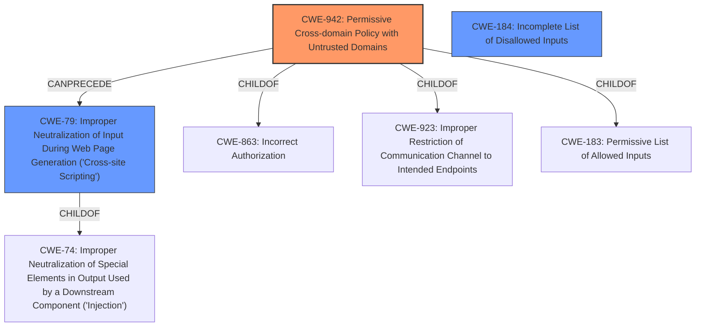

# Analysis for CVE-2022-27779

# Summary
| CWE ID | CWE Name | Confidence | CWE Abstraction Level | CWE Vulnerability Mapping Label | CWE-Vulnerability Mapping Notes |
|---|---|---|---|---|---|
| CWE-942 | Permissive Cross-domain Policy with Untrusted Domains | 0.8 | Variant | Allowed | Primary CWE |
| CWE-184 | Incomplete List of Disallowed Inputs | 0.6 | Base | Allowed | Secondary Candidate |
| CWE-79 | Improper Neutralization of Input During Web Page Generation ('Cross-site Scripting') | 0.5 | Base | Allowed | Secondary Candidate |

## Evidence and Confidence

*   **Confidence Score:** 0.8
*   **Evidence Strength:** MEDIUM

## Relationship Analysis
The primary relationship influencing the decision is the close match between the vulnerability description and CWE-942. The hierarchical and chain relationships of other CWEs were considered but deemed less relevant. The variant level of abstraction of CWE-942 is also a good fit for the specificity of the vulnerability.

## Vulnerability Chain
The vulnerability chain starts with the **improper input validation** of the hostname, specifically failing to handle trailing dots. This leads to a **bypass of cookie security** mechanisms intended to prevent cookies from being set on TLDs. The final impact is the potential for **cross-site cookie setting**, which can result in information exposure and data modification.

## Summary of Analysis
The primary CWE selected is CWE-942 because the vulnerability allows arbitrary sites to set cookies due to the **improper handling of trailing dots in hostnames**, effectively creating a **permissive cross-domain policy**. This aligns well with the description of CWE-942, which involves the use of cross-domain policy files that include domains that should not be trusted.

The evidence supporting this decision comes directly from the vulnerability description: "This can allow arbitrary sites to set cookies that then would get sent to a different and unrelated site or domain." The **root cause** is the **failure to properly validate the hostname**, leading to a bypass of the intended cookie security mechanism.

CWE-184 and CWE-79 were considered as secondary candidates. CWE-184 ("Incomplete List of Disallowed Inputs") is relevant because the check for preventing cookies on TLDs is incomplete due to the trailing dot bypass. CWE-79 ("Improper Neutralization of Input During Web Page Generation ('Cross-site Scripting')") was considered because the impact is similar to XSS attacks, but the root cause is more directly related to cross-domain policy issues than to input neutralization.

The selection of CWE-942 is at the optimal level of specificity because it directly addresses the vulnerability's mechanism: the **incorrect implementation of cross-domain policy checks**, which is a variant of the broader "Incorrect Authorization" (CWE-863).

Relevant CWE Information:

# Enhanced Context (25 CWEs)

## CWE-942: Permissive Cross-domain Policy with Untrusted Domains
**Abstraction Level**: Variant
**Similarity Score**: 7589.88
**Source**: sparse

**Description**:
The product uses a cross-domain policy file that includes domains that should not be trusted.

**Mapping Guidance**:
- Usage: Allowed
- Rationale: This CWE entry is at the Variant level of abstraction, which is a preferred level of abstraction for mapping to the root causes of vulnerabilities.

## CWE-184: Incomplete List of Disallowed Inputs
**Abstraction Level**: Base
**Similarity Score**: 3.20
**Source**: graph

**Description**:
The product implements a protection mechanism that relies on a list of inputs (or properties of inputs) that are not allowed by policy or otherwise require other action to neutralize before additional processing takes place, but the list is incomplete.

**Mapping Guidance**:
- Usage: Allowed
- Rationale: This CWE entry is at the Base level of abstraction, which is a preferred level of abstraction for mapping to the root causes of vulnerabilities.

## CWE-79: Improper Neutralization of Input During Web Page Generation ('Cross-site Scripting')
**Abstraction Level**: base
**Similarity Score**: 5.03
**Source**: graph

**Description**:
CWE-79: Improper Neutralization of Input During Web Page Generation ('Cross-site Scripting')

**Mapping Guidance**:
- Usage: Allowed
- Rationale: This CWE entry is at the Base level of abstraction, which is a preferred level of abstraction for mapping to the root causes of vulnerabilities.