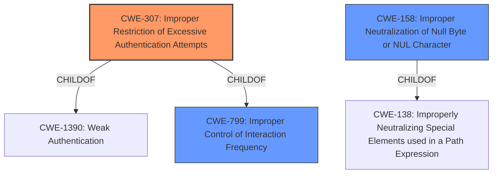

# Analysis Report for CVE-2022-2778

# Vulnerability Analysis Report: CVE-2022-2778

## Description


## Analysis (with Relationship Data)

# Summary

| CWE ID  | CWE Name                                                         | Confidence | CWE Abstraction Level | CWE Vulnerability Mapping Label | CWE-Vulnerability Mapping Notes |
| ------- | ---------------------------------------------------------------- | ---------- | ----------------------- | ------------------------------- | ----------------------------- |
| CWE-307 | Improper Restriction of Excessive Authentication Attempts        | 0.9        | Base                    | Primary                         | Allowed                       |
| CWE-158 | Improper Neutralization of Null Byte or NUL Character           | 0.7        | Variant                 | Secondary                       | Allowed                       |
| CWE-799 | Improper Control of Interaction Frequency                        | 0.6        | Class                   | Secondary                       | Allowed-with-Review         |

## Evidence and Confidence

*   **Confidence Score:** 0.8
*   **Evidence Strength:** HIGH

## Relationship Analysis

The primary CWE, CWE-307 [Improper Restriction of Excessive Authentication Attempts], is a base-level CWE and is child of both CWE-1390 [Weak Authentication] and CWE-799 [Improper Control of Interaction Frequency]. CWE-158 [Improper Neutralization of Null Byte or NUL Character] is a variant-level CWE and child of CWE-138. The relationship between these CWEs indicates that the **improper rate limiting** (CWE-307) is being bypassed due to the **improper handling of null bytes** (CWE-158).



## Vulnerability Chain

The vulnerability chain starts with the **improper handling of null bytes** (CWE-158) in the login process, which leads to the bypass of the intended rate limiting mechanism (CWE-307), ultimately allowing for potential brute-force attacks on user credentials.

## Summary of Analysis

Initially, the analysis focused on identifying the primary weakness related to the **improper rate limiting**. The vulnerability description and CVE Reference Links Content Summary clearly indicate a rate limit bypass as the core issue. The phrase "**improper rate limiting**" further supports this.

The Retriever Results suggested CWE-307 [Improper Restriction of Excessive Authentication Attempts] as a strong candidate. This CWE directly addresses the **lack of sufficient measures to prevent multiple failed authentication attempts**, aligning well with the **bypass of rate limiting** described in the vulnerability.

Additionally, the use of null bytes to bypass the rate limiting mechanism points to CWE-158 [Improper Neutralization of Null Byte or NUL Character]. The vulnerability description mentions that the bypass occurs "using null bytes," and the CVE Reference Links Content Summary states that login attempts with null bytes are the attack vector. This suggests that the application is not properly handling or neutralizing null bytes, allowing them to interfere with the rate limiting mechanism.

CWE-799 [Improper Control of Interaction Frequency] was also considered, as it broadly covers the **failure to limit the number or frequency of interactions**. However, CWE-307 is more specific to authentication attempts, making it a better fit as the primary CWE.

The final decision was to assign CWE-307 as the primary CWE, with CWE-158 and CWE-799 as secondary CWEs to provide additional context. This combination accurately captures the root cause (**improper rate limiting**), the exploitation vector (null bytes), and the broader class of the weakness (improper control of interaction frequency).

The selected CWEs are at the optimal level of specificity, as they directly address the identified weaknesses and are supported by the available evidence. CWE-307 is a base-level CWE, while CWE-158 is a variant-level CWE, providing a detailed and accurate representation of the vulnerability.

Relevant CWE Information:

# Enhanced Context (25 CWEs)
The following CWEs were identified as potentially relevant to this vulnerability:

## CWE-226: Sensitive Information in Resource Not Removed Before Reuse
**Abstraction Level**: Base
**Similarity Score**: 0.78
**Source**: dense

**Description**:
The product releases a resource such as memory or a file so that it can be made available for reuse, but it does not clear or "zeroize" the information contained in the resource before the product performs a critical state transition or makes the resource available for reuse by other entities.

**Mapping Guidance**:
- Usage: Allowed
- Rationale: This CWE entry is at the Base level of abstraction, which is a preferred level of abstraction for mapping to the root causes of vulnerabilities.

## CWE-405: Asymmetric Resource Consumption (Amplification)
**Abstraction Level**: Class
**Similarity Score**: 0.77
**Source**: dense

**Description**:
The product does not properly control situations in which an adversary can cause the product to consume or produce excessive resources without requiring the adversary to invest equivalent work or otherwise prove authorization, i.e., the adversary's influence is "asymmetric."

**Mapping Guidance**:
- Usage: Allowed-with-Review
- Rationale: This CWE entry is a Class and might have Base-level children that would be more appropriate

## CWE-404: Improper Resource Shutdown or Release
**Abstraction Level**: Class
**Similarity Score**: 0.77
**Source**: dense

**Description**:
The product does not release or incorrectly releases a resource before it is made available for re-use.

**Mapping Guidance**:
- Usage: Allowed-with-Review
- Rationale: This CWE entry is a Class and might have Base-level children that would be more appropriate

## CWE-799: Improper Control of Interaction Frequency
**Abstraction Level**: Class
**Similarity Score**: 0.77
**Source**: dense

**Description**:
The product does not properly limit the number or frequency of interactions that it has with an actor, such as the number of incoming requests.

**Mapping Guidance**:
- Usage: Allowed-with-Review
- Rationale: This CWE entry is a Class and might have Base-level children that would be more appropriate

## CWE-212: Improper Removal of Sensitive Information Before Storage or Transfer
**Abstraction Level**: Base
**Similarity Score**: 0.76
**Source**: dense

**Description**:
The product stores, transfers, or shares a resource that contains sensitive information, but it does not properly remove that information before the product makes the resource available to unauthorized actors.

**Mapping Guidance**:
- Usage: Allowed
- Rationale: This CWE entry is at the Base level of abstraction, which is a preferred level of abstraction for mapping to the root causes of vulnerabilities.

## CWE-668: Exposure of Resource to Wrong Sphere
**Abstraction Level**: Class
**Similarity Score**: 0.76
**Source**: dense

**Description**:
The product exposes a resource to the wrong control sphere, providing unintended actors with inappropriate access to the resource.

**Mapping Guidance**:
- Usage: Discouraged
- Rationale: CWE-668 is high-level and is often misused as a catch-all when lower-level CWE IDs might be applicable. It is sometimes used for low-information vulnerability reports [REF-1287]. It is a level-1 Class (i.e., a child of a Pillar). It is not useful for trend analysis.

## CWE-789: Memory Allocation with Excessive Size Value
**Abstraction Level**: Variant
**Similarity Score**: 0.76
**Source**: dense

**Description**:
The product allocates memory based on an untrusted, large size value, but it does not ensure that the size is within expected limits, allowing arbitrary amounts of memory to be allocated.

**Mapping Guidance**:
- Usage: Allowed
- Rationale: This CWE entry is at the Variant level of abstraction, which is a preferred level of abstraction for mapping to the root causes of vulnerabilities.

## CWE-407: Inefficient Algorithmic Complexity
**Abstraction Level**: Class
**Similarity Score**: 0.76
**Source**: dense

**Description**:
An algorithm in a product has an inefficient worst-case computational complexity that may be detrimental to system performance and can be triggered by an attacker, typically using crafted manipulations that ensure that the worst case is being reached.

**Mapping Guidance**:
- Usage: Allowed-with-Review
- Rationale: This CWE entry is a Class and might have Base-level children that would be more appropriate

## CWE-13


## CWE Relationship Analysis

Current CWEs represent these abstraction levels: .


### Vulnerability Chain Analysis

**Chain starting from CWE-158:**
- 158 (Improper Neutralization of Null Byte or NUL Character) - ROOT


**Chain starting from CWE-405:**
- 405 (Asymmetric Resource Consumption (Amplification)) - ROOT


### CWE Relationship Diagram

```mermaid
graph TD
    classDef primary fill:#f96,stroke:#333,stroke-width:2px
    classDef secondary fill:#69f,stroke:#333
    classDef tertiary fill:#9e9,stroke:#333
```


*Report generated on 2025-03-31 09:15:34*
