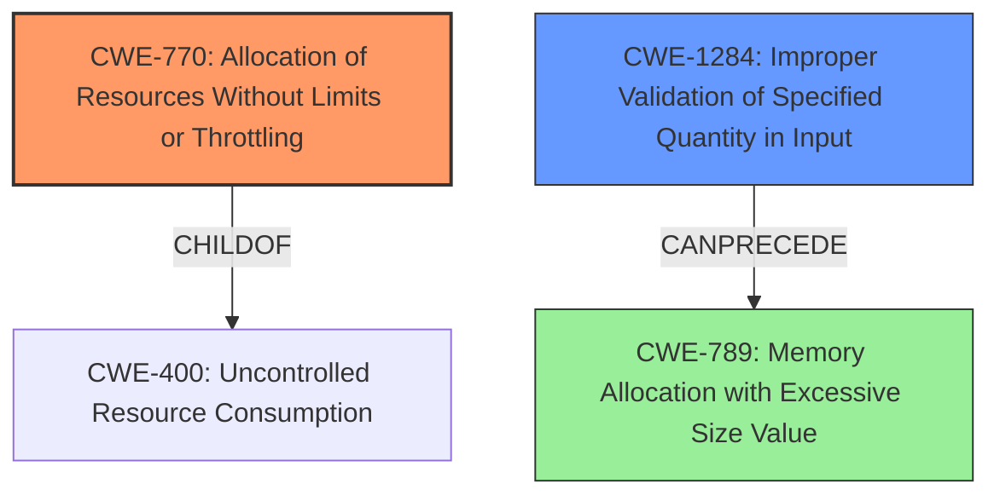

# Raw Analyzer Response for CVE-2022-27819

# Summary
| CWE ID | CWE Name | Confidence | CWE Abstraction Level | CWE Vulnerability Mapping Label | CWE-Vulnerability Mapping Notes |
|---|---|---|---|---|---|
| CWE-770 | Allocation of Resources Without Limits or Throttling | 0.9 | Base | Allowed | Primary CWE |
| CWE-1284 | Improper Validation of Specified Quantity in Input | 0.8 | Base | Allowed | Secondary Candidate |

## Evidence and Confidence

*   **Confidence Score:** 0.9
*   **Evidence Strength:** HIGH

## Relationship Analysis
The primary relationship impacting the decision is the hierarchical structure. CWE-770 (Allocation of Resources Without Limits or Throttling) is a child of CWE-400 (Uncontrolled Resource Consumption), making CWE-770 more specific and appropriate. CWE-1284 (Improper Validation of Specified Quantity in Input) can precede CWE-789 (Memory Allocation with Excessive Size Value).

## Vulnerability Chain
The vulnerability chain starts with the lack of input validation, leading to excessive resource allocation and ultimately a denial of service.

1.  **Root Cause:** **Unsafe Parsing** due to lack of input validation of file size via the `-c` option.
2.  **Weakness:** Allocation of Resources Without Limits or Throttling (CWE-770)
3.  **Impact:** Denial of Service (memory exhaustion)

## Summary of Analysis
The initial assessment identified **unsafe parsing** as the key weakness, particularly the lack of input validation related to file size. The **CVE Reference Links Content Summary** states: "The `swhkd` daemon directly reads and attempts to parse the content of any file provided using the `-c` option, regardless of its nature (e.g., regular files, block devices, character devices)." This indicates a clear absence of limits on resource allocation.

The retriever results suggested CWE-770 (Allocation of Resources Without Limits or Throttling) and CWE-1284 (Improper Validation of Specified Quantity in Input). While CWE-1284 is relevant due to the **missing validation** of the file size, CWE-770 directly addresses the allocation of resources without limits, which is the core issue. The **CVE Reference Links Content Summary** also categorizes the vulnerability under CWE-770.

The final decision is based on the evidence of **unsafe parsing** of potentially large files, the lack of input validation, and the resulting memory exhaustion. CWE-770 is at the optimal level of specificity as it directly describes the allocation of resources without limits, leading to a denial of service. CWE-1284 is considered as a secondary candidate because it contributes to the root cause by not properly validating the file size.

Relevant CWE Information:

# Enhanced Context (25 CWEs)
The following CWEs were identified as potentially relevant to this vulnerability:

## CWE-457: Use of Uninitialized Variable
**Abstraction Level**: Variant
**Similarity Score**: 0.78
**Source**: dense
**Description**:
The code uses a variable that has not been initialized, leading to unpredictable or unintended results.
**Why Not Used**: Irrelevant to the vulnerability description.

## CWE-667: Improper Locking
**Abstraction Level**: Class
**Similarity Score**: 0.76
**Source**: dense
**Description**:
The product does not properly acquire or release a lock on a resource, leading to unexpected resource state changes and behaviors.
**Why Not Used**: Irrelevant to the vulnerability description.

## CWE-909: Missing Initialization of Resource
**Abstraction Level**: Class
**Similarity Score**: 0.76
**Source**: dense
**Description**:
The product does not initialize a critical resource.
**Why Not Used**: Irrelevant to the vulnerability description.

## CWE-789: Memory Allocation with Excessive Size Value
**Abstraction Level**: Variant
**Similarity Score**: 0.76
**Source**: dense
**Description**:
The product allocates memory based on an untrusted, large size value, but it does not ensure that the size is within expected limits, allowing arbitrary amounts of memory to be allocated.
**Why Not Used**: While related to resource consumption, CWE-770 is a more direct fit as it describes the allocation of resources without *any* limits, not just excessive size.

## CWE-606: Unchecked Input for Loop Condition
**Abstraction Level**: Base
**Similarity Score**: 0.76
**Source**: dense
**Description**:
The product does not properly check inputs that are used for loop conditions, potentially leading to a denial of service or other consequences because of excessive looping.
**Why Not Used**: The vulnerability doesn't involve unchecked loop conditions.

## CWE-824: Access of Uninitialized Pointer
**Abstraction Level**: Base
**Similarity Score**: 0.76
**Source**: dense
**Description**:
The product accesses or uses a pointer that has not been initialized.
**Why Not Used**: Irrelevant to the vulnerability description.

## CWE-131: Incorrect Calculation of Buffer Size
**Abstraction Level**: Base
**Similarity Score**: 0.76
**Source**: dense
**Description**:
The product does not correctly calculate the size to be used when allocating a buffer, which could lead to a buffer overflow.
**Why Not Used**: The vulnerability is about allocating memory without limits, not incorrect buffer size calculations.

## CWE-908: Use of Uninitialized Resource
**Abstraction Level**: Base
**Similarity Score**: 0.76
**Source**: dense
**Description**:
The product uses or accesses a resource that has not been initialized.
**Why Not Used**: Irrelevant to the vulnerability description.

## CWE-226: Sensitive Information in Resource Not Removed Before Reuse
**Abstraction Level**: Base
**Similarity Score**: 0.76
**Source**: dense
**Description**:
The product releases a resource such as memory or a file so that it can be made available for reuse, but it does not clear or "zeroize" the information contained in the resource before the product performs a critical state transition or makes the resource available for reuse by other entities.
**Why Not Used**: Irrelevant to the vulnerability description.

## CWE-252: Unchecked Return Value
**Abstraction Level**: Base
**Similarity Score**: 0.75
**Source**: dense
**Description**:
The product does not check the return value from a method or function, which can prevent it from detecting unexpected states and conditions.
**Why Not Used**: Irrelevant to the vulnerability description.

## CWE-789: Memory Allocation with Excessive Size Value
**Abstraction Level**: Variant
**Similarity Score**: 5538.68
**Source**: sparse
**Description**:
The product allocates memory based on an untrusted, large size value, but it does not ensure that the size is within expected limits, allowing arbitrary amounts of memory to be allocated.
**Why Not Used**: While related to resource consumption, CWE-770 is a more direct fit as it describes the allocation of resources without *any* limits, not just excessive size.

## CWE-770: Allocation of Resources Without Limits or Throttling
**Abstraction Level**: Base
**Similarity Score**: 5267.41
**Source**: sparse
**Description**:
The product allocates a reusable resource or group of resources on behalf of an actor without imposing any restrictions on the size or number of resources that can be allocated, in violation of the intended security policy for that actor.

## CWE-1284: Improper Validation of Specified Quantity in Input
**Abstraction Level**: Base
**Similarity Score**: 5236.63
**Source**: sparse
**Description**:
The product receives input that is expected to specify a quantity (such as size or length), but it does not validate or incorrectly validates that the quantity has the required properties.

## CWE-835: Loop with Unreachable Exit Condition ('Infinite Loop')
**Abstraction Level**: Base
**Similarity Score**: 5233.52
**Source**: sparse
**Description**:
The product contains an iteration or loop with an exit condition that cannot be reached, i.e., an infinite loop.
**Why Not Used**: The vulnerability doesn't involve infinite loops.

## CWE-252: Unchecked Return Value
**Abstraction Level**: Base
**Similarity Score**: 5125.