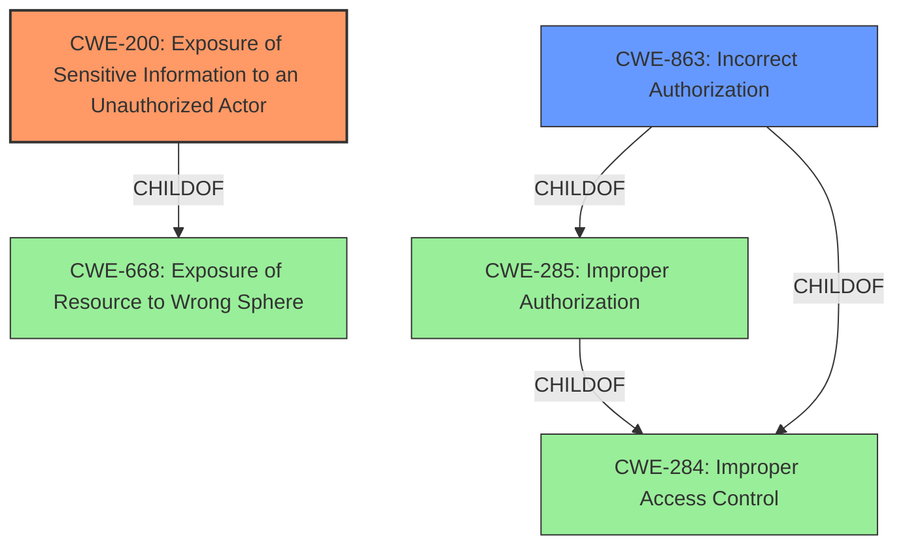

# Enhanced Analysis for CVE-2022-27822

# Summary
| CWE ID | CWE Name | Confidence | CWE Abstraction Level | CWE Vulnerability Mapping Label | CWE-Vulnerability Mapping Notes |
|---|---|---|---|---|---|
| CWE-200 | Exposure of Sensitive Information to an Unauthorized Actor | 0.9 | Class | Primary CWE | Discouraged because it is a technical impact, not a root cause. |
| CWE-863 | Incorrect Authorization | 0.7 | Class | Secondary Candidate | Allowed-with-Review because it's a Class CWE, children might be more appropriate. |

## Evidence and Confidence

*   **Confidence Score:** 0.8
*   **Evidence Strength:** HIGH

## Relationship Analysis
The primary CWE is CWE-200, which is a class-level CWE. It has child CWEs that are more specific.
CWE-863 is also a class-level CWE. It is related to authorization issues. It is a child of CWE-285 Improper Authorization which in turn is a child of CWE-284 Improper Access Control.
CWE-200 is a child of CWE-668, Exposure of Resource to Wrong Sphere.



## Vulnerability Chain
The vulnerability chain starts with the **exposure vulnerability in ril property setting**. This allows unauthorized access to the `EF_RUIMID` value. This leads to the **impact:** access EF_RUIMID value without permission which is sensitive information exposure.

## Summary of Analysis
The analysis is based on the provided evidence. The key phrases indicate an **exposure vulnerability** leading to unauthorized access to sensitive information. The CVE reference summary confirms this, highlighting the root cause as an information exposure issue in RIL property settings, specifically allowing access to the `EF_RUIMID` value without permission.

The primary CWE selected is CWE-200, "Exposure of Sensitive Information to an Unauthorized Actor." This aligns with the vulnerability description and the CVE reference summary, which both explicitly state that the vulnerability results in the exposure of sensitive information (`EF_RUIMID`) to unauthorized actors. However, CWE-200 is discouraged because it is a high level class CWE.

CWE-863, "Incorrect Authorization," is considered as a secondary candidate. The vulnerability allows access to a value without proper permission, indicating a potential authorization issue. However, the primary issue is the exposure of sensitive information, making CWE-200 a more direct fit.

The selection of CWE-200 is at a class level. Ideally a base or variant level would be better. The provided information does not allow for a more specific CWE assignment, as the exact mechanism **allowing access without permission** is not elaborated in enough detail to select a more specific CWE. Given the available information, CWE-200 is the most appropriate choice.


## CWE Relationship Analysis

Current CWEs represent these abstraction levels: .


### Vulnerability Chain Analysis

**Chain starting from CWE-200:**
- 200 (Exposure of Sensitive Information to an Unauthorized Actor) - ROOT


**Chain starting from CWE-668:**
- 668 (Exposure of Resource to Wrong Sphere) - ROOT


### CWE Relationship Diagram

```mermaid
graph TD
    classDef primary fill:#f96,stroke:#333,stroke-width:2px
    classDef secondary fill:#69f,stroke:#333
    classDef tertiary fill:#9e9,stroke:#333
```