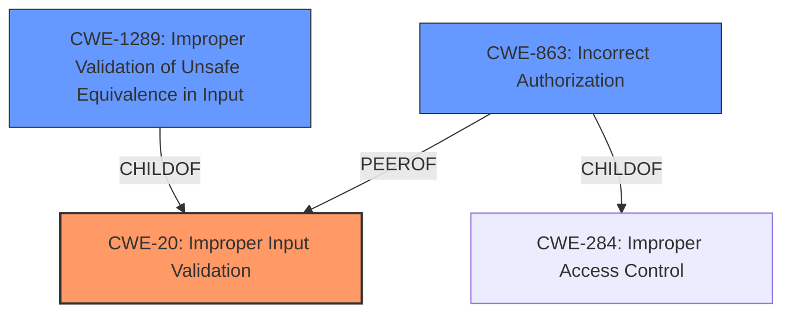

# Enhanced Analysis for CVE-2022-27826

# Summary
| CWE ID | CWE Name | Confidence | CWE Abstraction Level | CWE Vulnerability Mapping Label | CWE-Vulnerability Mapping Notes |
|---|---|---|---|---|---|
| CWE-20 | Improper Input Validation | 0.7 | Class | Primary | Discouraged |
| CWE-1289 | Improper Validation of Unsafe Equivalence in Input | 0.6 | Base | Secondary | Allowed |
| CWE-863 | Incorrect Authorization | 0.5 | Class | Secondary | Allowed-with-Review |

## Evidence and Confidence

*   **Confidence Score:** 0.7
*   **Evidence Strength:** MEDIUM

## Relationship Analysis
The primary CWE is CWE-20, which is a class-level weakness related to improper input validation. CWE-1289 and CWE-863 are secondary considerations. CWE-1289 is a more specific base-level weakness, and a child of CWE-20, focusing on improper validation of unsafe equivalence in input. CWE-863 is a Class level and also a child of CWE-284 but focuses on incorrect authorization.



## Vulnerability Chain
The chain of events starts with **improper validation** of input within the `SemSuspendDialogInfo` component. This **improper validation** leads to a state where attackers can launch certain activities, potentially with elevated privileges.

## Summary of Analysis
Initially, the analysis focused on the **improper validation** aspect of the vulnerability, as highlighted in both the vulnerability description and the CVE reference content summary: "**Improper validation vulnerability in SemSuspendDialogInfo** prior to SMR Apr-2022 Release 1 allows attackers to launch certain activities." and "**Root cause of vulnerability: Improper validation** in multiple components: `SemSuspendDialogInfo`". This points towards CWE-20 (Improper Input Validation).

However, the retriever results and the complete CWE specifications also provided relevant options such as CWE-1289 (Improper Validation of Unsafe Equivalence in Input) and CWE-863 (Incorrect Authorization). CWE-1289 aligns with the **improper validation** aspect, while CWE-863 relates to the ability to "launch certain activities", which could be due to authorization bypass. The analysis considered the relationships between these CWEs, particularly the parent-child relationships and the level of abstraction.

Given the available evidence and the MITRE mapping guidance, CWE-20 is selected as the primary CWE due to the root cause being **improper validation**. However, since the **improper validation** leads to the ability to launch activities, CWE-863 is considered as a secondary CWE.

CWE-1289 is also a valid secondary match as it focuses on **Improper Validation of Unsafe Equivalence in Input**.

Relevant CWE Information:

# Enhanced Context (25 CWEs)
The following CWEs were identified as potentially relevant to this vulnerability:

## CWE-1289: Improper Validation of Unsafe Equivalence in Input
**Abstraction Level**: Base
**Similarity Score**: 0.77
**Source**: dense

**Description**:
The product receives an input value that is used as a resource identifier or other type of reference, but it does not validate or incorrectly validates that the input is equivalent to a potentially-unsafe value.

**Mapping Guidance**:
- Usage: Allowed
- Rationale: This CWE entry is at the Base level of abstraction, which is a preferred level of abstraction for mapping to the root causes of vulnerabilities.

## CWE-863: Incorrect Authorization
**Abstraction Level**: Class
**Similarity Score**: 6144.40
**Source**: sparse

**Description**:
The product performs an authorization check when an actor attempts to access a resource or perform an action, but it does not correctly perform the check.

**Mapping Guidance**:
- Usage: Allowed-with-Review
- Rationale: This CWE entry is a Class and might have Base-level children that would be more appropriate

## CWE-20: Improper Input Validation
**Abstraction:** Class
**Status:** Stable

### Description
The product receives input or data, but it does
        not validate or incorrectly validates that the input has the
        properties that are required to process the data safely and
        correctly.

### Extended Description


Input validation is a frequently-used technique for checking potentially dangerous inputs in order to ensure that the inputs are safe for processing within the code, or when communicating with other components. When software does not validate input properly, an attacker is able to craft the input in a form that is not expected by the rest of the application. This will lead to parts of the system receiving unintended input, which may result in altered control flow, arbitrary control of a resource, or arbitrary code execution.


## CWE Relationship Analysis

Current CWEs represent these abstraction levels: .


### Vulnerability Chain Analysis

**Chain starting from CWE-1289:**
- 1289 (Improper Validation of Unsafe Equivalence in Input) - ROOT


**Chain starting from CWE-20:**
- 20 (Improper Input Validation) - ROOT


### CWE Relationship Diagram

```mermaid
graph TD
    classDef primary fill:#f96,stroke:#333,stroke-width:2px
    classDef secondary fill:#69f,stroke:#333
    classDef tertiary fill:#9e9,stroke:#333
```