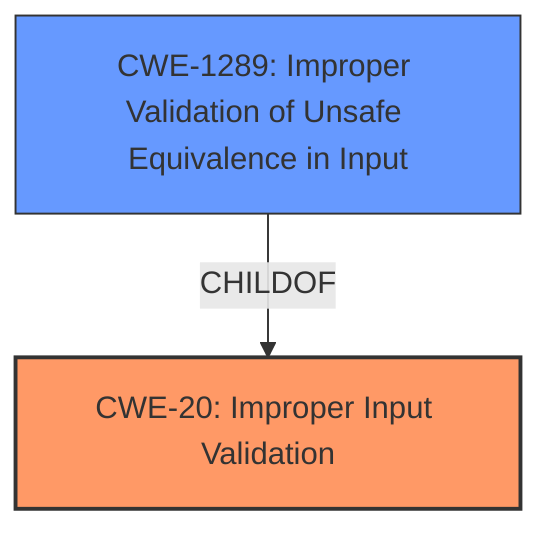

# Analysis for CVE-2022-27828

# Summary
| CWE ID | CWE Name | Confidence | CWE Abstraction Level | CWE Vulnerability Mapping Label | CWE-Vulnerability Mapping Notes |
|---|---|---|---|---|---|
| CWE-20 | Improper Input Validation | 0.9 | Class | Primary | Discouraged |
| CWE-1289 | Improper Validation of Unsafe Equivalence in Input | 0.7 | Base | Secondary | Allowed |

## Evidence and Confidence

*   **Confidence Score:** 0.9
*   **Evidence Strength:** HIGH

## Relationship Analysis
The primary relationship influencing the CWE selection is that CWE-20 [CWE-20: Improper Input Validation] is a parent of CWE-1289 [CWE-1289: Improper Validation of Unsafe Equivalence in Input]. CWE-20 is a class-level CWE, while CWE-1289 is a base-level CWE. Although CWE-20 is discouraged, it is selected as the primary because the description and reference material does not provide enough information to confidently select a more specific base-level CWE. CWE-1289 is considered a secondary option as the vulnerability description mentions "launch certain activities" which may be related to "unsafe equivalence".

## Vulnerability Chain
The vulnerability chain involves **improper validation** leading to the ability for attackers to "launch certain activities".

## Summary of Analysis
The initial assessment identified **improper validation** as the root cause, aligning with CWE-20 [CWE-20: Improper Input Validation]. The CVE Reference Links Content Summary reinforces this by stating "The root cause is an **Improper validation vulnerability**".

CWE-20 [CWE-20: Improper Input Validation] is a class-level CWE and is generally discouraged unless more specific CWEs cannot be identified. The retriever results also listed CWE-20 [CWE-20: Improper Input Validation] as one of the top matches. While several other CWEs were considered, including CWE-1289 [CWE-1289: Improper Validation of Unsafe Equivalence in Input], CWE-807 [CWE-807: Reliance on Untrusted Inputs in a Security Decision], and CWE-1284 [CWE-1284: Improper Validation of Specified Quantity in Input], the lack of specific details in the vulnerability description made it difficult to pinpoint a more precise CWE.

The decision to use CWE-20 [CWE-20: Improper Input Validation] is based on the evidence "rootcause: **Improper validation**" from the "Vulnerability Description Key Phrases" and the reference to **Improper validation vulnerability** in the CVE Reference Links Content Summary. Although CWE-20 [CWE-20: Improper Input Validation] is discouraged, the available evidence does not sufficiently support a more specific CWE, and therefore CWE-20 [CWE-20: Improper Input Validation] serves as the primary classification. CWE-1289 [CWE-1289: Improper Validation of Unsafe Equivalence in Input] is included as a secondary candidate, due to the "launch certain activities" impact possibly involving unsafe equivalence. The selected CWEs are at appropriate levels of specificity given the available information, but more information may change this assessment.

Relevant CWE Information:
* CWE-20 [CWE-20: Improper Input Validation]: The product receives input or data, but it does not validate or incorrectly validates that the input has the properties that are required to process the data safely and correctly.
* CWE-1289 [CWE-1289: Improper Validation of Unsafe Equivalence in Input]: The product receives an input value that is used as a resource identifier or other type of reference, but it does not validate or incorrectly validates that the input is equivalent to a potentially-unsafe value.