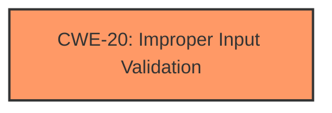

# Raw Analyzer Response for CVE-2022-27829

# Summary
| CWE ID | CWE Name | Confidence | CWE Abstraction Level | CWE Vulnerability Mapping Label | CWE-Vulnerability Mapping Notes |
|---|---|---|---|---|---|
| CWE-20 | Improper Input Validation | 0.8 | Class | Primary | Discouraged |

## Evidence and Confidence

*   **Confidence Score:** 0.8
*   **Evidence Strength:** HIGH

## Relationship Analysis
The primary CWE selected is CWE-20, **Improper Input Validation**, which is a Class-level CWE. While it's generally discouraged to map directly to Class-level CWEs, the vulnerability description explicitly mentions "**Improper validation**" as the root cause. The retriever results also list several child CWEs of CWE-20 (e.g., CWE-1284, CWE-1285, CWE-1286, CWE-1287, CWE-1288, CWE-1289) that could provide more specificity. However, without further details about the specific type of validation that is missing or **improper**, it is difficult to select a more specific CWE with high confidence. The relationships between CWE-20 and other CWEs like CWE-22 (Path Traversal) and CWE-119 (Buffer Overflow) indicate potential consequences of **improper input validation**.

## Vulnerability Chain
The vulnerability chain starts with the **improper validation** of input in the `VerifyCredentialResponse` component. This **improper validation** allows attackers to "launch certain activities," indicating a potential impact such as privilege escalation or unauthorized access to functionality.

## Summary of Analysis
The initial assessment focuses on the "**Improper validation**" as the root cause. The vulnerability description key phrases highlight this as the main weakness, and the CVE reference confirms this.

The Retriever Results offered CWE-20, **Improper Input Validation**, which aligns with the **root cause** description. While CWE-20 is a Class-level CWE and discouraged for direct mapping, the lack of specific details about the validation issue makes it difficult to choose a more specific Base or Variant CWE. The evidence strongly points to **improper validation** being the primary issue, but the type of **improper validation** is not specified.

Therefore, based on the available evidence, CWE-20 is the most appropriate choice.

Relevant CWE Information:

# Enhanced Context (25 CWEs)
The following CWEs were identified as potentially relevant to this vulnerability:

## CWE-20: Improper Input Validation
**Abstraction:** Class
**Status:** Stable

### Description
The product receives input or data, but it does
        not validate or incorrectly validates that the input has the
        properties that are required to process the data safely and
        correctly.