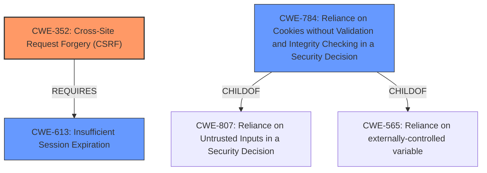

# Analysis for CVE-2022-2783

# Summary
| CWE ID    | CWE Name                                                       | Confidence | CWE Abstraction Level | CWE Vulnerability Mapping Label | CWE-Vulnerability Mapping Notes |
| :-------- | :------------------------------------------------------------- | :--------- | :-------------------- | :------------------------------ | :------------------------------ |
| CWE-352   | Cross-Site Request Forgery (CSRF)                              | 0.9        | Compound              | Primary                         | Allowed                       |
| CWE-613   | Insufficient Session Expiration                                | 0.6        | Base                  | Secondary                       | Allowed                       |
| CWE-784   | Reliance on Cookies without Validation and Integrity Checking in a Security Decision | 0.5        | Variant                 | Secondary                       | Allowed                       |

## Evidence and Confidence

*   **Confidence Score:** 0.8
*   **Evidence Strength:** HIGH

## Relationship Analysis
The primary CWE is CWE-352, which is a compound weakness requiring several conditions to be met. The vulnerability description clearly indicates a CSRF issue due to the session cookie being used as the CSRF token. Secondary CWEs like CWE-613 and CWE-784 are related to session management and cookie handling, respectively, and could contribute to the overall vulnerability. CWE-613 (Insufficient Session Expiration) is a REQUIRED relationship for CWE-352, suggesting it's a contributing factor. CWE-784 (Reliance on Cookies without Validation) is a more specific variant related to cookie handling and can be a contributing factor. The selection of CWE-352 as the primary CWE is based on its direct relevance to the vulnerability description and the explicit mention of CSRF.

## Vulnerability Chain
The vulnerability chain starts with the **weakness in session cookie management**, leading to a CSRF vulnerability.
1.  **Weakness in session cookie management**: The session cookie is used as the CSRF token.
2.  CSRF vulnerability: An attacker can make state-changing HTTP requests to the Octopus Server by tricking a user.
3.  Impact: An attacker could make state-changing HTTP requests to the Octopus Server.

## Summary of Analysis
The initial assessment identified a CSRF vulnerability due to the session cookie being used as the CSRF token. The evidence is strong, as indicated by the "CVE Reference Links Content Summary," which explicitly states: "Root cause of vulnerability: The session cookie is used as the CSRF token" and "Weaknesses/vulnerabilities present: CSRF vulnerability." This direct statement forms the basis for selecting CWE-352 as the primary CWE. The graph relationships support this by showing that CWE-352 REQUIRES CWE-613 (Insufficient Session Expiration), suggesting that session management issues are contributing factors. I considered if the use of a session cookie as a CSRF token could be a case of **Generation of Predictable Numbers or Identifiers (CWE-340)**, but the key issue is not the predictability of the token, but using the session cookie as the token itself. The selected CWEs are at the optimal level of specificity because CWE-352 directly addresses the CSRF vulnerability, and CWE-613 and CWE-784 represent contributing factors related to session management and cookie handling.

Relevant CWE Information:

# Enhanced Context (25 CWEs)
The following CWEs were identified as potentially relevant to this vulnerability:

## CWE-330: Use of Insufficiently Random Values
**Abstraction Level**: Class
**Similarity Score**: 0.80
**Source**: dense

**Description**:
The product uses insufficiently random numbers or values in a security context that depends on unpredictable numbers.

**Mapping Guidance**:
- Usage: Discouraged
- Rationale: This CWE entry is a level-1 Class (i.e., a child of a Pillar). It might have lower-level children that would be more appropriate

## CWE-338: Use of Cryptographically Weak Pseudo-Random Number Generator (PRNG)
**Abstraction Level**: Base
**Similarity Score**: 0.78
**Source**: dense

**Description**:
The product uses a Pseudo-Random Number Generator (PRNG) in a security context, but the PRNG's algorithm is not cryptographically strong.

**Mapping Guidance**:
- Usage: Allowed
- Rationale: This CWE entry is at the Base level of abstraction, which is a preferred level of abstraction for mapping to the root causes of vulnerabilities.

## CWE-335: Incorrect Usage of Seeds in Pseudo-Random Number Generator (PRNG)
**Abstraction Level**: Base
**Similarity Score**: 0.78
**Source**: dense

**Description**:
The product uses a Pseudo-Random Number Generator (PRNG) but does not correctly manage seeds.

**Mapping Guidance**:
- Usage: Allowed
- Rationale: This CWE entry is at the Base level of abstraction, which is a preferred level of abstraction for mapping to the root causes of vulnerabilities.

## CWE-331: Insufficient Entropy
**Abstraction Level**: Base
**Similarity Score**: 0.77
**Source**: dense

**Description**:
The product uses an algorithm or scheme that produces insufficient entropy, leaving patterns or clusters of values that are more likely to occur than others.

**Mapping Guidance**:
- Usage: Allowed
- Rationale: This CWE entry is at the Base level of abstraction, which is a preferred level of abstraction for mapping to the root causes of vulnerabilities.

## CWE-1391: Use of Weak Credentials
**Abstraction Level**: Class
**Similarity Score**: 0.76
**Source**: dense

**Description**:
The product uses weak credentials (such as a default key or hard-coded password) that can be calculated, derived, reused, or guessed by an attacker.

**Mapping Guidance**:
- Usage: Allowed-with-Review
- Rationale: This CWE entry is a Class and might have Base-level children that would be more appropriate

## CWE-1240: Use of a Cryptographic Primitive with a Risky Implementation
**Abstraction Level**: Base
**Similarity Score**: 0.76
**Source**: dense

**Description**:
To fulfill the need for a cryptographic primitive, the product implements a cryptographic algorithm using a non-standard, unproven, or disallowed/non-compliant cryptographic implementation.

**Mapping Guidance**:
- Usage: Allowed
- Rationale: This CWE entry is at the Base level of abstraction, which is a preferred level of abstraction for mapping to the root causes of vulnerabilities.

## CWE-807: Reliance on Untrusted Inputs in a Security Decision
**Abstraction Level**: Base
**Similarity Score**: 0.76
**Source**: dense

**Description**:
The product uses a protection mechanism that relies on the existence or values of an input, but the input can be modified by an untrusted actor in a way that bypasses the protection mechanism.

**Mapping Guidance**:
- Usage: Allowed
- Rationale: This CWE entry is at the Base level of abstraction, which is a preferred level of abstraction for mapping to the root causes of vulnerabilities.

## CWE-345: Insufficient Verification of Data Authenticity
**Abstraction Level**: Class
**Similarity Score**: 0.75
**Source**: dense

**Description**:
The product does not sufficiently verify the origin or authenticity of data, in a way that causes it to accept invalid data.

**Mapping Guidance**:
- Usage: Discouraged
- Rationale: This CWE entry is a level-1 Class (i.e., a child of a Pillar). It might have lower-level children that would be more appropriate

## CWE-340: Generation of Predictable Numbers or Identifiers
**Abstraction Level**: Class
**Similarity Score**: 0.75
**Source**: dense

**Description**:
The product uses a scheme that generates numbers or identifiers that are more predictable than required.

**Mapping Guidance**:
- Usage: Allowed-with-Review
- Rationale: This CWE entry is a Class and might have Base-level children that would be more appropriate

## CWE-208: Observable Timing Discrepancy
**Abstraction Level**: Base
**Similarity Score**: 0.75
**Source**: dense

**Description**:
Two separate operations in a product require different amounts of time to complete,