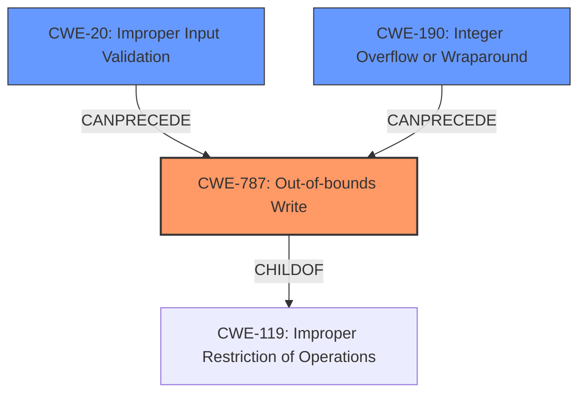

# Raw Analyzer Response for CVE-2022-27833

# Summary
| CWE ID | CWE Name | Confidence | CWE Abstraction Level | CWE Vulnerability Mapping Label | CWE-Vulnerability Mapping Notes |
|---|---|---|---|---|---|
| CWE-787 | Out-of-bounds Write | 1.0 | Base | Allowed | Primary CWE. The vulnerability description explicitly mentions "**out-of-bounds write**". |
| CWE-20 | Improper Input Validation | 0.8 | Class | Discouraged | Secondary CWE. The vulnerability description explicitly mentions "**Improper input validation**". |
| CWE-190 | Integer Overflow or Wraparound | 0.7 | Base | Allowed | Secondary CWE. The vulnerability description mentions "**out-of-bounds write**" by integer overflow. |

## Evidence and Confidence

*   **Confidence Score:** 0.9
*   **Evidence Strength:** MEDIUM

## Relationship Analysis
The primary weakness is CWE-787, which is a child of CWE-119 (Improper Restriction of Operations within the Bounds of a Memory Buffer). The vulnerability description explicitly mentions both **"Improper input validation"** and "**out-of-bounds write**", suggesting a chain of events where improper validation leads to an out-of-bounds write. CWE-190 (Integer Overflow or Wraparound) can precede CWE-787, which is consistent with the description of the vulnerability involving integer overflow leading to an out-of-bounds write. CWE-20 is a high-level class that is discouraged, but explicitly mentioned as the rootcause by the report.

## Vulnerability Chain
The vulnerability chain starts with **Improper input validation** (CWE-20), which leads to an integer overflow (CWE-190), and ultimately results in an **out-of-bounds write** (CWE-787). This chain reflects the described sequence of events in the vulnerability description.

## Summary of Analysis
The initial analysis focused on identifying CWEs related to improper input validation and out-of-bounds write. The retriever results provided several candidate CWEs, including CWE-476, CWE-1285, CWE-125, CWE-190, CWE-197, CWE-823, and CWE-787. The final decision was based on the explicit mention of "**out-of-bounds write**" and "**Improper input validation**" in the vulnerability description.

The vulnerability description states: "**Improper input validation** in DSP driver prior to SMR Apr-2022 Release 1 allows **out-of-bounds write** by integer overflow."

This statement directly supports the selection of CWE-787 as the primary weakness, with CWE-20 and CWE-190 contributing to the vulnerability. The relationships between these CWEs, particularly the "CanPrecede" relationship between CWE-20/CWE-190 and CWE-787, reinforce the understanding of the vulnerability as a chain of events.

CWE-787 is at the optimal level of specificity because it directly describes the observed weakness. CWE-20 and CWE-190 provide additional context regarding the root cause and the mechanism that leads to the out-of-bounds write.

Relevant CWE Information:
- **CWE-787:** This is a direct match since the vulnerability description includes "**out-of-bounds write**".
- **CWE-20:** This is also a direct match since the vulnerability description includes "**Improper input validation**"
- **CWE-190:** The vulnerability description mentions "**out-of-bounds write**" by integer overflow.

Other CWEs Considered:

- **CWE-476 (NULL Pointer Dereference):** While a possible consequence of memory corruption, it is not directly mentioned in the vulnerability description.
- **CWE-1285 (Improper Validation of Specified Index, Position, or Offset in Input):** More specific than CWE-20, but the description doesn't provide that level of detail.
- **CWE-125 (Out-of-bounds Read):** The vulnerability description explicitly states an out-of-bounds *write*, not a read.
- **CWE-197 (Numeric Truncation Error):** Not directly mentioned, though numeric issues are involved, integer overflow is more precise.
- **CWE-823 (Use of Out-of-range Pointer Offset):** A possible cause of out-of-bounds write, but less direct than integer overflow.
- **CWE-1339 (Insufficient Precision or Accuracy of a Real Number):** Not related to the provided description.