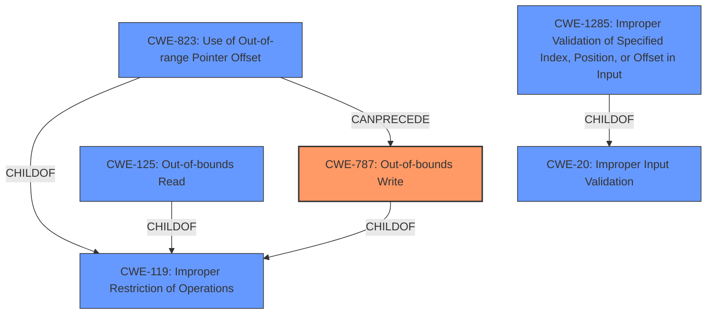

# Enhanced Analysis for CVE-2022-27835

# Summary

| CWE ID  | CWE Name                                                                   | Confidence | CWE Abstraction Level | CWE Vulnerability Mapping Label | CWE-Vulnerability Mapping Notes |
| :-------- | :------------------------------------------------------------------------- | :--------- | :---------------------- | :------------------------------ | :------------------------------ |
| CWE-787 | Out-of-bounds Write                                                        | 1.0        | Base                    | Primary CWE                     | Allowed                       |
| CWE-125 | Out-of-bounds Read | 0.7        | Base                    | Secondary Candidate              | Allowed                       |
| CWE-823 | Use of Out-of-range Pointer Offset                                           | 0.6        | Base                    | Secondary Candidate              | Allowed                       |
| CWE-1285 | Improper Validation of Specified Index, Position, or Offset in Input                                           | 0.6        | Base                    | Secondary Candidate              | Allowed                       |

## Evidence and Confidence

*   **Confidence Score:** 0.8
*   **Evidence Strength:** HIGH

## Relationship Analysis
The primary CWE, CWE-787 (Out-of-bounds Write), is a base-level CWE that directly addresses the vulnerability's impact: arbitrary memory write due to an **improper boundary check**. CWE-787 is related to CWE-119 (Improper Restriction of Operations within the Bounds of a Memory Buffer), but the description provides enough details to use the more specific CWE-787. CWE-125 (Out-of-bounds Read) and CWE-823 (Use of Out-of-range Pointer Offset) were also considered because they are related to memory access issues. CWE-1285 (Improper Validation of Specified Index, Position, or Offset in Input) was also considered because the root cause is an **improper boundary check**, which means the index, position, or offset was not properly validated.



## Vulnerability Chain
The vulnerability chain starts with an **improper boundary check** in the UWB firmware, leading to an out-of-bounds write.

Root Cause: **Improper boundary check**
Weakness: CWE-787 Out-of-bounds Write
Impact: Arbitrary memory write

## Summary of Analysis
The analysis is based on the vulnerability description and the provided CVE reference content summary. The root cause is the **improper boundary check**, which allows writing to arbitrary memory locations.

The vulnerability description states, " **Improper boundary check** in UWB firmware prior to SMR Apr-2022 Release 1 allows arbitrary memory write." The CVE Reference Links Content Summary also confirms this, stating, "The root cause is an **improper boundary check** in UWB (Ultra-Wideband) firmware."

The primary CWE, CWE-787, is at the optimal level of specificity because it directly reflects the impact of the vulnerability.

Relevant CWE Information:

# Enhanced Context (25 CWEs)

## CWE-274: Improper Handling of Insufficient Privileges
**Abstraction Level**: Base
**Similarity Score**: 0.78
**Source**: dense

**Description**:
The product does not handle or incorrectly handles when it has insufficient privileges to perform an operation, leading to resultant weaknesses.

**Mapping Guidance**:
- Usage: Discouraged
- Rationale: This CWE entry could be deprecated in a future version of CWE.

*Not selected as the vulnerability is not related to privileges, but related to boundary check.*

## CWE-653: Improper Isolation or Compartmentalization
**Abstraction Level**: Class
**Similarity Score**: 0.77
**Source**: dense

**Description**:
The product does not properly compartmentalize or isolate functionality, processes, or resources that require different privilege levels, rights, or permissions.

**Mapping Guidance**:
- Usage: Allowed
- Rationale: This CWE entry is at the Base level of abstraction, which is a preferred level of abstraction for mapping to the root causes of vulnerabilities.

*Not selected as the vulnerability is not related to isolation or compartmentalization, but related to boundary check.*

## CWE-280: Improper Handling of Insufficient Permissions or Privileges
**Abstraction Level**: Base
**Similarity Score**: 0.76
**Source**: dense

**Description**:
The product does not handle or incorrectly handles when it has insufficient privileges to access resources or functionality as specified by their permissions. This may cause it to follow unexpected code paths that may leave the product in an invalid state.

**Mapping Guidance**:
- Usage: Allowed
- Rationale: This CWE entry is at the Base level of abstraction, which is a preferred level of abstraction for mapping to the root causes of vulnerabilities.

*Not selected as the vulnerability is not related to permissions or privileges, but related to boundary check.*

## CWE-1289: Improper Validation of Unsafe Equivalence in Input
**Abstraction Level**: Base
**Similarity Score**: 0.76
**Source**: dense

**Description**:
The product receives an input value that is used as a resource identifier or other type of reference, but it does not validate or incorrectly validates that the input is equivalent to a potentially-unsafe value.

**Mapping Guidance**:
- Usage: Allowed
- Rationale: This CWE entry is at the Base level of abstraction, which is a preferred level of abstraction for mapping to the root causes of vulnerabilities.

*Not selected as the vulnerability is not about unsafe equivalence in input, but related to boundary check.*

## CWE-266: Incorrect Privilege Assignment
**Abstraction Level**: Base
**Similarity Score**: 0.75
**Source**: dense

**Description**:
A product incorrectly assigns a privilege to a particular actor, creating an unintended sphere of control for that actor.

**Mapping Guidance**:
- Usage: Allowed
- Rationale: This CWE entry is at the Base level of abstraction, which is a preferred level of abstraction for mapping to the root causes of vulnerabilities.

*Not selected as the vulnerability is not about privilege assignment, but related to boundary check.*

## CWE-667: Improper Locking
**Abstraction Level**: Class
**Similarity Score**: 0.75
**Source**: dense

**Description**:
The product does not properly acquire or release a lock on a resource, leading to unexpected resource state changes and behaviors.

**Mapping Guidance**:
- Usage: Allowed-with-Review
- Rationale: This CWE entry is a Class and might have Base-level children that would be more appropriate

*Not selected as the vulnerability is not about locking, but related to boundary check.*

## CWE-404: Improper Resource Shutdown or Release
**Abstraction Level**: Class
**Similarity Score**: 0.75
**Source**: dense

**Description**:
The product does not release or incorrectly releases a resource before it is made available for re-use.

**Mapping Guidance**:
- Usage: Allowed-with-Review
- Rationale: This CWE entry is a Class and might have Base-level children that would be more appropriate

*Not selected as the vulnerability is not about resource shutdown or release, but related to boundary check.*

## CWE-807: Reliance on Untrusted Inputs in a Security Decision
**Abstraction Level**: Base
**Similarity Score**: 0.75
**Source**: dense

**Description**:
The product uses a protection mechanism that relies on the existence or values of an input, but the input can be modified by an untrusted actor in a way that bypasses the protection mechanism.

**Mapping Guidance**:
- Usage: Allowed
- Rationale: This CWE entry is at the Base level of abstraction, which is a preferred level of abstraction for mapping to the root causes of vulnerabilities.

*Not selected as the vulnerability is not about relying on untrusted inputs, but related to boundary check.*

## CWE-691: Insufficient Control Flow Management
**Abstraction Level**: Pillar
**Similarity Score**: 0.75
**Source**: dense

**Description**:
The code does not sufficiently manage its control flow during execution, creating conditions in which the control flow can be modified in unexpected ways.


## CWE Relationship Analysis

Current CWEs represent these abstraction levels: .


### Vulnerability Chain Analysis

**Chain starting from CWE-266:**
- 266 (Incorrect Privilege Assignment) - ROOT


**Chain starting from CWE-280:**
- 280 (Improper Handling of Insufficient Permissions or Privileges ) - ROOT


### CWE Relationship Diagram

```mermaid
graph TD
    classDef primary fill:#f96,stroke:#333,stroke-width:2px
    classDef secondary fill:#69f,stroke:#333
    classDef tertiary fill:#9e9,stroke:#333
```