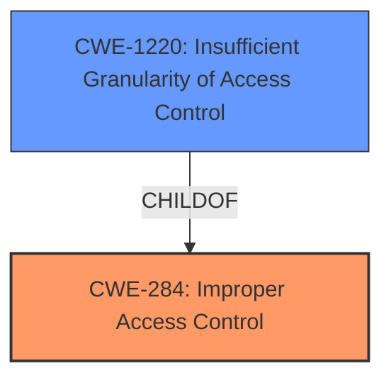

# Analysis for CVE-2022-27838

# Summary
| CWE ID    | CWE Name                       | Confidence | CWE Abstraction Level | CWE Vulnerability Mapping Label | CWE-Vulnerability Mapping Notes |
| :-------- | :----------------------------- | :--------- | :-------------------- | :------------------------------ | :------------------------------ |
| CWE-284   | Improper Access Control        | 0.75       | Pillar                | Primary                         | Discouraged                    |
| CWE-1220 | Insufficient Granularity of Access Control | 0.75       | Base                | Secondary                       | Allowed                    |

## Evidence and Confidence

*   **Confidence Score:** 0.75
*   **Evidence Strength:** HIGH

## Relationship Analysis
The primary CWE is CWE-284, which is a Pillar, and therefore very high-level. The analysis considered the MITRE guidance that discourages the use of CWE-284 and suggests more specific descendants. CWE-1220, a child of CWE-284, offers a more granular description of the access control issue.

## Vulnerability Chain
The vulnerability chain starts with the **improper access control**, leading to the impact of an attacker being able to access files with system privileges.

## Summary of Analysis
The initial assessment based on the vulnerability description and key phrases points to **improper access control** as the root cause. The vulnerability description states "**Improper access control** vulnerability in FactoryCamera prior to version 2.1.96 allows attacker to access the file with system privilege." This is reinforced by the CVE Reference Links Content Summary, which states that the root cause of the vulnerability is **improper access control**, and the impact is that an attacker could access files with system privileges.

The retriever results also indicate that CWE-284 (Improper Access Control) is a potential candidate. However, CWE-284 is a Pillar and is discouraged by MITRE, which recommends using more specific descendants.

The analysis considered the relationship between CWE-284 and its children, and CWE-1220 (Insufficient Granularity of Access Control) was identified as a more specific and relevant CWE. While the description doesn't explicitly mention granularity, the concept aligns with the idea that the access control is not fine-grained enough to prevent unauthorized access. Therefore, CWE-1220 is included as a secondary mapping to provide more context.

The selection of CWE-284 as primary and CWE-1220 as secondary reflects a balance between the high-level description of the vulnerability and the need for a more specific classification.

Relevant CWE Information:

# Enhanced Context (25 CWEs)
The following CWEs were identified as potentially relevant to this vulnerability:

## CWE-1220: Insufficient Granularity of Access Control
**Abstraction Level**: Base
**Similarity Score**: 0.75
**Source**: dense

**Description**:
The product implements access controls via a policy or other feature with the intention to disable or restrict accesses (reads and/or writes) to assets in a system from untrusted agents. However, implemented access controls lack required granularity, which renders the control policy too broad because it allows accesses from unauthorized agents to the security-sensitive assets.

**Mapping Guidance**:
- Usage: Allowed
- Rationale: This CWE entry is at the Base level of abstraction, which is a preferred level of abstraction for mapping to the root causes of vulnerabilities.

## CWE-284: Improper Access Control
**Abstraction:** Pillar
**Status:** Incomplete

### Description
The product does not restrict or incorrectly restricts access to a resource from an unauthorized actor.

### Mapping Guidance
**Usage:** Discouraged
**Rationale:** CWE-284 is extremely high-level, a Pillar. Its name, "Improper Access Control," is often misused in low-information vulnerability reports [REF-1287] or by active use of the OWASP Top Ten, such as "A01:2021-Broken Access Control". It is not useful for trend analysis.
**Comments:** Consider using descendants of CWE-284 that are more specific to the kind of access control involved, such as those involving authorization (Missing Authorization (CWE-862), Incorrect Authorization (CWE-863), Incorrect Permission Assignment for Critical Resource (CWE-732), etc.); authentication (Missing Authentication (CWE-306) or Weak Authentication (CWE-1390)); Incorrect User Management (CWE-286); Improper Restriction of Communication Channel to Intended Endpoints (CWE-923); etc.

### Analysis of other CWEs Considered but not Used
*   CWE-285 (Improper Authorization), CWE-269 (Improper Privilege Management), CWE-732 (Incorrect Permission Assignment for Critical Resource), CWE-287 (Improper Authentication): These CWEs are related to access control issues, but they are not as directly relevant as CWE-284 and CWE-1220. They focus on authorization, privilege management, permission assignment, and authentication, while the vulnerability description emphasizes the overall **improper access control** as the root cause.
*   CWE-613 (Insufficient Session Expiration): This CWE is not applicable because the vulnerability is not related to session management.
*   CWE-926 (Improper Export of Android Application Components): This CWE is specific to Android applications and component exporting. It's more specific than the description provided, and there's no specific mention of exported components, so this is not a strong match.
*   CWE-863 (Incorrect Authorization), CWE-639 (Authorization Bypass Through User-Controlled Key): These CWEs focus on authorization issues, which are related to access control but not the central issue as described.