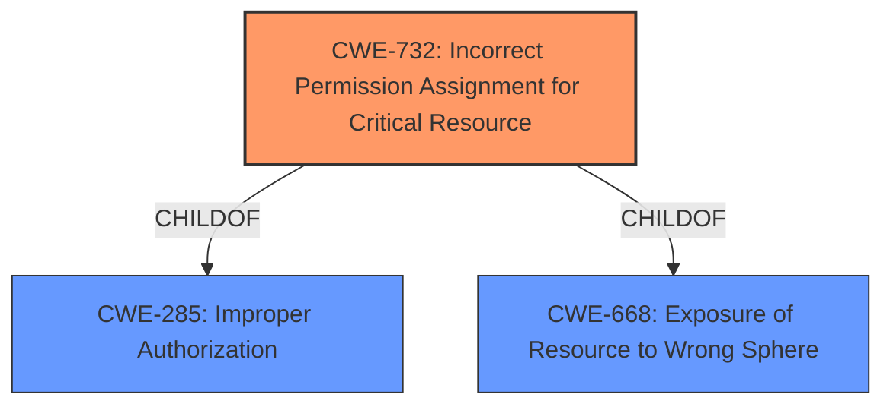

# Enhanced Analysis for CVE-2022-27840

# Summary
| CWE ID  | CWE Name                                                                                                                            | Confidence | CWE Abstraction Level | CWE Vulnerability Mapping Label | CWE-Vulnerability Mapping Notes |
| :-------- | :---------------------------------------------------------------------------------------------------------------------------------- | :--------- | :---------------------- | :-------------------------------- | :------------------------------ |
| CWE-732 | Incorrect Permission Assignment for Critical Resource                                                                               | 0.85       | Class                   | Allowed-with-Review             | Primary CWE                     |
| CWE-285 | Improper Authorization                                                                                                              | 0.6        | Class                   | Discouraged                       | Secondary Candidate             |

## Evidence and Confidence

*   **Confidence Score:** 0.8
*   **Evidence Strength:** HIGH

## Relationship Analysis
The primary CWE identified is CWE-732, which falls under the class level of abstraction. This class is a child of both CWE-285 (Improper Authorization) and CWE-668 (Exposure of Resource to Wrong Sphere). While CWE-285 is a broader category, CWE-732 more specifically addresses the **incorrect permission assignment** leading to the vulnerability. The decision to prioritize CWE-732 over CWE-285 is based on its higher specificity and the direct mention of "permissions" in the vulnerability description. Other considered CWEs like CWE-863 and CWE-862 are also related to authorization but are not as fitting since the problem isn't so much about the authorization *check* itself, but the initial permission setup.



## Vulnerability Chain
The vulnerability chain starts with an **improper access control**, specifically, an **incorrect permission assignment** (CWE-732). This leads to a scenario where local attackers can delete arbitrary files with SamsungRecovery permissions, effectively bypassing intended access restrictions and resulting in potential data loss or system instability.

## Summary of Analysis
The initial assessment focused on the **improper access control** as the primary **root cause**. The retriever results suggested several CWEs, including CWE-269, CWE-284, CWE-285, CWE-732 and CWE-863. However, based on the complete CWE specifications, and the evidence from the vulnerability description, CWE-732 (Incorrect Permission Assignment for Critical Resource) emerged as the most appropriate choice.

The vulnerability description clearly states that the issue is related to **improper access control**, which allows local attackers to delete arbitrary files as SamsungRecovery permission. The "CVE Reference Links Content Summary" reinforces this by stating "**Root Cause of Vulnerability:** - Improper access control in Samsung Recovery" and "The vulnerability allows local attackers to delete arbitrary files due to insufficient access control in Samsung Recovery."

CWE-732 is more specific than its parent CWE-285, aligning well with the root cause, "**incorrect permission assignment**" which is more descriptive of the **improper access control**. While CWE-285 (Improper Authorization) could be considered, the issue isn't necessarily about the authorization process itself, but the initial misconfiguration of permissions. Therefore, CWE-732 captures the essence of the vulnerability more accurately.

CWE-269 (Improper Privilege Management) was considered but deemed less appropriate because the issue isn't primarily about managing privileges in general, but about the specific permissions assigned to the resource.

CWE-863 (Incorrect Authorization) was also considered, but the issue isn't about performing an authorization check incorrectly, but the incorrect setting of permissions in the first place.

CWE-862 (Missing Authorization) was also considered, but the access control exists, but it is improperly configured through the **incorrect permission assignment**.


## CWE Relationship Analysis

Current CWEs represent these abstraction levels: .


### Vulnerability Chain Analysis

**Chain starting from CWE-862:**
- 862 (Missing Authorization) - ROOT


**Chain starting from CWE-668:**
- 668 (Exposure of Resource to Wrong Sphere) - ROOT


### CWE Relationship Diagram

```mermaid
graph TD
    classDef primary fill:#f96,stroke:#333,stroke-width:2px
    classDef secondary fill:#69f,stroke:#333
    classDef tertiary fill:#9e9,stroke:#333
```