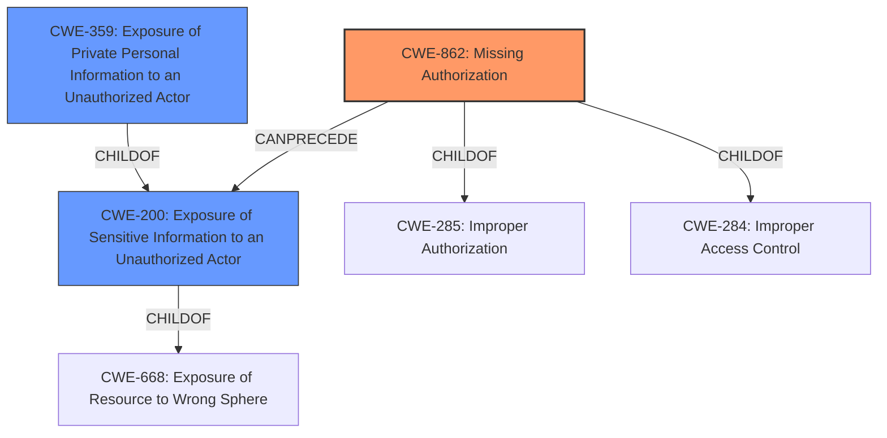

# Analysis for CVE-2022-27849

# Summary
| CWE ID | CWE Name | Confidence | CWE Abstraction Level | CWE Vulnerability Mapping Label | CWE-Vulnerability Mapping Notes |
|---|---|---|---|---|---|
| CWE-862 | Missing Authorization | 1.0 | Class | Allowed-with-Review | Primary CWE |
| CWE-200 | Exposure of Sensitive Information to an Unauthorized Actor | 0.7 | Class | Discouraged | Secondary Candidate |
| CWE-359 | Exposure of Private Personal Information to an Unauthorized Actor | 0.6 | Base | Allowed | Secondary Candidate |

## Evidence and Confidence

*   **Confidence Score:** 0.8
*   **Evidence Strength:** HIGH

## Relationship Analysis
The primary CWE is CWE-862 **Missing Authorization**, a Class-level CWE. The vulnerability description indicates that the plugin lacks proper access control, leading to sensitive data exposure, which aligns with the definition of **Missing Authorization**. CWE-862 is a child of CWE-285 and CWE-284, representing more general authorization issues. Because the description specifically highlights the absence of authorization checks, CWE-862 is more appropriate than its parents.

CWE-200 **Exposure of Sensitive Information to an Unauthorized Actor** is a Class-level CWE and child of CWE-668. The description states the impact is "sensitive data exposure," which aligns with CWE-200. However, CWE-200 is discouraged as it describes the impact of a vulnerability rather than the root cause. The relationship CanPrecede exists between CWE-862 and CWE-200, but the root cause here is the missing authorization, which then leads to the information exposure.

CWE-359 **Exposure of Private Personal Information to an Unauthorized Actor** is a Base-level CWE and a child of CWE-200. Given the vulnerability involves sensitive data exposure, and there is a focus on unauthorized access, CWE-359 is relevant. However, the description doesn't explicitly state that the exposed information is "private personal information," so this is a less certain fit.

## Vulnerability Chain
The vulnerability chain starts with **Missing Authorization** (CWE-862) which leads to **Exposure of Sensitive Information** (CWE-200), and may further lead to **Exposure of Private Personal Information** (CWE-359). The **root cause** is the missing authorization check, which allows unauthenticated users to access sensitive data.

## Summary of Analysis
Initially, the analysis identified that the **impact** was Sensitive Information Disclosure, as stated in the "Vulnerability Description Key Phrases".

The "CVE Reference Links Content Summary" confirms this by stating:
*   "The vulnerability is due to **insufficient access control**, leading to sensitive data exposure."
*   "The vulnerability can be exploited by unauthenticated users."

This evidence supports that the primary **root cause** is CWE-862 **Missing Authorization**.

CWE-200 **Exposure of Sensitive Information to an Unauthorized Actor** and CWE-359 **Exposure of Private Personal Information to an Unauthorized Actor** were considered as secondary mappings. While they describe the impact of the vulnerability, they are not the **root cause**. CWE-200 is discouraged by MITRE as it often describes the impact and not the **root cause**.

The choice of CWE-862 is at the Class level of abstraction, and while there are more specific Base-level CWEs related to authorization, the current description does not provide enough specific details to warrant a lower-level mapping. Therefore, CWE-862 provides the optimal level of specificity based on the available evidence.

Relevant CWE Information: